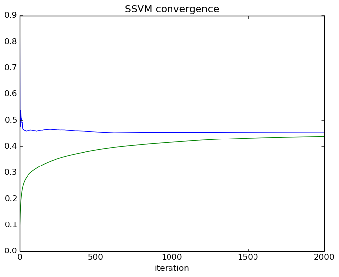
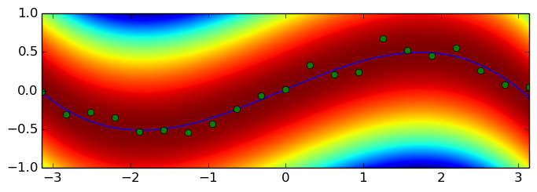

    using BCFWstruct

    function lossCB(param, y, ybar)
      abs(ybar - y)
    end
    
    function featureCB(param, x, y)
      [y,
       y * x,
       y * x^2,
       y * x^3,
       - 0.5 * y^2]
    end
    
    function oracleCB(param, model, x, y)  # loss-augmented inference
      w = model.w
      z = w[1] + w[2] * x + w[3] * x.^2 + w[4] * x.^3
        yhat = Float64[]
      if w[5] > 0
        yhat = [z - 1, z + 1] / w[5]
        yhat = max(min(yhat, 1),-1)
      end
        append!(yhat, [-1, 1])   
        augLoss = y_::Vector{Float64} -> abs(y_ - y) + z * y_ - 0.5 * y_.^2 * w[5]
      worse = indmax(augLoss(yhat))
        yhat = yhat[worse]
    end
    
    function oracleCB(param, model, x)    # inference
      w = model.w
        z = w[1] + w[2] * x + w[3] * x.^2 + w[4] * x.^3
        y = z / w[5]
    end

    oracleCB (generic function with 2 methods)

    x = collect(linspace(-pi,pi,21))
    y = 0.5*sin(x)
    y = y + 0.1*randn(size(y));

    xr = collect(linspace(minimum(x), maximum(x), 1024))
    yr = collect(linspace(-1,1,1024));

    param = BCFWstruct.Param(
        x,
        y,
        lossCB,
        oracleCB,
        featureCB
        )

    BCFWstruct.Param{Float64,Float64}([-3.14159,-2.82743,-2.51327,-2.19911,-1.88496,-1.5708,-1.25664,-0.942478,-0.628319,-0.314159  …  0.314159,0.628319,0.942478,1.25664,1.5708,1.88496,2.19911,2.51327,2.82743,3.14159],[-0.00853983,-0.309255,-0.271232,-0.342945,-0.526396,-0.510696,-0.54101,-0.425326,-0.237026,-0.0651087  …  0.330254,0.211964,0.243429,0.67993,0.528908,0.456445,0.554805,0.258425,0.074824,0.0439403],lossCB,oracleCB,featureCB)

    options = BCFWstruct.Options(Float64, Float64, 5, length(x))
    options.num_passes = 2000
    options.gap_threshold = 0.01;
    options.debug = true;

    model, progress = BCFWstruct.solverBCFW(param, options);

    running BCFW on 21 examples. The options are as follows:
    
    BCFWstruct.Options{Float64,Float64}(Float32[0.0f0,0.0f0,0.0f0,0.0f0,0.0f0],0x00000000000007d0,true,true,Inf32,true,0x0000000000000001,uniform::BCFWstruct.Sample,100,0.04761905f0,(Float64[],Float64[]),0.01,0x000000000000000a)
    pass 1 (iteration 21), SVM primal = 0.796107, SVM dual = 0.077083, duality gap = 0.719025, train_error = 0.305863 
    pass 2 (iteration 42), SVM primal = 0.826386, SVM dual = 0.099456, duality gap = 0.726930, train_error = 0.385318 
    pass 3 (iteration 63), SVM primal = 0.533878, SVM dual = 0.122905, duality gap = 0.410974, train_error = 0.125959 
    pass 4 (iteration 84), SVM primal = 0.518843, SVM dual = 0.140970, duality gap = 0.377873, train_error = 0.123403 
    pass 5 (iteration 105), SVM primal = 0.476712, SVM dual = 0.155054, duality gap = 0.321658, train_error = 0.092968 
    pass 6 (iteration 126), SVM primal = 0.482373, SVM dual = 0.167625, duality gap = 0.314748, train_error = 0.099050 
    pass 7 (iteration 147), SVM primal = 0.534269, SVM dual = 0.179516, duality gap = 0.354753, train_error = 0.138700 
    pass 8 (iteration 168), SVM primal = 0.538246, SVM dual = 0.189546, duality gap = 0.348700, train_error = 0.141525 
    pass 9 (iteration 189), SVM primal = 0.516791, SVM dual = 0.197100, duality gap = 0.319691, train_error = 0.125727 
    pass 10 (iteration 210), SVM primal = 0.508161, SVM dual = 0.203255, duality gap = 0.304906, train_error = 0.119017 
    Duality gap check: gap = 0.304906 at pass 10 (iteration 210)
    pass 11 (iteration 231), SVM primal = 0.507358, SVM dual = 0.209481, duality gap = 0.297877, train_error = 0.116932 
    pass 12 (iteration 252), SVM primal = 0.502028, SVM dual = 0.215264, duality gap = 0.286764, train_error = 0.112831 
    pass 13 (iteration 273), SVM primal = 0.502753, SVM dual = 0.220221, duality gap = 0.282532, train_error = 0.113237 
    pass 14 (iteration 294), SVM primal = 0.503057, SVM dual = 0.224677, duality gap = 0.278380, train_error = 0.113650 
    pass 15 (iteration 315), SVM primal = 0.490629, SVM dual = 0.229010, duality gap = 0.261619, train_error = 0.103908 
    pass 16 (iteration 336), SVM primal = 0.493025, SVM dual = 0.232894, duality gap = 0.260131, train_error = 0.106049 
    pass 17 (iteration 357), SVM primal = 0.492937, SVM dual = 0.236371, duality gap = 0.256566, train_error = 0.106257 
    pass 18 (iteration 378), SVM primal = 0.486026, SVM dual = 0.239468, duality gap = 0.246558, train_error = 0.100498 
    pass 19 (iteration 399), SVM primal = 0.477476, SVM dual = 0.242242, duality gap = 0.235234, train_error = 0.092726 
    pass 20 (iteration 420), SVM primal = 0.469292, SVM dual = 0.244871, duality gap = 0.224421, train_error = 0.085595 
    Duality gap check: gap = 0.224421 at pass 20 (iteration 420)
    pass 21 (iteration 441), SVM primal = 0.468078, SVM dual = 0.247544, duality gap = 0.220534, train_error = 0.084907 
    pass 22 (iteration 462), SVM primal = 0.466079, SVM dual = 0.249993, duality gap = 0.216086, train_error = 0.083405 
    pass 23 (iteration 483), SVM primal = 0.465002, SVM dual = 0.252245, duality gap = 0.212758, train_error = 0.082717 
    pass 24 (iteration 504), SVM primal = 0.463638, SVM dual = 0.254343, duality gap = 0.209295, train_error = 0.081764 
    pass 25 (iteration 525), SVM primal = 0.464219, SVM dual = 0.256352, duality gap = 0.207867, train_error = 0.082275 
    pass 26 (iteration 546), SVM primal = 0.464249, SVM dual = 0.258234, duality gap = 0.206015, train_error = 0.082272 
    pass 27 (iteration 567), SVM primal = 0.463722, SVM dual = 0.259975, duality gap = 0.203747, train_error = 0.082028 
    pass 28 (iteration 588), SVM primal = 0.463425, SVM dual = 0.261584, duality gap = 0.201841, train_error = 0.081902 
    pass 29 (iteration 609), SVM primal = 0.462906, SVM dual = 0.263119, duality gap = 0.199787, train_error = 0.081713 
    pass 30 (iteration 630), SVM primal = 0.462646, SVM dual = 0.264599, duality gap = 0.198047, train_error = 0.081528 
    Duality gap check: gap = 0.198047 at pass 30 (iteration 630)
    pass 31 (iteration 651), SVM primal = 0.462028, SVM dual = 0.266006, duality gap = 0.196022, train_error = 0.081016 
    pass 32 (iteration 672), SVM primal = 0.461933, SVM dual = 0.267344, duality gap = 0.194589, train_error = 0.080874 
    pass 33 (iteration 693), SVM primal = 0.462121, SVM dual = 0.268626, duality gap = 0.193495, train_error = 0.080612 
    pass 34 (iteration 714), SVM primal = 0.462180, SVM dual = 0.269870, duality gap = 0.192311, train_error = 0.080597 
    pass 35 (iteration 735), SVM primal = 0.462173, SVM dual = 0.271071, duality gap = 0.191101, train_error = 0.080748 
    pass 36 (iteration 756), SVM primal = 0.461489, SVM dual = 0.272220, duality gap = 0.189269, train_error = 0.080298 
    pass 37 (iteration 777), SVM primal = 0.461238, SVM dual = 0.273323, duality gap = 0.187915, train_error = 0.080409 
    pass 38 (iteration 798), SVM primal = 0.460656, SVM dual = 0.274379, duality gap = 0.186277, train_error = 0.080179 
    pass 39 (iteration 819), SVM primal = 0.460059, SVM dual = 0.275416, duality gap = 0.184643, train_error = 0.079659 
    pass 40 (iteration 840), SVM primal = 0.459910, SVM dual = 0.276441, duality gap = 0.183470, train_error = 0.079495 
    Duality gap check: gap = 0.183470 at pass 40 (iteration 840)
    pass 41 (iteration 861), SVM primal = 0.459435, SVM dual = 0.277428, duality gap = 0.182007, train_error = 0.079084 
    pass 42 (iteration 882), SVM primal = 0.459229, SVM dual = 0.278390, duality gap = 0.180839, train_error = 0.079055 
    pass 43 (iteration 903), SVM primal = 0.459166, SVM dual = 0.279323, duality gap = 0.179843, train_error = 0.079005 
    pass 44 (iteration 924), SVM primal = 0.458964, SVM dual = 0.280251, duality gap = 0.178713, train_error = 0.078849 
    pass 45 (iteration 945), SVM primal = 0.459353, SVM dual = 0.281174, duality gap = 0.178179, train_error = 0.079346 
    pass 46 (iteration 966), SVM primal = 0.459466, SVM dual = 0.282085, duality gap = 0.177380, train_error = 0.079425 
    pass 47 (iteration 987), SVM primal = 0.459876, SVM dual = 0.282974, duality gap = 0.176901, train_error = 0.079787 
    pass 48 (iteration 1008), SVM primal = 0.459795, SVM dual = 0.283839, duality gap = 0.175956, train_error = 0.079726 
    pass 49 (iteration 1029), SVM primal = 0.460169, SVM dual = 0.284709, duality gap = 0.175460, train_error = 0.080046 
    pass 50 (iteration 1050), SVM primal = 0.459785, SVM dual = 0.285553, duality gap = 0.174231, train_error = 0.079946 
    Duality gap check: gap = 0.174231 at pass 50 (iteration 1050)
    pass 51 (iteration 1071), SVM primal = 0.460005, SVM dual = 0.286379, duality gap = 0.173625, train_error = 0.080362 
    pass 52 (iteration 1092), SVM primal = 0.460434, SVM dual = 0.287182, duality gap = 0.173252, train_error = 0.080803 
    pass 53 (iteration 1113), SVM primal = 0.460454, SVM dual = 0.287962, duality gap = 0.172492, train_error = 0.080808 
    pass 54 (iteration 1134), SVM primal = 0.460830, SVM dual = 0.288722, duality gap = 0.172109, train_error = 0.081156 
    pass 55 (iteration 1155), SVM primal = 0.460847, SVM dual = 0.289458, duality gap = 0.171389, train_error = 0.081272 
    pass 56 (iteration 1176), SVM primal = 0.461400, SVM dual = 0.290180, duality gap = 0.171220, train_error = 0.081707 
    pass 57 (iteration 1197), SVM primal = 0.461438, SVM dual = 0.290882, duality gap = 0.170556, train_error = 0.081819 
    pass 58 (iteration 1218), SVM primal = 0.461226, SVM dual = 0.291557, duality gap = 0.169668, train_error = 0.081774 
    pass 59 (iteration 1239), SVM primal = 0.461929, SVM dual = 0.292214, duality gap = 0.169715, train_error = 0.082315 
    pass 60 (iteration 1260), SVM primal = 0.462104, SVM dual = 0.292859, duality gap = 0.169245, train_error = 0.082483 
    Duality gap check: gap = 0.169245 at pass 60 (iteration 1260)
    pass 61 (iteration 1281), SVM primal = 0.462320, SVM dual = 0.293492, duality gap = 0.168828, train_error = 0.082684 
    pass 62 (iteration 1302), SVM primal = 0.462070, SVM dual = 0.294109, duality gap = 0.167960, train_error = 0.082493 
    pass 63 (iteration 1323), SVM primal = 0.461784, SVM dual = 0.294714, duality gap = 0.167070, train_error = 0.082242 
    pass 64 (iteration 1344), SVM primal = 0.462039, SVM dual = 0.295311, duality gap = 0.166728, train_error = 0.082543 
    pass 65 (iteration 1365), SVM primal = 0.461905, SVM dual = 0.295891, duality gap = 0.166014, train_error = 0.082541 
    pass 66 (iteration 1386), SVM primal = 0.461914, SVM dual = 0.296458, duality gap = 0.165455, train_error = 0.082571 
    pass 67 (iteration 1407), SVM primal = 0.462545, SVM dual = 0.297010, duality gap = 0.165535, train_error = 0.083076 
    pass 68 (iteration 1428), SVM primal = 0.462715, SVM dual = 0.297559, duality gap = 0.165155, train_error = 0.083223 
    pass 69 (iteration 1449), SVM primal = 0.462988, SVM dual = 0.298103, duality gap = 0.164885, train_error = 0.083620 
    pass 70 (iteration 1470), SVM primal = 0.463198, SVM dual = 0.298637, duality gap = 0.164561, train_error = 0.083940 
    Duality gap check: gap = 0.164561 at pass 70 (iteration 1470)
    pass 71 (iteration 1491), SVM primal = 0.463520, SVM dual = 0.299160, duality gap = 0.164360, train_error = 0.084326 
    pass 72 (iteration 1512), SVM primal = 0.463019, SVM dual = 0.299673, duality gap = 0.163346, train_error = 0.084180 
    pass 73 (iteration 1533), SVM primal = 0.462738, SVM dual = 0.300181, duality gap = 0.162557, train_error = 0.084104 
    pass 74 (iteration 1554), SVM primal = 0.462956, SVM dual = 0.300677, duality gap = 0.162279, train_error = 0.084409 
    pass 75 (iteration 1575), SVM primal = 0.463011, SVM dual = 0.301165, duality gap = 0.161846, train_error = 0.084600 
    pass 76 (iteration 1596), SVM primal = 0.462894, SVM dual = 0.301645, duality gap = 0.161250, train_error = 0.084583 
    pass 77 (iteration 1617), SVM primal = 0.462685, SVM dual = 0.302122, duality gap = 0.160563, train_error = 0.084528 
    pass 78 (iteration 1638), SVM primal = 0.462846, SVM dual = 0.302596, duality gap = 0.160249, train_error = 0.084664 
    pass 79 (iteration 1659), SVM primal = 0.462548, SVM dual = 0.303064, duality gap = 0.159484, train_error = 0.084521 
    pass 80 (iteration 1680), SVM primal = 0.462549, SVM dual = 0.303529, duality gap = 0.159021, train_error = 0.084612 
    Duality gap check: gap = 0.159021 at pass 80 (iteration 1680)
    pass 81 (iteration 1701), SVM primal = 0.462492, SVM dual = 0.303985, duality gap = 0.158507, train_error = 0.084676 
    pass 82 (iteration 1722), SVM primal = 0.462499, SVM dual = 0.304435, duality gap = 0.158064, train_error = 0.084771 
    pass 83 (iteration 1743), SVM primal = 0.462442, SVM dual = 0.304876, duality gap = 0.157565, train_error = 0.084761 
    pass 84 (iteration 1764), SVM primal = 0.462525, SVM dual = 0.305315, duality gap = 0.157211, train_error = 0.084822 
    pass 85 (iteration 1785), SVM primal = 0.462079, SVM dual = 0.305746, duality gap = 0.156333, train_error = 0.084521 
    pass 86 (iteration 1806), SVM primal = 0.461918, SVM dual = 0.306173, duality gap = 0.155745, train_error = 0.084451 
    pass 87 (iteration 1827), SVM primal = 0.461791, SVM dual = 0.306599, duality gap = 0.155191, train_error = 0.084413 
    pass 88 (iteration 1848), SVM primal = 0.461978, SVM dual = 0.307025, duality gap = 0.154954, train_error = 0.084590 
    pass 89 (iteration 1869), SVM primal = 0.461626, SVM dual = 0.307448, duality gap = 0.154179, train_error = 0.084346 
    pass 90 (iteration 1890), SVM primal = 0.461323, SVM dual = 0.307866, duality gap = 0.153458, train_error = 0.084139 
    Duality gap check: gap = 0.153458 at pass 90 (iteration 1890)
    pass 91 (iteration 1911), SVM primal = 0.460915, SVM dual = 0.308282, duality gap = 0.152633, train_error = 0.083870 
    pass 92 (iteration 1932), SVM primal = 0.460711, SVM dual = 0.308696, duality gap = 0.152015, train_error = 0.083721 
    pass 93 (iteration 1953), SVM primal = 0.460697, SVM dual = 0.309105, duality gap = 0.151592, train_error = 0.083788 
    pass 94 (iteration 1974), SVM primal = 0.460845, SVM dual = 0.309511, duality gap = 0.151335, train_error = 0.083953 
    pass 95 (iteration 1995), SVM primal = 0.460540, SVM dual = 0.309916, duality gap = 0.150624, train_error = 0.083742 
    pass 96 (iteration 2016), SVM primal = 0.460356, SVM dual = 0.310320, duality gap = 0.150036, train_error = 0.083612 
    pass 97 (iteration 2037), SVM primal = 0.460326, SVM dual = 0.310721, duality gap = 0.149605, train_error = 0.083672 
    pass 98 (iteration 2058), SVM primal = 0.460048, SVM dual = 0.311119, duality gap = 0.148930, train_error = 0.083518 
    pass 99 (iteration 2079), SVM primal = 0.460402, SVM dual = 0.311513, duality gap = 0.148889, train_error = 0.083859 
    pass 100 (iteration 2100), SVM primal = 0.460489, SVM dual = 0.311908, duality gap = 0.148580, train_error = 0.083964 
    Duality gap check: gap = 0.148580 at pass 100 (iteration 2100)
    pass 101 (iteration 2121), SVM primal = 0.460449, SVM dual = 0.312303, duality gap = 0.148146, train_error = 0.083965 
    pass 102 (iteration 2142), SVM primal = 0.460492, SVM dual = 0.312697, duality gap = 0.147794, train_error = 0.084009 
    pass 103 (iteration 2163), SVM primal = 0.460016, SVM dual = 0.313088, duality gap = 0.146928, train_error = 0.083671 
    pass 104 (iteration 2184), SVM primal = 0.459901, SVM dual = 0.313474, duality gap = 0.146427, train_error = 0.083611 
    pass 105 (iteration 2205), SVM primal = 0.459854, SVM dual = 0.313859, duality gap = 0.145994, train_error = 0.083589 
    pass 106 (iteration 2226), SVM primal = 0.460049, SVM dual = 0.314241, duality gap = 0.145808, train_error = 0.083803 
    pass 107 (iteration 2247), SVM primal = 0.459789, SVM dual = 0.314618, duality gap = 0.145171, train_error = 0.083678 
    pass 108 (iteration 2268), SVM primal = 0.459548, SVM dual = 0.314993, duality gap = 0.144555, train_error = 0.083585 
    pass 109 (iteration 2289), SVM primal = 0.459436, SVM dual = 0.315364, duality gap = 0.144072, train_error = 0.083532 
    pass 110 (iteration 2310), SVM primal = 0.459549, SVM dual = 0.315733, duality gap = 0.143817, train_error = 0.083594 
    Duality gap check: gap = 0.143817 at pass 110 (iteration 2310)
    pass 111 (iteration 2331), SVM primal = 0.459130, SVM dual = 0.316099, duality gap = 0.143031, train_error = 0.083242 
    pass 112 (iteration 2352), SVM primal = 0.458916, SVM dual = 0.316462, duality gap = 0.142454, train_error = 0.083100 
    pass 113 (iteration 2373), SVM primal = 0.458927, SVM dual = 0.316823, duality gap = 0.142104, train_error = 0.083141 
    pass 114 (iteration 2394), SVM primal = 0.459213, SVM dual = 0.317185, duality gap = 0.142028, train_error = 0.083375 
    pass 115 (iteration 2415), SVM primal = 0.459289, SVM dual = 0.317550, duality gap = 0.141739, train_error = 0.083448 
    pass 116 (iteration 2436), SVM primal = 0.459663, SVM dual = 0.317917, duality gap = 0.141745, train_error = 0.083751 
    pass 117 (iteration 2457), SVM primal = 0.459792, SVM dual = 0.318284, duality gap = 0.141508, train_error = 0.083874 
    pass 118 (iteration 2478), SVM primal = 0.459928, SVM dual = 0.318649, duality gap = 0.141279, train_error = 0.084029 
    pass 119 (iteration 2499), SVM primal = 0.459635, SVM dual = 0.319013, duality gap = 0.140622, train_error = 0.083807 
    pass 120 (iteration 2520), SVM primal = 0.459615, SVM dual = 0.319373, duality gap = 0.140241, train_error = 0.083803 
    Duality gap check: gap = 0.140241 at pass 120 (iteration 2520)
    pass 121 (iteration 2541), SVM primal = 0.459709, SVM dual = 0.319732, duality gap = 0.139977, train_error = 0.083889 
    pass 122 (iteration 2562), SVM primal = 0.459752, SVM dual = 0.320090, duality gap = 0.139663, train_error = 0.083915 
    pass 123 (iteration 2583), SVM primal = 0.460128, SVM dual = 0.320447, duality gap = 0.139681, train_error = 0.084216 
    pass 124 (iteration 2604), SVM primal = 0.460177, SVM dual = 0.320806, duality gap = 0.139371, train_error = 0.084269 
    pass 125 (iteration 2625), SVM primal = 0.460166, SVM dual = 0.321162, duality gap = 0.139005, train_error = 0.084274 
    pass 126 (iteration 2646), SVM primal = 0.460711, SVM dual = 0.321517, duality gap = 0.139195, train_error = 0.084708 
    pass 127 (iteration 2667), SVM primal = 0.460919, SVM dual = 0.321871, duality gap = 0.139048, train_error = 0.084873 
    pass 128 (iteration 2688), SVM primal = 0.461519, SVM dual = 0.322223, duality gap = 0.139297, train_error = 0.085333 
    pass 129 (iteration 2709), SVM primal = 0.461538, SVM dual = 0.322572, duality gap = 0.138966, train_error = 0.085387 
    pass 130 (iteration 2730), SVM primal = 0.461806, SVM dual = 0.322919, duality gap = 0.138887, train_error = 0.085611 
    Duality gap check: gap = 0.138887 at pass 130 (iteration 2730)
    pass 131 (iteration 2751), SVM primal = 0.461854, SVM dual = 0.323270, duality gap = 0.138584, train_error = 0.085692 
    pass 132 (iteration 2772), SVM primal = 0.461768, SVM dual = 0.323620, duality gap = 0.138148, train_error = 0.085667 
    pass 133 (iteration 2793), SVM primal = 0.462128, SVM dual = 0.323970, duality gap = 0.138159, train_error = 0.085940 
    pass 134 (iteration 2814), SVM primal = 0.462275, SVM dual = 0.324315, duality gap = 0.137960, train_error = 0.086048 
    pass 135 (iteration 2835), SVM primal = 0.462145, SVM dual = 0.324659, duality gap = 0.137486, train_error = 0.085982 
    pass 136 (iteration 2856), SVM primal = 0.461963, SVM dual = 0.325001, duality gap = 0.136962, train_error = 0.085858 
    pass 137 (iteration 2877), SVM primal = 0.462001, SVM dual = 0.325343, duality gap = 0.136659, train_error = 0.085879 
    pass 138 (iteration 2898), SVM primal = 0.462374, SVM dual = 0.325684, duality gap = 0.136690, train_error = 0.086165 
    pass 139 (iteration 2919), SVM primal = 0.462252, SVM dual = 0.326021, duality gap = 0.136231, train_error = 0.086078 
    pass 140 (iteration 2940), SVM primal = 0.462465, SVM dual = 0.326356, duality gap = 0.136109, train_error = 0.086246 
    Duality gap check: gap = 0.136109 at pass 140 (iteration 2940)
    pass 141 (iteration 2961), SVM primal = 0.462554, SVM dual = 0.326687, duality gap = 0.135867, train_error = 0.086332 
    pass 142 (iteration 2982), SVM primal = 0.462567, SVM dual = 0.327014, duality gap = 0.135553, train_error = 0.086347 
    pass 143 (iteration 3003), SVM primal = 0.462512, SVM dual = 0.327339, duality gap = 0.135173, train_error = 0.086324 
    pass 144 (iteration 3024), SVM primal = 0.462662, SVM dual = 0.327662, duality gap = 0.135000, train_error = 0.086455 
    pass 145 (iteration 3045), SVM primal = 0.462704, SVM dual = 0.327984, duality gap = 0.134720, train_error = 0.086481 
    pass 146 (iteration 3066), SVM primal = 0.462437, SVM dual = 0.328302, duality gap = 0.134135, train_error = 0.086297 
    pass 147 (iteration 3087), SVM primal = 0.462437, SVM dual = 0.328616, duality gap = 0.133821, train_error = 0.086319 
    pass 148 (iteration 3108), SVM primal = 0.462510, SVM dual = 0.328930, duality gap = 0.133581, train_error = 0.086401 
    pass 149 (iteration 3129), SVM primal = 0.462597, SVM dual = 0.329241, duality gap = 0.133356, train_error = 0.086472 
    pass 150 (iteration 3150), SVM primal = 0.462437, SVM dual = 0.329548, duality gap = 0.132889, train_error = 0.086360 
    Duality gap check: gap = 0.132889 at pass 150 (iteration 3150)
    pass 151 (iteration 3171), SVM primal = 0.462714, SVM dual = 0.329852, duality gap = 0.132862, train_error = 0.086569 
    pass 152 (iteration 3192), SVM primal = 0.462766, SVM dual = 0.330154, duality gap = 0.132612, train_error = 0.086617 
    pass 153 (iteration 3213), SVM primal = 0.462791, SVM dual = 0.330455, duality gap = 0.132336, train_error = 0.086647 
    pass 154 (iteration 3234), SVM primal = 0.463203, SVM dual = 0.330755, duality gap = 0.132448, train_error = 0.086971 
    pass 155 (iteration 3255), SVM primal = 0.463052, SVM dual = 0.331054, duality gap = 0.131998, train_error = 0.086882 
    pass 156 (iteration 3276), SVM primal = 0.463230, SVM dual = 0.331352, duality gap = 0.131879, train_error = 0.087042 
    pass 157 (iteration 3297), SVM primal = 0.463360, SVM dual = 0.331647, duality gap = 0.131713, train_error = 0.087146 
    pass 158 (iteration 3318), SVM primal = 0.463496, SVM dual = 0.331939, duality gap = 0.131556, train_error = 0.087241 
    pass 159 (iteration 3339), SVM primal = 0.463806, SVM dual = 0.332229, duality gap = 0.131577, train_error = 0.087476 
    pass 160 (iteration 3360), SVM primal = 0.464053, SVM dual = 0.332518, duality gap = 0.131536, train_error = 0.087675 
    Duality gap check: gap = 0.131536 at pass 160 (iteration 3360)
    pass 161 (iteration 3381), SVM primal = 0.464205, SVM dual = 0.332804, duality gap = 0.131401, train_error = 0.087802 
    pass 162 (iteration 3402), SVM primal = 0.464265, SVM dual = 0.333088, duality gap = 0.131176, train_error = 0.087862 
    pass 163 (iteration 3423), SVM primal = 0.464253, SVM dual = 0.333371, duality gap = 0.130882, train_error = 0.087855 
    pass 164 (iteration 3444), SVM primal = 0.464087, SVM dual = 0.333651, duality gap = 0.130436, train_error = 0.087742 
    pass 165 (iteration 3465), SVM primal = 0.464208, SVM dual = 0.333931, duality gap = 0.130277, train_error = 0.087847 
    pass 166 (iteration 3486), SVM primal = 0.464202, SVM dual = 0.334211, duality gap = 0.129991, train_error = 0.087858 
    pass 167 (iteration 3507), SVM primal = 0.464119, SVM dual = 0.334487, duality gap = 0.129632, train_error = 0.087802 
    pass 168 (iteration 3528), SVM primal = 0.463987, SVM dual = 0.334762, duality gap = 0.129226, train_error = 0.087724 
    pass 169 (iteration 3549), SVM primal = 0.464001, SVM dual = 0.335034, duality gap = 0.128968, train_error = 0.087749 
    pass 170 (iteration 3570), SVM primal = 0.464231, SVM dual = 0.335303, duality gap = 0.128928, train_error = 0.087922 
    Duality gap check: gap = 0.128928 at pass 170 (iteration 3570)
    pass 171 (iteration 3591), SVM primal = 0.464565, SVM dual = 0.335572, duality gap = 0.128993, train_error = 0.088174 
    pass 172 (iteration 3612), SVM primal = 0.464805, SVM dual = 0.335841, duality gap = 0.128964, train_error = 0.088357 
    pass 173 (iteration 3633), SVM primal = 0.464826, SVM dual = 0.336110, duality gap = 0.128716, train_error = 0.088379 
    pass 174 (iteration 3654), SVM primal = 0.464961, SVM dual = 0.336377, duality gap = 0.128584, train_error = 0.088476 
    pass 175 (iteration 3675), SVM primal = 0.465382, SVM dual = 0.336643, duality gap = 0.128739, train_error = 0.088767 
    pass 176 (iteration 3696), SVM primal = 0.465414, SVM dual = 0.336909, duality gap = 0.128505, train_error = 0.088779 
    pass 177 (iteration 3717), SVM primal = 0.465345, SVM dual = 0.337173, duality gap = 0.128172, train_error = 0.088726 
    pass 178 (iteration 3738), SVM primal = 0.465310, SVM dual = 0.337434, duality gap = 0.127876, train_error = 0.088713 
    pass 179 (iteration 3759), SVM primal = 0.465242, SVM dual = 0.337693, duality gap = 0.127549, train_error = 0.088678 
    pass 180 (iteration 3780), SVM primal = 0.465120, SVM dual = 0.337951, duality gap = 0.127169, train_error = 0.088610 
    Duality gap check: gap = 0.127169 at pass 180 (iteration 3780)
    pass 181 (iteration 3801), SVM primal = 0.465335, SVM dual = 0.338208, duality gap = 0.127127, train_error = 0.088773 
    pass 182 (iteration 3822), SVM primal = 0.465269, SVM dual = 0.338464, duality gap = 0.126805, train_error = 0.088734 
    pass 183 (iteration 3843), SVM primal = 0.465440, SVM dual = 0.338718, duality gap = 0.126722, train_error = 0.088855 
    pass 184 (iteration 3864), SVM primal = 0.465512, SVM dual = 0.338970, duality gap = 0.126542, train_error = 0.088905 
    pass 185 (iteration 3885), SVM primal = 0.465527, SVM dual = 0.339222, duality gap = 0.126305, train_error = 0.088930 
    pass 186 (iteration 3906), SVM primal = 0.465468, SVM dual = 0.339470, duality gap = 0.125997, train_error = 0.088891 
    pass 187 (iteration 3927), SVM primal = 0.465312, SVM dual = 0.339717, duality gap = 0.125596, train_error = 0.088791 
    pass 188 (iteration 3948), SVM primal = 0.465447, SVM dual = 0.339963, duality gap = 0.125485, train_error = 0.088893 
    pass 189 (iteration 3969), SVM primal = 0.465458, SVM dual = 0.340208, duality gap = 0.125250, train_error = 0.088911 
    pass 190 (iteration 3990), SVM primal = 0.465510, SVM dual = 0.340452, duality gap = 0.125057, train_error = 0.088956 
    Duality gap check: gap = 0.125057 at pass 190 (iteration 3990)
    pass 191 (iteration 4011), SVM primal = 0.465709, SVM dual = 0.340701, duality gap = 0.125009, train_error = 0.089094 
    pass 192 (iteration 4032), SVM primal = 0.465914, SVM dual = 0.340958, duality gap = 0.124956, train_error = 0.089235 
    pass 193 (iteration 4053), SVM primal = 0.465892, SVM dual = 0.341214, duality gap = 0.124678, train_error = 0.089215 
    pass 194 (iteration 4074), SVM primal = 0.465810, SVM dual = 0.341468, duality gap = 0.124342, train_error = 0.089150 
    pass 195 (iteration 4095), SVM primal = 0.465746, SVM dual = 0.341720, duality gap = 0.124027, train_error = 0.089102 
    pass 196 (iteration 4116), SVM primal = 0.465747, SVM dual = 0.341969, duality gap = 0.123778, train_error = 0.089101 
    pass 197 (iteration 4137), SVM primal = 0.465660, SVM dual = 0.342216, duality gap = 0.123444, train_error = 0.089049 
    pass 198 (iteration 4158), SVM primal = 0.465787, SVM dual = 0.342461, duality gap = 0.123326, train_error = 0.089146 
    pass 199 (iteration 4179), SVM primal = 0.465796, SVM dual = 0.342704, duality gap = 0.123092, train_error = 0.089154 
    pass 200 (iteration 4200), SVM primal = 0.465794, SVM dual = 0.342946, duality gap = 0.122848, train_error = 0.089157 
    Duality gap check: gap = 0.122848 at pass 200 (iteration 4200)
    pass 201 (iteration 4221), SVM primal = 0.465975, SVM dual = 0.343185, duality gap = 0.122790, train_error = 0.089279 
    pass 202 (iteration 4242), SVM primal = 0.466012, SVM dual = 0.343422, duality gap = 0.122590, train_error = 0.089302 
    pass 203 (iteration 4263), SVM primal = 0.465899, SVM dual = 0.343657, duality gap = 0.122242, train_error = 0.089216 
    pass 204 (iteration 4284), SVM primal = 0.465888, SVM dual = 0.343891, duality gap = 0.121997, train_error = 0.089208 
    pass 205 (iteration 4305), SVM primal = 0.465881, SVM dual = 0.344122, duality gap = 0.121759, train_error = 0.089213 
    pass 206 (iteration 4326), SVM primal = 0.465795, SVM dual = 0.344352, duality gap = 0.121443, train_error = 0.089146 
    pass 207 (iteration 4347), SVM primal = 0.465701, SVM dual = 0.344581, duality gap = 0.121121, train_error = 0.089081 
    pass 208 (iteration 4368), SVM primal = 0.465602, SVM dual = 0.344807, duality gap = 0.120794, train_error = 0.089014 
    pass 209 (iteration 4389), SVM primal = 0.465514, SVM dual = 0.345033, duality gap = 0.120481, train_error = 0.088957 
    pass 210 (iteration 4410), SVM primal = 0.465412, SVM dual = 0.345257, duality gap = 0.120155, train_error = 0.088892 
    Duality gap check: gap = 0.120155 at pass 210 (iteration 4410)
    pass 211 (iteration 4431), SVM primal = 0.465507, SVM dual = 0.345479, duality gap = 0.120028, train_error = 0.088963 
    pass 212 (iteration 4452), SVM primal = 0.465467, SVM dual = 0.345700, duality gap = 0.119767, train_error = 0.088938 
    pass 213 (iteration 4473), SVM primal = 0.465478, SVM dual = 0.345920, duality gap = 0.119558, train_error = 0.088945 
    pass 214 (iteration 4494), SVM primal = 0.465362, SVM dual = 0.346138, duality gap = 0.119224, train_error = 0.088867 
    pass 215 (iteration 4515), SVM primal = 0.465309, SVM dual = 0.346354, duality gap = 0.118954, train_error = 0.088826 
    pass 216 (iteration 4536), SVM primal = 0.465307, SVM dual = 0.346570, duality gap = 0.118737, train_error = 0.088815 
    pass 217 (iteration 4557), SVM primal = 0.465278, SVM dual = 0.346784, duality gap = 0.118495, train_error = 0.088796 
    pass 218 (iteration 4578), SVM primal = 0.465270, SVM dual = 0.346996, duality gap = 0.118275, train_error = 0.088793 
    pass 219 (iteration 4599), SVM primal = 0.465331, SVM dual = 0.347207, duality gap = 0.118124, train_error = 0.088853 
    pass 220 (iteration 4620), SVM primal = 0.465286, SVM dual = 0.347417, duality gap = 0.117869, train_error = 0.088826 
    Duality gap check: gap = 0.117869 at pass 220 (iteration 4620)
    pass 221 (iteration 4641), SVM primal = 0.465243, SVM dual = 0.347625, duality gap = 0.117618, train_error = 0.088797 
    pass 222 (iteration 4662), SVM primal = 0.465132, SVM dual = 0.347832, duality gap = 0.117300, train_error = 0.088720 
    pass 223 (iteration 4683), SVM primal = 0.465239, SVM dual = 0.348037, duality gap = 0.117202, train_error = 0.088781 
    pass 224 (iteration 4704), SVM primal = 0.465355, SVM dual = 0.348241, duality gap = 0.117114, train_error = 0.088855 
    pass 225 (iteration 4725), SVM primal = 0.465269, SVM dual = 0.348444, duality gap = 0.116825, train_error = 0.088801 
    pass 226 (iteration 4746), SVM primal = 0.465289, SVM dual = 0.348646, duality gap = 0.116643, train_error = 0.088816 
    pass 227 (iteration 4767), SVM primal = 0.465268, SVM dual = 0.348848, duality gap = 0.116420, train_error = 0.088799 
    pass 228 (iteration 4788), SVM primal = 0.465263, SVM dual = 0.349048, duality gap = 0.116215, train_error = 0.088795 
    pass 229 (iteration 4809), SVM primal = 0.465254, SVM dual = 0.349248, duality gap = 0.116007, train_error = 0.088774 
    pass 230 (iteration 4830), SVM primal = 0.465204, SVM dual = 0.349447, duality gap = 0.115758, train_error = 0.088733 
    Duality gap check: gap = 0.115758 at pass 230 (iteration 4830)
    pass 231 (iteration 4851), SVM primal = 0.465104, SVM dual = 0.349645, duality gap = 0.115459, train_error = 0.088651 
    pass 232 (iteration 4872), SVM primal = 0.464778, SVM dual = 0.349843, duality gap = 0.114935, train_error = 0.088422 
    pass 233 (iteration 4893), SVM primal = 0.464591, SVM dual = 0.350041, duality gap = 0.114550, train_error = 0.088305 
    pass 234 (iteration 4914), SVM primal = 0.464344, SVM dual = 0.350240, duality gap = 0.114104, train_error = 0.088144 
    pass 235 (iteration 4935), SVM primal = 0.464427, SVM dual = 0.350438, duality gap = 0.113989, train_error = 0.088211 
    pass 236 (iteration 4956), SVM primal = 0.464256, SVM dual = 0.350634, duality gap = 0.113622, train_error = 0.088096 
    pass 237 (iteration 4977), SVM primal = 0.464188, SVM dual = 0.350830, duality gap = 0.113359, train_error = 0.088050 
    pass 238 (iteration 4998), SVM primal = 0.464355, SVM dual = 0.351024, duality gap = 0.113331, train_error = 0.088170 
    pass 239 (iteration 5019), SVM primal = 0.464459, SVM dual = 0.351218, duality gap = 0.113240, train_error = 0.088240 
    pass 240 (iteration 5040), SVM primal = 0.464450, SVM dual = 0.351412, duality gap = 0.113038, train_error = 0.088243 
    Duality gap check: gap = 0.113038 at pass 240 (iteration 5040)
    pass 241 (iteration 5061), SVM primal = 0.464489, SVM dual = 0.351606, duality gap = 0.112883, train_error = 0.088285 
    pass 242 (iteration 5082), SVM primal = 0.464466, SVM dual = 0.351800, duality gap = 0.112667, train_error = 0.088280 
    pass 243 (iteration 5103), SVM primal = 0.464439, SVM dual = 0.351993, duality gap = 0.112445, train_error = 0.088263 
    pass 244 (iteration 5124), SVM primal = 0.464369, SVM dual = 0.352186, duality gap = 0.112183, train_error = 0.088211 
    pass 245 (iteration 5145), SVM primal = 0.464214, SVM dual = 0.352378, duality gap = 0.111836, train_error = 0.088102 
    pass 246 (iteration 5166), SVM primal = 0.464114, SVM dual = 0.352568, duality gap = 0.111546, train_error = 0.088028 
    pass 247 (iteration 5187), SVM primal = 0.464092, SVM dual = 0.352757, duality gap = 0.111335, train_error = 0.088010 
    pass 248 (iteration 5208), SVM primal = 0.464023, SVM dual = 0.352945, duality gap = 0.111079, train_error = 0.087966 
    pass 249 (iteration 5229), SVM primal = 0.463870, SVM dual = 0.353131, duality gap = 0.110739, train_error = 0.087864 
    pass 250 (iteration 5250), SVM primal = 0.463734, SVM dual = 0.353317, duality gap = 0.110418, train_error = 0.087777 
    Duality gap check: gap = 0.110418 at pass 250 (iteration 5250)
    pass 251 (iteration 5271), SVM primal = 0.463696, SVM dual = 0.353502, duality gap = 0.110195, train_error = 0.087757 
    pass 252 (iteration 5292), SVM primal = 0.463859, SVM dual = 0.353686, duality gap = 0.110172, train_error = 0.087875 
    pass 253 (iteration 5313), SVM primal = 0.463857, SVM dual = 0.353870, duality gap = 0.109987, train_error = 0.087874 
    pass 254 (iteration 5334), SVM primal = 0.463866, SVM dual = 0.354054, duality gap = 0.109812, train_error = 0.087878 
    pass 255 (iteration 5355), SVM primal = 0.463998, SVM dual = 0.354236, duality gap = 0.109761, train_error = 0.087973 
    pass 256 (iteration 5376), SVM primal = 0.463922, SVM dual = 0.354418, duality gap = 0.109504, train_error = 0.087919 
    pass 257 (iteration 5397), SVM primal = 0.463798, SVM dual = 0.354600, duality gap = 0.109198, train_error = 0.087822 
    pass 258 (iteration 5418), SVM primal = 0.463683, SVM dual = 0.354780, duality gap = 0.108903, train_error = 0.087744 
    pass 259 (iteration 5439), SVM primal = 0.463666, SVM dual = 0.354960, duality gap = 0.108706, train_error = 0.087735 
    pass 260 (iteration 5460), SVM primal = 0.463571, SVM dual = 0.355138, duality gap = 0.108433, train_error = 0.087682 
    Duality gap check: gap = 0.108433 at pass 260 (iteration 5460)
    pass 261 (iteration 5481), SVM primal = 0.463529, SVM dual = 0.355316, duality gap = 0.108213, train_error = 0.087661 
    pass 262 (iteration 5502), SVM primal = 0.463473, SVM dual = 0.355493, duality gap = 0.107979, train_error = 0.087605 
    pass 263 (iteration 5523), SVM primal = 0.463402, SVM dual = 0.355669, duality gap = 0.107732, train_error = 0.087551 
    pass 264 (iteration 5544), SVM primal = 0.463364, SVM dual = 0.355844, duality gap = 0.107520, train_error = 0.087526 
    pass 265 (iteration 5565), SVM primal = 0.463253, SVM dual = 0.356018, duality gap = 0.107234, train_error = 0.087447 
    pass 266 (iteration 5586), SVM primal = 0.463264, SVM dual = 0.356192, duality gap = 0.107072, train_error = 0.087458 
    pass 267 (iteration 5607), SVM primal = 0.463214, SVM dual = 0.356364, duality gap = 0.106850, train_error = 0.087416 
    pass 268 (iteration 5628), SVM primal = 0.463279, SVM dual = 0.356536, duality gap = 0.106743, train_error = 0.087461 
    pass 269 (iteration 5649), SVM primal = 0.463257, SVM dual = 0.356706, duality gap = 0.106551, train_error = 0.087447 
    pass 270 (iteration 5670), SVM primal = 0.463304, SVM dual = 0.356877, duality gap = 0.106428, train_error = 0.087480 
    Duality gap check: gap = 0.106428 at pass 270 (iteration 5670)
    pass 271 (iteration 5691), SVM primal = 0.463233, SVM dual = 0.357047, duality gap = 0.106186, train_error = 0.087431 
    pass 272 (iteration 5712), SVM primal = 0.463324, SVM dual = 0.357221, duality gap = 0.106103, train_error = 0.087505 
    pass 273 (iteration 5733), SVM primal = 0.463384, SVM dual = 0.357395, duality gap = 0.105990, train_error = 0.087557 
    pass 274 (iteration 5754), SVM primal = 0.463545, SVM dual = 0.357567, duality gap = 0.105977, train_error = 0.087668 
    pass 275 (iteration 5775), SVM primal = 0.463580, SVM dual = 0.357740, duality gap = 0.105840, train_error = 0.087697 
    pass 276 (iteration 5796), SVM primal = 0.463458, SVM dual = 0.357911, duality gap = 0.105547, train_error = 0.087605 
    pass 277 (iteration 5817), SVM primal = 0.463429, SVM dual = 0.358081, duality gap = 0.105348, train_error = 0.087593 
    pass 278 (iteration 5838), SVM primal = 0.463493, SVM dual = 0.358251, duality gap = 0.105242, train_error = 0.087619 
    pass 279 (iteration 5859), SVM primal = 0.463427, SVM dual = 0.358419, duality gap = 0.105008, train_error = 0.087567 
    pass 280 (iteration 5880), SVM primal = 0.463365, SVM dual = 0.358587, duality gap = 0.104778, train_error = 0.087521 
    Duality gap check: gap = 0.104778 at pass 280 (iteration 5880)
    pass 281 (iteration 5901), SVM primal = 0.463479, SVM dual = 0.358754, duality gap = 0.104726, train_error = 0.087607 
    pass 282 (iteration 5922), SVM primal = 0.463399, SVM dual = 0.358920, duality gap = 0.104480, train_error = 0.087554 
    pass 283 (iteration 5943), SVM primal = 0.463435, SVM dual = 0.359084, duality gap = 0.104350, train_error = 0.087578 
    pass 284 (iteration 5964), SVM primal = 0.463462, SVM dual = 0.359248, duality gap = 0.104213, train_error = 0.087595 
    pass 285 (iteration 5985), SVM primal = 0.463375, SVM dual = 0.359412, duality gap = 0.103963, train_error = 0.087533 
    pass 286 (iteration 6006), SVM primal = 0.463304, SVM dual = 0.359575, duality gap = 0.103729, train_error = 0.087483 
    pass 287 (iteration 6027), SVM primal = 0.463357, SVM dual = 0.359736, duality gap = 0.103620, train_error = 0.087519 
    pass 288 (iteration 6048), SVM primal = 0.463361, SVM dual = 0.359898, duality gap = 0.103463, train_error = 0.087512 
    pass 289 (iteration 6069), SVM primal = 0.463322, SVM dual = 0.360058, duality gap = 0.103263, train_error = 0.087479 
    pass 290 (iteration 6090), SVM primal = 0.463313, SVM dual = 0.360219, duality gap = 0.103095, train_error = 0.087469 
    Duality gap check: gap = 0.103095 at pass 290 (iteration 6090)
    pass 291 (iteration 6111), SVM primal = 0.463302, SVM dual = 0.360378, duality gap = 0.102923, train_error = 0.087454 
    pass 292 (iteration 6132), SVM primal = 0.463270, SVM dual = 0.360537, duality gap = 0.102732, train_error = 0.087430 
    pass 293 (iteration 6153), SVM primal = 0.463371, SVM dual = 0.360696, duality gap = 0.102675, train_error = 0.087506 
    pass 294 (iteration 6174), SVM primal = 0.463318, SVM dual = 0.360855, duality gap = 0.102463, train_error = 0.087468 
    pass 295 (iteration 6195), SVM primal = 0.463290, SVM dual = 0.361013, duality gap = 0.102277, train_error = 0.087449 
    pass 296 (iteration 6216), SVM primal = 0.463350, SVM dual = 0.361170, duality gap = 0.102180, train_error = 0.087496 
    pass 297 (iteration 6237), SVM primal = 0.463372, SVM dual = 0.361326, duality gap = 0.102046, train_error = 0.087513 
    pass 298 (iteration 6258), SVM primal = 0.463281, SVM dual = 0.361481, duality gap = 0.101800, train_error = 0.087448 
    pass 299 (iteration 6279), SVM primal = 0.463180, SVM dual = 0.361636, duality gap = 0.101544, train_error = 0.087378 
    pass 300 (iteration 6300), SVM primal = 0.463074, SVM dual = 0.361789, duality gap = 0.101285, train_error = 0.087306 
    Duality gap check: gap = 0.101285 at pass 300 (iteration 6300)
    pass 301 (iteration 6321), SVM primal = 0.463047, SVM dual = 0.361942, duality gap = 0.101105, train_error = 0.087288 
    pass 302 (iteration 6342), SVM primal = 0.462918, SVM dual = 0.362094, duality gap = 0.100825, train_error = 0.087197 
    pass 303 (iteration 6363), SVM primal = 0.462869, SVM dual = 0.362246, duality gap = 0.100624, train_error = 0.087165 
    pass 304 (iteration 6384), SVM primal = 0.462797, SVM dual = 0.362396, duality gap = 0.100401, train_error = 0.087119 
    pass 305 (iteration 6405), SVM primal = 0.462732, SVM dual = 0.362546, duality gap = 0.100186, train_error = 0.087075 
    pass 306 (iteration 6426), SVM primal = 0.462681, SVM dual = 0.362695, duality gap = 0.099986, train_error = 0.087037 
    pass 307 (iteration 6447), SVM primal = 0.462643, SVM dual = 0.362844, duality gap = 0.099799, train_error = 0.087008 
    pass 308 (iteration 6468), SVM primal = 0.462610, SVM dual = 0.362992, duality gap = 0.099618, train_error = 0.086980 
    pass 309 (iteration 6489), SVM primal = 0.462552, SVM dual = 0.363140, duality gap = 0.099412, train_error = 0.086940 
    pass 310 (iteration 6510), SVM primal = 0.462430, SVM dual = 0.363287, duality gap = 0.099142, train_error = 0.086847 
    Duality gap check: gap = 0.099142 at pass 310 (iteration 6510)
    pass 311 (iteration 6531), SVM primal = 0.462351, SVM dual = 0.363435, duality gap = 0.098916, train_error = 0.086792 
    pass 312 (iteration 6552), SVM primal = 0.462346, SVM dual = 0.363581, duality gap = 0.098765, train_error = 0.086789 
    pass 313 (iteration 6573), SVM primal = 0.462324, SVM dual = 0.363728, duality gap = 0.098596, train_error = 0.086777 
    pass 314 (iteration 6594), SVM primal = 0.462280, SVM dual = 0.363874, duality gap = 0.098406, train_error = 0.086743 
    pass 315 (iteration 6615), SVM primal = 0.462253, SVM dual = 0.364019, duality gap = 0.098234, train_error = 0.086722 
    pass 316 (iteration 6636), SVM primal = 0.462221, SVM dual = 0.364164, duality gap = 0.098057, train_error = 0.086693 
    pass 317 (iteration 6657), SVM primal = 0.462208, SVM dual = 0.364309, duality gap = 0.097899, train_error = 0.086680 
    pass 318 (iteration 6678), SVM primal = 0.462178, SVM dual = 0.364453, duality gap = 0.097724, train_error = 0.086652 
    pass 319 (iteration 6699), SVM primal = 0.462162, SVM dual = 0.364597, duality gap = 0.097565, train_error = 0.086640 
    pass 320 (iteration 6720), SVM primal = 0.462139, SVM dual = 0.364742, duality gap = 0.097398, train_error = 0.086617 
    Duality gap check: gap = 0.097398 at pass 320 (iteration 6720)
    pass 321 (iteration 6741), SVM primal = 0.462075, SVM dual = 0.364885, duality gap = 0.097190, train_error = 0.086569 
    pass 322 (iteration 6762), SVM primal = 0.461986, SVM dual = 0.365028, duality gap = 0.096959, train_error = 0.086504 
    pass 323 (iteration 6783), SVM primal = 0.461915, SVM dual = 0.365170, duality gap = 0.096745, train_error = 0.086454 
    pass 324 (iteration 6804), SVM primal = 0.461895, SVM dual = 0.365312, duality gap = 0.096584, train_error = 0.086447 
    pass 325 (iteration 6825), SVM primal = 0.461887, SVM dual = 0.365452, duality gap = 0.096434, train_error = 0.086444 
    pass 326 (iteration 6846), SVM primal = 0.461860, SVM dual = 0.365592, duality gap = 0.096268, train_error = 0.086419 
    pass 327 (iteration 6867), SVM primal = 0.461860, SVM dual = 0.365732, duality gap = 0.096128, train_error = 0.086412 
    pass 328 (iteration 6888), SVM primal = 0.461871, SVM dual = 0.365871, duality gap = 0.096001, train_error = 0.086420 
    pass 329 (iteration 6909), SVM primal = 0.461811, SVM dual = 0.366009, duality gap = 0.095801, train_error = 0.086372 
    pass 330 (iteration 6930), SVM primal = 0.461721, SVM dual = 0.366148, duality gap = 0.095573, train_error = 0.086300 
    Duality gap check: gap = 0.095573 at pass 330 (iteration 6930)
    pass 331 (iteration 6951), SVM primal = 0.461675, SVM dual = 0.366286, duality gap = 0.095390, train_error = 0.086267 
    pass 332 (iteration 6972), SVM primal = 0.461709, SVM dual = 0.366423, duality gap = 0.095286, train_error = 0.086293 
    pass 333 (iteration 6993), SVM primal = 0.461753, SVM dual = 0.366560, duality gap = 0.095194, train_error = 0.086319 
    pass 334 (iteration 7014), SVM primal = 0.461659, SVM dual = 0.366696, duality gap = 0.094963, train_error = 0.086249 
    pass 335 (iteration 7035), SVM primal = 0.461668, SVM dual = 0.366832, duality gap = 0.094836, train_error = 0.086256 
    pass 336 (iteration 7056), SVM primal = 0.461653, SVM dual = 0.366967, duality gap = 0.094686, train_error = 0.086246 
    pass 337 (iteration 7077), SVM primal = 0.461637, SVM dual = 0.367103, duality gap = 0.094534, train_error = 0.086232 
    pass 338 (iteration 7098), SVM primal = 0.461537, SVM dual = 0.367238, duality gap = 0.094300, train_error = 0.086150 
    pass 339 (iteration 7119), SVM primal = 0.461440, SVM dual = 0.367372, duality gap = 0.094068, train_error = 0.086078 
    pass 340 (iteration 7140), SVM primal = 0.461369, SVM dual = 0.367506, duality gap = 0.093863, train_error = 0.086027 
    Duality gap check: gap = 0.093863 at pass 340 (iteration 7140)
    pass 341 (iteration 7161), SVM primal = 0.461298, SVM dual = 0.367640, duality gap = 0.093658, train_error = 0.085977 
    pass 342 (iteration 7182), SVM primal = 0.461183, SVM dual = 0.367774, duality gap = 0.093409, train_error = 0.085887 
    pass 343 (iteration 7203), SVM primal = 0.461157, SVM dual = 0.367907, duality gap = 0.093251, train_error = 0.085861 
    pass 344 (iteration 7224), SVM primal = 0.461130, SVM dual = 0.368040, duality gap = 0.093090, train_error = 0.085832 
    pass 345 (iteration 7245), SVM primal = 0.460962, SVM dual = 0.368173, duality gap = 0.092789, train_error = 0.085706 
    pass 346 (iteration 7266), SVM primal = 0.460914, SVM dual = 0.368305, duality gap = 0.092609, train_error = 0.085672 
    pass 347 (iteration 7287), SVM primal = 0.460855, SVM dual = 0.368437, duality gap = 0.092419, train_error = 0.085627 
    pass 348 (iteration 7308), SVM primal = 0.460749, SVM dual = 0.368568, duality gap = 0.092181, train_error = 0.085547 
    pass 349 (iteration 7329), SVM primal = 0.460758, SVM dual = 0.368699, duality gap = 0.092060, train_error = 0.085561 
    pass 350 (iteration 7350), SVM primal = 0.460655, SVM dual = 0.368829, duality gap = 0.091826, train_error = 0.085483 
    Duality gap check: gap = 0.091826 at pass 350 (iteration 7350)
    pass 351 (iteration 7371), SVM primal = 0.460657, SVM dual = 0.368960, duality gap = 0.091697, train_error = 0.085482 
    pass 352 (iteration 7392), SVM primal = 0.460603, SVM dual = 0.369089, duality gap = 0.091514, train_error = 0.085443 
    pass 353 (iteration 7413), SVM primal = 0.460540, SVM dual = 0.369219, duality gap = 0.091321, train_error = 0.085395 
    pass 354 (iteration 7434), SVM primal = 0.460466, SVM dual = 0.369348, duality gap = 0.091118, train_error = 0.085343 
    pass 355 (iteration 7455), SVM primal = 0.460385, SVM dual = 0.369477, duality gap = 0.090908, train_error = 0.085290 
    pass 356 (iteration 7476), SVM primal = 0.460380, SVM dual = 0.369606, duality gap = 0.090774, train_error = 0.085284 
    pass 357 (iteration 7497), SVM primal = 0.460328, SVM dual = 0.369734, duality gap = 0.090594, train_error = 0.085244 
    pass 358 (iteration 7518), SVM primal = 0.460392, SVM dual = 0.369862, duality gap = 0.090530, train_error = 0.085293 
    pass 359 (iteration 7539), SVM primal = 0.460362, SVM dual = 0.369990, duality gap = 0.090372, train_error = 0.085279 
    pass 360 (iteration 7560), SVM primal = 0.460268, SVM dual = 0.370117, duality gap = 0.090151, train_error = 0.085219 
    Duality gap check: gap = 0.090151 at pass 360 (iteration 7560)
    pass 361 (iteration 7581), SVM primal = 0.460215, SVM dual = 0.370244, duality gap = 0.089971, train_error = 0.085193 
    pass 362 (iteration 7602), SVM primal = 0.460167, SVM dual = 0.370370, duality gap = 0.089797, train_error = 0.085169 
    pass 363 (iteration 7623), SVM primal = 0.460069, SVM dual = 0.370496, duality gap = 0.089573, train_error = 0.085101 
    pass 364 (iteration 7644), SVM primal = 0.460041, SVM dual = 0.370621, duality gap = 0.089420, train_error = 0.085088 
    pass 365 (iteration 7665), SVM primal = 0.460004, SVM dual = 0.370746, duality gap = 0.089258, train_error = 0.085063 
    pass 366 (iteration 7686), SVM primal = 0.459913, SVM dual = 0.370870, duality gap = 0.089043, train_error = 0.085003 
    pass 367 (iteration 7707), SVM primal = 0.459848, SVM dual = 0.370994, duality gap = 0.088853, train_error = 0.084959 
    pass 368 (iteration 7728), SVM primal = 0.459844, SVM dual = 0.371118, duality gap = 0.088726, train_error = 0.084957 
    pass 369 (iteration 7749), SVM primal = 0.459896, SVM dual = 0.371241, duality gap = 0.088655, train_error = 0.085003 
    pass 370 (iteration 7770), SVM primal = 0.459859, SVM dual = 0.371364, duality gap = 0.088495, train_error = 0.084982 
    Duality gap check: gap = 0.088495 at pass 370 (iteration 7770)
    pass 371 (iteration 7791), SVM primal = 0.459863, SVM dual = 0.371488, duality gap = 0.088375, train_error = 0.084986 
    pass 372 (iteration 7812), SVM primal = 0.459829, SVM dual = 0.371611, duality gap = 0.088218, train_error = 0.084962 
    pass 373 (iteration 7833), SVM primal = 0.459836, SVM dual = 0.371734, duality gap = 0.088102, train_error = 0.084970 
    pass 374 (iteration 7854), SVM primal = 0.459982, SVM dual = 0.371858, duality gap = 0.088124, train_error = 0.085091 
    pass 375 (iteration 7875), SVM primal = 0.460030, SVM dual = 0.371981, duality gap = 0.088049, train_error = 0.085125 
    pass 376 (iteration 7896), SVM primal = 0.460012, SVM dual = 0.372104, duality gap = 0.087908, train_error = 0.085115 
    pass 377 (iteration 7917), SVM primal = 0.460014, SVM dual = 0.372227, duality gap = 0.087787, train_error = 0.085126 
    pass 378 (iteration 7938), SVM primal = 0.459925, SVM dual = 0.372349, duality gap = 0.087576, train_error = 0.085065 
    pass 379 (iteration 7959), SVM primal = 0.459906, SVM dual = 0.372471, duality gap = 0.087435, train_error = 0.085054 
    pass 380 (iteration 7980), SVM primal = 0.459911, SVM dual = 0.372593, duality gap = 0.087318, train_error = 0.085058 
    Duality gap check: gap = 0.087318 at pass 380 (iteration 7980)
    pass 381 (iteration 8001), SVM primal = 0.459884, SVM dual = 0.372714, duality gap = 0.087170, train_error = 0.085034 
    pass 382 (iteration 8022), SVM primal = 0.459852, SVM dual = 0.372835, duality gap = 0.087017, train_error = 0.085008 
    pass 383 (iteration 8043), SVM primal = 0.459810, SVM dual = 0.372955, duality gap = 0.086855, train_error = 0.084978 
    pass 384 (iteration 8064), SVM primal = 0.459756, SVM dual = 0.373075, duality gap = 0.086681, train_error = 0.084937 
    pass 385 (iteration 8085), SVM primal = 0.459742, SVM dual = 0.373194, duality gap = 0.086548, train_error = 0.084924 
    pass 386 (iteration 8106), SVM primal = 0.459748, SVM dual = 0.373313, duality gap = 0.086434, train_error = 0.084930 
    pass 387 (iteration 8127), SVM primal = 0.459697, SVM dual = 0.373432, duality gap = 0.086265, train_error = 0.084890 
    pass 388 (iteration 8148), SVM primal = 0.459688, SVM dual = 0.373551, duality gap = 0.086137, train_error = 0.084885 
    pass 389 (iteration 8169), SVM primal = 0.459683, SVM dual = 0.373671, duality gap = 0.086012, train_error = 0.084875 
    pass 390 (iteration 8190), SVM primal = 0.459783, SVM dual = 0.373791, duality gap = 0.085992, train_error = 0.084952 
    Duality gap check: gap = 0.085992 at pass 390 (iteration 8190)
    pass 391 (iteration 8211), SVM primal = 0.459725, SVM dual = 0.373912, duality gap = 0.085813, train_error = 0.084914 
    pass 392 (iteration 8232), SVM primal = 0.459732, SVM dual = 0.374033, duality gap = 0.085700, train_error = 0.084922 
    pass 393 (iteration 8253), SVM primal = 0.459681, SVM dual = 0.374153, duality gap = 0.085527, train_error = 0.084885 
    pass 394 (iteration 8274), SVM primal = 0.459676, SVM dual = 0.374274, duality gap = 0.085402, train_error = 0.084887 
    pass 395 (iteration 8295), SVM primal = 0.459624, SVM dual = 0.374394, duality gap = 0.085230, train_error = 0.084861 
    pass 396 (iteration 8316), SVM primal = 0.459670, SVM dual = 0.374514, duality gap = 0.085155, train_error = 0.084909 
    pass 397 (iteration 8337), SVM primal = 0.459767, SVM dual = 0.374637, duality gap = 0.085130, train_error = 0.085000 
    pass 398 (iteration 8358), SVM primal = 0.459714, SVM dual = 0.374760, duality gap = 0.084955, train_error = 0.084961 
    pass 399 (iteration 8379), SVM primal = 0.459706, SVM dual = 0.374882, duality gap = 0.084824, train_error = 0.084952 
    pass 400 (iteration 8400), SVM primal = 0.459653, SVM dual = 0.375003, duality gap = 0.084649, train_error = 0.084914 
    Duality gap check: gap = 0.084649 at pass 400 (iteration 8400)
    pass 401 (iteration 8421), SVM primal = 0.459562, SVM dual = 0.375124, duality gap = 0.084438, train_error = 0.084847 
    pass 402 (iteration 8442), SVM primal = 0.459521, SVM dual = 0.375245, duality gap = 0.084276, train_error = 0.084814 
    pass 403 (iteration 8463), SVM primal = 0.459440, SVM dual = 0.375367, duality gap = 0.084073, train_error = 0.084755 
    pass 404 (iteration 8484), SVM primal = 0.459372, SVM dual = 0.375487, duality gap = 0.083885, train_error = 0.084704 
    pass 405 (iteration 8505), SVM primal = 0.459342, SVM dual = 0.375608, duality gap = 0.083734, train_error = 0.084673 
    pass 406 (iteration 8526), SVM primal = 0.459331, SVM dual = 0.375729, duality gap = 0.083603, train_error = 0.084668 
    pass 407 (iteration 8547), SVM primal = 0.459330, SVM dual = 0.375849, duality gap = 0.083481, train_error = 0.084658 
    pass 408 (iteration 8568), SVM primal = 0.459276, SVM dual = 0.375969, duality gap = 0.083308, train_error = 0.084617 
    pass 409 (iteration 8589), SVM primal = 0.459196, SVM dual = 0.376088, duality gap = 0.083107, train_error = 0.084550 
    pass 410 (iteration 8610), SVM primal = 0.459142, SVM dual = 0.376208, duality gap = 0.082934, train_error = 0.084501 
    Duality gap check: gap = 0.082934 at pass 410 (iteration 8610)
    pass 411 (iteration 8631), SVM primal = 0.459090, SVM dual = 0.376328, duality gap = 0.082762, train_error = 0.084462 
    pass 412 (iteration 8652), SVM primal = 0.459187, SVM dual = 0.376448, duality gap = 0.082739, train_error = 0.084545 
    pass 413 (iteration 8673), SVM primal = 0.459171, SVM dual = 0.376568, duality gap = 0.082603, train_error = 0.084538 
    pass 414 (iteration 8694), SVM primal = 0.459114, SVM dual = 0.376687, duality gap = 0.082427, train_error = 0.084494 
    pass 415 (iteration 8715), SVM primal = 0.459102, SVM dual = 0.376806, duality gap = 0.082296, train_error = 0.084481 
    pass 416 (iteration 8736), SVM primal = 0.459130, SVM dual = 0.376925, duality gap = 0.082206, train_error = 0.084501 
    pass 417 (iteration 8757), SVM primal = 0.459134, SVM dual = 0.377044, duality gap = 0.082091, train_error = 0.084496 
    pass 418 (iteration 8778), SVM primal = 0.459143, SVM dual = 0.377162, duality gap = 0.081981, train_error = 0.084490 
    pass 419 (iteration 8799), SVM primal = 0.459091, SVM dual = 0.377281, duality gap = 0.081810, train_error = 0.084447 
    pass 420 (iteration 8820), SVM primal = 0.459022, SVM dual = 0.377399, duality gap = 0.081624, train_error = 0.084392 
    Duality gap check: gap = 0.081624 at pass 420 (iteration 8820)
    pass 421 (iteration 8841), SVM primal = 0.458950, SVM dual = 0.377516, duality gap = 0.081434, train_error = 0.084339 
    pass 422 (iteration 8862), SVM primal = 0.458960, SVM dual = 0.377633, duality gap = 0.081327, train_error = 0.084348 
    pass 423 (iteration 8883), SVM primal = 0.458896, SVM dual = 0.377751, duality gap = 0.081146, train_error = 0.084299 
    pass 424 (iteration 8904), SVM primal = 0.458841, SVM dual = 0.377868, duality gap = 0.080973, train_error = 0.084251 
    pass 425 (iteration 8925), SVM primal = 0.458751, SVM dual = 0.377986, duality gap = 0.080765, train_error = 0.084179 
    pass 426 (iteration 8946), SVM primal = 0.458667, SVM dual = 0.378103, duality gap = 0.080564, train_error = 0.084112 
    pass 427 (iteration 8967), SVM primal = 0.458579, SVM dual = 0.378220, duality gap = 0.080359, train_error = 0.084046 
    pass 428 (iteration 8988), SVM primal = 0.458496, SVM dual = 0.378337, duality gap = 0.080160, train_error = 0.083978 
    pass 429 (iteration 9009), SVM primal = 0.458439, SVM dual = 0.378452, duality gap = 0.079987, train_error = 0.083936 
    pass 430 (iteration 9030), SVM primal = 0.458378, SVM dual = 0.378568, duality gap = 0.079810, train_error = 0.083888 
    Duality gap check: gap = 0.079810 at pass 430 (iteration 9030)
    pass 431 (iteration 9051), SVM primal = 0.458334, SVM dual = 0.378683, duality gap = 0.079651, train_error = 0.083850 
    pass 432 (iteration 9072), SVM primal = 0.458338, SVM dual = 0.378798, duality gap = 0.079540, train_error = 0.083836 
    pass 433 (iteration 9093), SVM primal = 0.458356, SVM dual = 0.378913, duality gap = 0.079443, train_error = 0.083837 
    pass 434 (iteration 9114), SVM primal = 0.458307, SVM dual = 0.379027, duality gap = 0.079280, train_error = 0.083800 
    pass 435 (iteration 9135), SVM primal = 0.458329, SVM dual = 0.379141, duality gap = 0.079188, train_error = 0.083810 
    pass 436 (iteration 9156), SVM primal = 0.458288, SVM dual = 0.379255, duality gap = 0.079033, train_error = 0.083777 
    pass 437 (iteration 9177), SVM primal = 0.458228, SVM dual = 0.379368, duality gap = 0.078860, train_error = 0.083732 
    pass 438 (iteration 9198), SVM primal = 0.458206, SVM dual = 0.379481, duality gap = 0.078725, train_error = 0.083712 
    pass 439 (iteration 9219), SVM primal = 0.458178, SVM dual = 0.379593, duality gap = 0.078584, train_error = 0.083691 
    pass 440 (iteration 9240), SVM primal = 0.458115, SVM dual = 0.379705, duality gap = 0.078410, train_error = 0.083644 
    Duality gap check: gap = 0.078410 at pass 440 (iteration 9240)
    pass 441 (iteration 9261), SVM primal = 0.458123, SVM dual = 0.379817, duality gap = 0.078306, train_error = 0.083646 
    pass 442 (iteration 9282), SVM primal = 0.458102, SVM dual = 0.379929, duality gap = 0.078174, train_error = 0.083628 
    pass 443 (iteration 9303), SVM primal = 0.458022, SVM dual = 0.380040, duality gap = 0.077983, train_error = 0.083561 
    pass 444 (iteration 9324), SVM primal = 0.457982, SVM dual = 0.380150, duality gap = 0.077832, train_error = 0.083526 
    pass 445 (iteration 9345), SVM primal = 0.457982, SVM dual = 0.380261, duality gap = 0.077721, train_error = 0.083527 
    pass 446 (iteration 9366), SVM primal = 0.457943, SVM dual = 0.380371, duality gap = 0.077572, train_error = 0.083493 
    pass 447 (iteration 9387), SVM primal = 0.457894, SVM dual = 0.380481, duality gap = 0.077414, train_error = 0.083449 
    pass 448 (iteration 9408), SVM primal = 0.457868, SVM dual = 0.380590, duality gap = 0.077277, train_error = 0.083420 
    pass 449 (iteration 9429), SVM primal = 0.457832, SVM dual = 0.380699, duality gap = 0.077133, train_error = 0.083389 
    pass 450 (iteration 9450), SVM primal = 0.457833, SVM dual = 0.380808, duality gap = 0.077025, train_error = 0.083384 
    Duality gap check: gap = 0.077025 at pass 450 (iteration 9450)
    pass 451 (iteration 9471), SVM primal = 0.457831, SVM dual = 0.380917, duality gap = 0.076914, train_error = 0.083387 
    pass 452 (iteration 9492), SVM primal = 0.457787, SVM dual = 0.381025, duality gap = 0.076761, train_error = 0.083353 
    pass 453 (iteration 9513), SVM primal = 0.457764, SVM dual = 0.381134, duality gap = 0.076630, train_error = 0.083337 
    pass 454 (iteration 9534), SVM primal = 0.457733, SVM dual = 0.381242, duality gap = 0.076491, train_error = 0.083311 
    pass 455 (iteration 9555), SVM primal = 0.457719, SVM dual = 0.381350, duality gap = 0.076369, train_error = 0.083292 
    pass 456 (iteration 9576), SVM primal = 0.457680, SVM dual = 0.381457, duality gap = 0.076222, train_error = 0.083255 
    pass 457 (iteration 9597), SVM primal = 0.457597, SVM dual = 0.381564, duality gap = 0.076033, train_error = 0.083191 
    pass 458 (iteration 9618), SVM primal = 0.457512, SVM dual = 0.381671, duality gap = 0.075841, train_error = 0.083131 
    pass 459 (iteration 9639), SVM primal = 0.457405, SVM dual = 0.381777, duality gap = 0.075627, train_error = 0.083049 
    pass 460 (iteration 9660), SVM primal = 0.457357, SVM dual = 0.381884, duality gap = 0.075474, train_error = 0.083015 
    Duality gap check: gap = 0.075474 at pass 460 (iteration 9660)
    pass 461 (iteration 9681), SVM primal = 0.457303, SVM dual = 0.381990, duality gap = 0.075313, train_error = 0.082975 
    pass 462 (iteration 9702), SVM primal = 0.457259, SVM dual = 0.382095, duality gap = 0.075164, train_error = 0.082944 
    pass 463 (iteration 9723), SVM primal = 0.457201, SVM dual = 0.382201, duality gap = 0.075000, train_error = 0.082898 
    pass 464 (iteration 9744), SVM primal = 0.457125, SVM dual = 0.382306, duality gap = 0.074819, train_error = 0.082839 
    pass 465 (iteration 9765), SVM primal = 0.457095, SVM dual = 0.382411, duality gap = 0.074683, train_error = 0.082813 
    pass 466 (iteration 9786), SVM primal = 0.457069, SVM dual = 0.382516, duality gap = 0.074553, train_error = 0.082793 
    pass 467 (iteration 9807), SVM primal = 0.457035, SVM dual = 0.382620, duality gap = 0.074415, train_error = 0.082772 
    pass 468 (iteration 9828), SVM primal = 0.456991, SVM dual = 0.382724, duality gap = 0.074267, train_error = 0.082743 
    pass 469 (iteration 9849), SVM primal = 0.456954, SVM dual = 0.382827, duality gap = 0.074127, train_error = 0.082713 
    pass 470 (iteration 9870), SVM primal = 0.456921, SVM dual = 0.382930, duality gap = 0.073991, train_error = 0.082691 
    Duality gap check: gap = 0.073991 at pass 470 (iteration 9870)
    pass 471 (iteration 9891), SVM primal = 0.456813, SVM dual = 0.383033, duality gap = 0.073780, train_error = 0.082596 
    pass 472 (iteration 9912), SVM primal = 0.456722, SVM dual = 0.383135, duality gap = 0.073587, train_error = 0.082524 
    pass 473 (iteration 9933), SVM primal = 0.456615, SVM dual = 0.383238, duality gap = 0.073378, train_error = 0.082433 
    pass 474 (iteration 9954), SVM primal = 0.456558, SVM dual = 0.383340, duality gap = 0.073219, train_error = 0.082393 
    pass 475 (iteration 9975), SVM primal = 0.456486, SVM dual = 0.383442, duality gap = 0.073045, train_error = 0.082335 
    pass 476 (iteration 9996), SVM primal = 0.456419, SVM dual = 0.383543, duality gap = 0.072876, train_error = 0.082283 
    pass 477 (iteration 10017), SVM primal = 0.456414, SVM dual = 0.383645, duality gap = 0.072769, train_error = 0.082278 
    pass 478 (iteration 10038), SVM primal = 0.456369, SVM dual = 0.383746, duality gap = 0.072623, train_error = 0.082233 
    pass 479 (iteration 10059), SVM primal = 0.456380, SVM dual = 0.383847, duality gap = 0.072533, train_error = 0.082239 
    pass 480 (iteration 10080), SVM primal = 0.456376, SVM dual = 0.383948, duality gap = 0.072428, train_error = 0.082223 
    Duality gap check: gap = 0.072428 at pass 480 (iteration 10080)
    pass 481 (iteration 10101), SVM primal = 0.456395, SVM dual = 0.384049, duality gap = 0.072345, train_error = 0.082238 
    pass 482 (iteration 10122), SVM primal = 0.456360, SVM dual = 0.384151, duality gap = 0.072209, train_error = 0.082207 
    pass 483 (iteration 10143), SVM primal = 0.456370, SVM dual = 0.384253, duality gap = 0.072117, train_error = 0.082203 
    pass 484 (iteration 10164), SVM primal = 0.456306, SVM dual = 0.384355, duality gap = 0.071950, train_error = 0.082149 
    pass 485 (iteration 10185), SVM primal = 0.456223, SVM dual = 0.384458, duality gap = 0.071766, train_error = 0.082085 
    pass 486 (iteration 10206), SVM primal = 0.456174, SVM dual = 0.384559, duality gap = 0.071615, train_error = 0.082049 
    pass 487 (iteration 10227), SVM primal = 0.456154, SVM dual = 0.384661, duality gap = 0.071493, train_error = 0.082039 
    pass 488 (iteration 10248), SVM primal = 0.456074, SVM dual = 0.384762, duality gap = 0.071312, train_error = 0.081974 
    pass 489 (iteration 10269), SVM primal = 0.456027, SVM dual = 0.384863, duality gap = 0.071164, train_error = 0.081931 
    pass 490 (iteration 10290), SVM primal = 0.455999, SVM dual = 0.384964, duality gap = 0.071036, train_error = 0.081903 
    Duality gap check: gap = 0.071036 at pass 490 (iteration 10290)
    pass 491 (iteration 10311), SVM primal = 0.455964, SVM dual = 0.385064, duality gap = 0.070899, train_error = 0.081870 
    pass 492 (iteration 10332), SVM primal = 0.455906, SVM dual = 0.385165, duality gap = 0.070741, train_error = 0.081817 
    pass 493 (iteration 10353), SVM primal = 0.455900, SVM dual = 0.385266, duality gap = 0.070635, train_error = 0.081814 
    pass 494 (iteration 10374), SVM primal = 0.455844, SVM dual = 0.385366, duality gap = 0.070478, train_error = 0.081779 
    pass 495 (iteration 10395), SVM primal = 0.455830, SVM dual = 0.385466, duality gap = 0.070365, train_error = 0.081770 
    pass 496 (iteration 10416), SVM primal = 0.455825, SVM dual = 0.385565, duality gap = 0.070260, train_error = 0.081765 
    pass 497 (iteration 10437), SVM primal = 0.455837, SVM dual = 0.385665, duality gap = 0.070172, train_error = 0.081773 
    pass 498 (iteration 10458), SVM primal = 0.455781, SVM dual = 0.385765, duality gap = 0.070016, train_error = 0.081727 
    pass 499 (iteration 10479), SVM primal = 0.455725, SVM dual = 0.385864, duality gap = 0.069861, train_error = 0.081687 
    pass 500 (iteration 10500), SVM primal = 0.455710, SVM dual = 0.385963, duality gap = 0.069748, train_error = 0.081676 
    Duality gap check: gap = 0.069748 at pass 500 (iteration 10500)
    pass 501 (iteration 10521), SVM primal = 0.455677, SVM dual = 0.386061, duality gap = 0.069615, train_error = 0.081653 
    pass 502 (iteration 10542), SVM primal = 0.455607, SVM dual = 0.386160, duality gap = 0.069446, train_error = 0.081602 
    pass 503 (iteration 10563), SVM primal = 0.455569, SVM dual = 0.386259, duality gap = 0.069310, train_error = 0.081571 
    pass 504 (iteration 10584), SVM primal = 0.455593, SVM dual = 0.386358, duality gap = 0.069235, train_error = 0.081586 
    pass 505 (iteration 10605), SVM primal = 0.455585, SVM dual = 0.386458, duality gap = 0.069127, train_error = 0.081579 
    pass 506 (iteration 10626), SVM primal = 0.455568, SVM dual = 0.386557, duality gap = 0.069012, train_error = 0.081564 
    pass 507 (iteration 10647), SVM primal = 0.455535, SVM dual = 0.386656, duality gap = 0.068879, train_error = 0.081534 
    pass 508 (iteration 10668), SVM primal = 0.455440, SVM dual = 0.386754, duality gap = 0.068685, train_error = 0.081456 
    pass 509 (iteration 10689), SVM primal = 0.455402, SVM dual = 0.386853, duality gap = 0.068549, train_error = 0.081425 
    pass 510 (iteration 10710), SVM primal = 0.455353, SVM dual = 0.386950, duality gap = 0.068403, train_error = 0.081386 
    Duality gap check: gap = 0.068403 at pass 510 (iteration 10710)
    pass 511 (iteration 10731), SVM primal = 0.455290, SVM dual = 0.387048, duality gap = 0.068242, train_error = 0.081337 
    pass 512 (iteration 10752), SVM primal = 0.455227, SVM dual = 0.387145, duality gap = 0.068082, train_error = 0.081286 
    pass 513 (iteration 10773), SVM primal = 0.455176, SVM dual = 0.387242, duality gap = 0.067934, train_error = 0.081248 
    pass 514 (iteration 10794), SVM primal = 0.455123, SVM dual = 0.387338, duality gap = 0.067784, train_error = 0.081202 
    pass 515 (iteration 10815), SVM primal = 0.455093, SVM dual = 0.387434, duality gap = 0.067658, train_error = 0.081181 
    pass 516 (iteration 10836), SVM primal = 0.455038, SVM dual = 0.387530, duality gap = 0.067508, train_error = 0.081138 
    pass 517 (iteration 10857), SVM primal = 0.455024, SVM dual = 0.387625, duality gap = 0.067399, train_error = 0.081132 
    pass 518 (iteration 10878), SVM primal = 0.455004, SVM dual = 0.387720, duality gap = 0.067284, train_error = 0.081115 
    pass 519 (iteration 10899), SVM primal = 0.454978, SVM dual = 0.387814, duality gap = 0.067164, train_error = 0.081091 
    pass 520 (iteration 10920), SVM primal = 0.454970, SVM dual = 0.387908, duality gap = 0.067062, train_error = 0.081085 
    Duality gap check: gap = 0.067062 at pass 520 (iteration 10920)
    pass 521 (iteration 10941), SVM primal = 0.454971, SVM dual = 0.388002, duality gap = 0.066969, train_error = 0.081085 
    pass 522 (iteration 10962), SVM primal = 0.454951, SVM dual = 0.388095, duality gap = 0.066856, train_error = 0.081068 
    pass 523 (iteration 10983), SVM primal = 0.454919, SVM dual = 0.388188, duality gap = 0.066731, train_error = 0.081043 
    pass 524 (iteration 11004), SVM primal = 0.454886, SVM dual = 0.388281, duality gap = 0.066605, train_error = 0.081016 
    pass 525 (iteration 11025), SVM primal = 0.454867, SVM dual = 0.388373, duality gap = 0.066493, train_error = 0.081001 
    pass 526 (iteration 11046), SVM primal = 0.454835, SVM dual = 0.388466, duality gap = 0.066370, train_error = 0.080973 
    pass 527 (iteration 11067), SVM primal = 0.454793, SVM dual = 0.388558, duality gap = 0.066235, train_error = 0.080931 
    pass 528 (iteration 11088), SVM primal = 0.454720, SVM dual = 0.388649, duality gap = 0.066070, train_error = 0.080871 
    pass 529 (iteration 11109), SVM primal = 0.454667, SVM dual = 0.388741, duality gap = 0.065926, train_error = 0.080831 
    pass 530 (iteration 11130), SVM primal = 0.454614, SVM dual = 0.388832, duality gap = 0.065782, train_error = 0.080790 
    Duality gap check: gap = 0.065782 at pass 530 (iteration 11130)
    pass 531 (iteration 11151), SVM primal = 0.454577, SVM dual = 0.388923, duality gap = 0.065653, train_error = 0.080763 
    pass 532 (iteration 11172), SVM primal = 0.454560, SVM dual = 0.389014, duality gap = 0.065546, train_error = 0.080756 
    pass 533 (iteration 11193), SVM primal = 0.454549, SVM dual = 0.389104, duality gap = 0.065445, train_error = 0.080744 
    pass 534 (iteration 11214), SVM primal = 0.454544, SVM dual = 0.389194, duality gap = 0.065350, train_error = 0.080738 
    pass 535 (iteration 11235), SVM primal = 0.454525, SVM dual = 0.389284, duality gap = 0.065242, train_error = 0.080723 
    pass 536 (iteration 11256), SVM primal = 0.454477, SVM dual = 0.389373, duality gap = 0.065104, train_error = 0.080686 
    pass 537 (iteration 11277), SVM primal = 0.454457, SVM dual = 0.389462, duality gap = 0.064995, train_error = 0.080665 
    pass 538 (iteration 11298), SVM primal = 0.454431, SVM dual = 0.389551, duality gap = 0.064881, train_error = 0.080639 
    pass 539 (iteration 11319), SVM primal = 0.454376, SVM dual = 0.389639, duality gap = 0.064737, train_error = 0.080598 
    pass 540 (iteration 11340), SVM primal = 0.454334, SVM dual = 0.389728, duality gap = 0.064606, train_error = 0.080566 
    Duality gap check: gap = 0.064606 at pass 540 (iteration 11340)
    pass 541 (iteration 11361), SVM primal = 0.454305, SVM dual = 0.389816, duality gap = 0.064489, train_error = 0.080542 
    pass 542 (iteration 11382), SVM primal = 0.454282, SVM dual = 0.389904, duality gap = 0.064378, train_error = 0.080523 
    pass 543 (iteration 11403), SVM primal = 0.454240, SVM dual = 0.389991, duality gap = 0.064249, train_error = 0.080488 
    pass 544 (iteration 11424), SVM primal = 0.454204, SVM dual = 0.390079, duality gap = 0.064125, train_error = 0.080454 
    pass 545 (iteration 11445), SVM primal = 0.454169, SVM dual = 0.390166, duality gap = 0.064004, train_error = 0.080422 
    pass 546 (iteration 11466), SVM primal = 0.454142, SVM dual = 0.390252, duality gap = 0.063890, train_error = 0.080395 
    pass 547 (iteration 11487), SVM primal = 0.454088, SVM dual = 0.390338, duality gap = 0.063749, train_error = 0.080351 
    pass 548 (iteration 11508), SVM primal = 0.454088, SVM dual = 0.390425, duality gap = 0.063663, train_error = 0.080354 
    pass 549 (iteration 11529), SVM primal = 0.454050, SVM dual = 0.390510, duality gap = 0.063540, train_error = 0.080324 
    pass 550 (iteration 11550), SVM primal = 0.454010, SVM dual = 0.390596, duality gap = 0.063414, train_error = 0.080287 
    Duality gap check: gap = 0.063414 at pass 550 (iteration 11550)
    pass 551 (iteration 11571), SVM primal = 0.453965, SVM dual = 0.390681, duality gap = 0.063284, train_error = 0.080245 
    pass 552 (iteration 11592), SVM primal = 0.453928, SVM dual = 0.390766, duality gap = 0.063162, train_error = 0.080212 
    pass 553 (iteration 11613), SVM primal = 0.453907, SVM dual = 0.390850, duality gap = 0.063056, train_error = 0.080195 
    pass 554 (iteration 11634), SVM primal = 0.453863, SVM dual = 0.390934, duality gap = 0.062928, train_error = 0.080161 
    pass 555 (iteration 11655), SVM primal = 0.453841, SVM dual = 0.391018, duality gap = 0.062823, train_error = 0.080139 
    pass 556 (iteration 11676), SVM primal = 0.453809, SVM dual = 0.391102, duality gap = 0.062707, train_error = 0.080113 
    pass 557 (iteration 11697), SVM primal = 0.453758, SVM dual = 0.391186, duality gap = 0.062573, train_error = 0.080062 
    pass 558 (iteration 11718), SVM primal = 0.453712, SVM dual = 0.391269, duality gap = 0.062443, train_error = 0.080021 
    pass 559 (iteration 11739), SVM primal = 0.453664, SVM dual = 0.391352, duality gap = 0.062312, train_error = 0.079979 
    pass 560 (iteration 11760), SVM primal = 0.453617, SVM dual = 0.391435, duality gap = 0.062182, train_error = 0.079938 
    Duality gap check: gap = 0.062182 at pass 560 (iteration 11760)
    pass 561 (iteration 11781), SVM primal = 0.453588, SVM dual = 0.391518, duality gap = 0.062070, train_error = 0.079914 
    pass 562 (iteration 11802), SVM primal = 0.453567, SVM dual = 0.391600, duality gap = 0.061966, train_error = 0.079893 
    pass 563 (iteration 11823), SVM primal = 0.453553, SVM dual = 0.391683, duality gap = 0.061871, train_error = 0.079883 
    pass 564 (iteration 11844), SVM primal = 0.453503, SVM dual = 0.391765, duality gap = 0.061738, train_error = 0.079843 
    pass 565 (iteration 11865), SVM primal = 0.453475, SVM dual = 0.391847, duality gap = 0.061628, train_error = 0.079821 
    pass 566 (iteration 11886), SVM primal = 0.453484, SVM dual = 0.391928, duality gap = 0.061555, train_error = 0.079826 
    pass 567 (iteration 11907), SVM primal = 0.453484, SVM dual = 0.392009, duality gap = 0.061474, train_error = 0.079826 
    pass 568 (iteration 11928), SVM primal = 0.453493, SVM dual = 0.392090, duality gap = 0.061402, train_error = 0.079832 
    pass 569 (iteration 11949), SVM primal = 0.453430, SVM dual = 0.392171, duality gap = 0.061259, train_error = 0.079776 
    pass 570 (iteration 11970), SVM primal = 0.453396, SVM dual = 0.392251, duality gap = 0.061145, train_error = 0.079747 
    Duality gap check: gap = 0.061145 at pass 570 (iteration 11970)
    pass 571 (iteration 11991), SVM primal = 0.453360, SVM dual = 0.392331, duality gap = 0.061028, train_error = 0.079720 
    pass 572 (iteration 12012), SVM primal = 0.453348, SVM dual = 0.392411, duality gap = 0.060937, train_error = 0.079713 
    pass 573 (iteration 12033), SVM primal = 0.453338, SVM dual = 0.392491, duality gap = 0.060847, train_error = 0.079705 
    pass 574 (iteration 12054), SVM primal = 0.453330, SVM dual = 0.392570, duality gap = 0.060760, train_error = 0.079697 
    pass 575 (iteration 12075), SVM primal = 0.453290, SVM dual = 0.392650, duality gap = 0.060641, train_error = 0.079656 
    pass 576 (iteration 12096), SVM primal = 0.453283, SVM dual = 0.392729, duality gap = 0.060554, train_error = 0.079649 
    pass 577 (iteration 12117), SVM primal = 0.453253, SVM dual = 0.392808, duality gap = 0.060445, train_error = 0.079625 
    pass 578 (iteration 12138), SVM primal = 0.453221, SVM dual = 0.392887, duality gap = 0.060334, train_error = 0.079599 
    pass 579 (iteration 12159), SVM primal = 0.453171, SVM dual = 0.392965, duality gap = 0.060206, train_error = 0.079557 
    pass 580 (iteration 12180), SVM primal = 0.453137, SVM dual = 0.393044, duality gap = 0.060093, train_error = 0.079526 
    Duality gap check: gap = 0.060093 at pass 580 (iteration 12180)
    pass 581 (iteration 12201), SVM primal = 0.453133, SVM dual = 0.393122, duality gap = 0.060010, train_error = 0.079525 
    pass 582 (iteration 12222), SVM primal = 0.453112, SVM dual = 0.393200, duality gap = 0.059912, train_error = 0.079513 
    pass 583 (iteration 12243), SVM primal = 0.453093, SVM dual = 0.393278, duality gap = 0.059815, train_error = 0.079499 
    pass 584 (iteration 12264), SVM primal = 0.453080, SVM dual = 0.393355, duality gap = 0.059725, train_error = 0.079487 
    pass 585 (iteration 12285), SVM primal = 0.453029, SVM dual = 0.393432, duality gap = 0.059597, train_error = 0.079440 
    pass 586 (iteration 12306), SVM primal = 0.452961, SVM dual = 0.393509, duality gap = 0.059451, train_error = 0.079384 
    pass 587 (iteration 12327), SVM primal = 0.452935, SVM dual = 0.393586, duality gap = 0.059349, train_error = 0.079364 
    pass 588 (iteration 12348), SVM primal = 0.452924, SVM dual = 0.393663, duality gap = 0.059262, train_error = 0.079357 
    pass 589 (iteration 12369), SVM primal = 0.452903, SVM dual = 0.393739, duality gap = 0.059164, train_error = 0.079336 
    pass 590 (iteration 12390), SVM primal = 0.452878, SVM dual = 0.393815, duality gap = 0.059062, train_error = 0.079320 
    Duality gap check: gap = 0.059062 at pass 590 (iteration 12390)
    pass 591 (iteration 12411), SVM primal = 0.452891, SVM dual = 0.393891, duality gap = 0.059000, train_error = 0.079338 
    pass 592 (iteration 12432), SVM primal = 0.452867, SVM dual = 0.393967, duality gap = 0.058900, train_error = 0.079316 
    pass 593 (iteration 12453), SVM primal = 0.452833, SVM dual = 0.394042, duality gap = 0.058791, train_error = 0.079286 
    pass 594 (iteration 12474), SVM primal = 0.452814, SVM dual = 0.394117, duality gap = 0.058697, train_error = 0.079275 
    pass 595 (iteration 12495), SVM primal = 0.452789, SVM dual = 0.394193, duality gap = 0.058597, train_error = 0.079258 
    pass 596 (iteration 12516), SVM primal = 0.452785, SVM dual = 0.394268, duality gap = 0.058518, train_error = 0.079256 
    pass 597 (iteration 12537), SVM primal = 0.452785, SVM dual = 0.394342, duality gap = 0.058442, train_error = 0.079256 
    pass 598 (iteration 12558), SVM primal = 0.452742, SVM dual = 0.394417, duality gap = 0.058325, train_error = 0.079220 
    pass 599 (iteration 12579), SVM primal = 0.452727, SVM dual = 0.394491, duality gap = 0.058236, train_error = 0.079209 
    pass 600 (iteration 12600), SVM primal = 0.452729, SVM dual = 0.394565, duality gap = 0.058164, train_error = 0.079216 
    Duality gap check: gap = 0.058164 at pass 600 (iteration 12600)
    pass 601 (iteration 12621), SVM primal = 0.452726, SVM dual = 0.394639, duality gap = 0.058087, train_error = 0.079218 
    pass 602 (iteration 12642), SVM primal = 0.452709, SVM dual = 0.394712, duality gap = 0.057996, train_error = 0.079203 
    pass 603 (iteration 12663), SVM primal = 0.452697, SVM dual = 0.394786, duality gap = 0.057912, train_error = 0.079195 
    pass 604 (iteration 12684), SVM primal = 0.452664, SVM dual = 0.394859, duality gap = 0.057805, train_error = 0.079173 
    pass 605 (iteration 12705), SVM primal = 0.452652, SVM dual = 0.394931, duality gap = 0.057720, train_error = 0.079167 
    pass 606 (iteration 12726), SVM primal = 0.452614, SVM dual = 0.395004, duality gap = 0.057610, train_error = 0.079135 
    pass 607 (iteration 12747), SVM primal = 0.452580, SVM dual = 0.395076, duality gap = 0.057504, train_error = 0.079108 
    pass 608 (iteration 12768), SVM primal = 0.452571, SVM dual = 0.395149, duality gap = 0.057422, train_error = 0.079106 
    pass 609 (iteration 12789), SVM primal = 0.452552, SVM dual = 0.395221, duality gap = 0.057332, train_error = 0.079094 
    pass 610 (iteration 12810), SVM primal = 0.452512, SVM dual = 0.395292, duality gap = 0.057220, train_error = 0.079062 
    Duality gap check: gap = 0.057220 at pass 610 (iteration 12810)
    pass 611 (iteration 12831), SVM primal = 0.452515, SVM dual = 0.395364, duality gap = 0.057151, train_error = 0.079069 
    pass 612 (iteration 12852), SVM primal = 0.452524, SVM dual = 0.395436, duality gap = 0.057088, train_error = 0.079077 
    pass 613 (iteration 12873), SVM primal = 0.452505, SVM dual = 0.395508, duality gap = 0.056997, train_error = 0.079061 
    pass 614 (iteration 12894), SVM primal = 0.452473, SVM dual = 0.395579, duality gap = 0.056894, train_error = 0.079041 
    pass 615 (iteration 12915), SVM primal = 0.452418, SVM dual = 0.395651, duality gap = 0.056768, train_error = 0.078998 
    pass 616 (iteration 12936), SVM primal = 0.452390, SVM dual = 0.395722, duality gap = 0.056668, train_error = 0.078981 
    pass 617 (iteration 12957), SVM primal = 0.452367, SVM dual = 0.395793, duality gap = 0.056573, train_error = 0.078963 
    pass 618 (iteration 12978), SVM primal = 0.452342, SVM dual = 0.395864, duality gap = 0.056477, train_error = 0.078949 
    pass 619 (iteration 12999), SVM primal = 0.452304, SVM dual = 0.395935, duality gap = 0.056369, train_error = 0.078922 
    pass 620 (iteration 13020), SVM primal = 0.452263, SVM dual = 0.396006, duality gap = 0.056257, train_error = 0.078892 
    Duality gap check: gap = 0.056257 at pass 620 (iteration 13020)
    pass 621 (iteration 13041), SVM primal = 0.452247, SVM dual = 0.396077, duality gap = 0.056171, train_error = 0.078890 
    pass 622 (iteration 13062), SVM primal = 0.452251, SVM dual = 0.396147, duality gap = 0.056104, train_error = 0.078902 
    pass 623 (iteration 13083), SVM primal = 0.452259, SVM dual = 0.396217, duality gap = 0.056041, train_error = 0.078919 
    pass 624 (iteration 13104), SVM primal = 0.452270, SVM dual = 0.396287, duality gap = 0.055983, train_error = 0.078935 
    pass 625 (iteration 13125), SVM primal = 0.452281, SVM dual = 0.396357, duality gap = 0.055923, train_error = 0.078947 
    pass 626 (iteration 13146), SVM primal = 0.452299, SVM dual = 0.396427, duality gap = 0.055872, train_error = 0.078968 
    pass 627 (iteration 13167), SVM primal = 0.452311, SVM dual = 0.396497, duality gap = 0.055815, train_error = 0.078985 
    pass 628 (iteration 13188), SVM primal = 0.452319, SVM dual = 0.396566, duality gap = 0.055752, train_error = 0.078997 
    pass 629 (iteration 13209), SVM primal = 0.452335, SVM dual = 0.396636, duality gap = 0.055699, train_error = 0.079019 
    pass 630 (iteration 13230), SVM primal = 0.452341, SVM dual = 0.396705, duality gap = 0.055636, train_error = 0.079030 
    Duality gap check: gap = 0.055636 at pass 630 (iteration 13230)
    pass 631 (iteration 13251), SVM primal = 0.452355, SVM dual = 0.396774, duality gap = 0.055581, train_error = 0.079047 
    pass 632 (iteration 13272), SVM primal = 0.452361, SVM dual = 0.396843, duality gap = 0.055518, train_error = 0.079056 
    pass 633 (iteration 13293), SVM primal = 0.452371, SVM dual = 0.396912, duality gap = 0.055459, train_error = 0.079065 
    pass 634 (iteration 13314), SVM primal = 0.452379, SVM dual = 0.396980, duality gap = 0.055398, train_error = 0.079077 
    pass 635 (iteration 13335), SVM primal = 0.452384, SVM dual = 0.397049, duality gap = 0.055336, train_error = 0.079086 
    pass 636 (iteration 13356), SVM primal = 0.452388, SVM dual = 0.397117, duality gap = 0.055272, train_error = 0.079092 
    pass 637 (iteration 13377), SVM primal = 0.452395, SVM dual = 0.397184, duality gap = 0.055211, train_error = 0.079101 
    pass 638 (iteration 13398), SVM primal = 0.452408, SVM dual = 0.397252, duality gap = 0.055156, train_error = 0.079114 
    pass 639 (iteration 13419), SVM primal = 0.452422, SVM dual = 0.397320, duality gap = 0.055102, train_error = 0.079123 
    pass 640 (iteration 13440), SVM primal = 0.452427, SVM dual = 0.397387, duality gap = 0.055040, train_error = 0.079131 
    Duality gap check: gap = 0.055040 at pass 640 (iteration 13440)
    pass 641 (iteration 13461), SVM primal = 0.452423, SVM dual = 0.397454, duality gap = 0.054969, train_error = 0.079131 
    pass 642 (iteration 13482), SVM primal = 0.452427, SVM dual = 0.397522, duality gap = 0.054906, train_error = 0.079139 
    pass 643 (iteration 13503), SVM primal = 0.452436, SVM dual = 0.397589, duality gap = 0.054848, train_error = 0.079152 
    pass 644 (iteration 13524), SVM primal = 0.452439, SVM dual = 0.397656, duality gap = 0.054783, train_error = 0.079156 
    pass 645 (iteration 13545), SVM primal = 0.452449, SVM dual = 0.397723, duality gap = 0.054726, train_error = 0.079167 
    pass 646 (iteration 13566), SVM primal = 0.452453, SVM dual = 0.397789, duality gap = 0.054664, train_error = 0.079177 
    pass 647 (iteration 13587), SVM primal = 0.452457, SVM dual = 0.397856, duality gap = 0.054601, train_error = 0.079182 
    pass 648 (iteration 13608), SVM primal = 0.452464, SVM dual = 0.397922, duality gap = 0.054542, train_error = 0.079190 
    pass 649 (iteration 13629), SVM primal = 0.452482, SVM dual = 0.397988, duality gap = 0.054494, train_error = 0.079213 
    pass 650 (iteration 13650), SVM primal = 0.452493, SVM dual = 0.398055, duality gap = 0.054438, train_error = 0.079226 
    Duality gap check: gap = 0.054438 at pass 650 (iteration 13650)
    pass 651 (iteration 13671), SVM primal = 0.452492, SVM dual = 0.398120, duality gap = 0.054372, train_error = 0.079227 
    pass 652 (iteration 13692), SVM primal = 0.452499, SVM dual = 0.398186, duality gap = 0.054313, train_error = 0.079239 
    pass 653 (iteration 13713), SVM primal = 0.452497, SVM dual = 0.398252, duality gap = 0.054246, train_error = 0.079243 
    pass 654 (iteration 13734), SVM primal = 0.452497, SVM dual = 0.398317, duality gap = 0.054180, train_error = 0.079244 
    pass 655 (iteration 13755), SVM primal = 0.452509, SVM dual = 0.398382, duality gap = 0.054127, train_error = 0.079260 
    pass 656 (iteration 13776), SVM primal = 0.452517, SVM dual = 0.398447, duality gap = 0.054069, train_error = 0.079270 
    pass 657 (iteration 13797), SVM primal = 0.452525, SVM dual = 0.398512, duality gap = 0.054012, train_error = 0.079278 
    pass 658 (iteration 13818), SVM primal = 0.452526, SVM dual = 0.398577, duality gap = 0.053949, train_error = 0.079277 
    pass 659 (iteration 13839), SVM primal = 0.452532, SVM dual = 0.398641, duality gap = 0.053891, train_error = 0.079282 
    pass 660 (iteration 13860), SVM primal = 0.452537, SVM dual = 0.398706, duality gap = 0.053831, train_error = 0.079287 
    Duality gap check: gap = 0.053831 at pass 660 (iteration 13860)
    pass 661 (iteration 13881), SVM primal = 0.452545, SVM dual = 0.398770, duality gap = 0.053775, train_error = 0.079294 
    pass 662 (iteration 13902), SVM primal = 0.452553, SVM dual = 0.398834, duality gap = 0.053719, train_error = 0.079297 
    pass 663 (iteration 13923), SVM primal = 0.452563, SVM dual = 0.398897, duality gap = 0.053666, train_error = 0.079303 
    pass 664 (iteration 13944), SVM primal = 0.452579, SVM dual = 0.398961, duality gap = 0.053618, train_error = 0.079321 
    pass 665 (iteration 13965), SVM primal = 0.452584, SVM dual = 0.399024, duality gap = 0.053559, train_error = 0.079327 
    pass 666 (iteration 13986), SVM primal = 0.452591, SVM dual = 0.399088, duality gap = 0.053503, train_error = 0.079336 
    pass 667 (iteration 14007), SVM primal = 0.452598, SVM dual = 0.399151, duality gap = 0.053447, train_error = 0.079344 
    pass 668 (iteration 14028), SVM primal = 0.452605, SVM dual = 0.399214, duality gap = 0.053390, train_error = 0.079354 
    pass 669 (iteration 14049), SVM primal = 0.452608, SVM dual = 0.399278, duality gap = 0.053331, train_error = 0.079361 
    pass 670 (iteration 14070), SVM primal = 0.452616, SVM dual = 0.399340, duality gap = 0.053275, train_error = 0.079367 
    Duality gap check: gap = 0.053275 at pass 670 (iteration 14070)
    pass 671 (iteration 14091), SVM primal = 0.452632, SVM dual = 0.399403, duality gap = 0.053228, train_error = 0.079387 
    pass 672 (iteration 14112), SVM primal = 0.452645, SVM dual = 0.399466, duality gap = 0.053179, train_error = 0.079403 
    pass 673 (iteration 14133), SVM primal = 0.452657, SVM dual = 0.399529, duality gap = 0.053128, train_error = 0.079419 
    pass 674 (iteration 14154), SVM primal = 0.452665, SVM dual = 0.399592, duality gap = 0.053073, train_error = 0.079428 
    pass 675 (iteration 14175), SVM primal = 0.452668, SVM dual = 0.399654, duality gap = 0.053014, train_error = 0.079439 
    pass 676 (iteration 14196), SVM primal = 0.452667, SVM dual = 0.399717, duality gap = 0.052950, train_error = 0.079440 
    pass 677 (iteration 14217), SVM primal = 0.452669, SVM dual = 0.399780, duality gap = 0.052890, train_error = 0.079446 
    pass 678 (iteration 14238), SVM primal = 0.452679, SVM dual = 0.399842, duality gap = 0.052837, train_error = 0.079456 
    pass 679 (iteration 14259), SVM primal = 0.452684, SVM dual = 0.399904, duality gap = 0.052780, train_error = 0.079461 
    pass 680 (iteration 14280), SVM primal = 0.452684, SVM dual = 0.399966, duality gap = 0.052718, train_error = 0.079460 
    Duality gap check: gap = 0.052718 at pass 680 (iteration 14280)
    pass 681 (iteration 14301), SVM primal = 0.452690, SVM dual = 0.400028, duality gap = 0.052662, train_error = 0.079467 
    pass 682 (iteration 14322), SVM primal = 0.452699, SVM dual = 0.400090, duality gap = 0.052609, train_error = 0.079481 
    pass 683 (iteration 14343), SVM primal = 0.452703, SVM dual = 0.400152, duality gap = 0.052552, train_error = 0.079488 
    pass 684 (iteration 14364), SVM primal = 0.452709, SVM dual = 0.400213, duality gap = 0.052496, train_error = 0.079492 
    pass 685 (iteration 14385), SVM primal = 0.452721, SVM dual = 0.400275, duality gap = 0.052447, train_error = 0.079504 
    pass 686 (iteration 14406), SVM primal = 0.452721, SVM dual = 0.400336, duality gap = 0.052385, train_error = 0.079510 
    pass 687 (iteration 14427), SVM primal = 0.452724, SVM dual = 0.400397, duality gap = 0.052327, train_error = 0.079516 
    pass 688 (iteration 14448), SVM primal = 0.452726, SVM dual = 0.400458, duality gap = 0.052267, train_error = 0.079516 
    pass 689 (iteration 14469), SVM primal = 0.452722, SVM dual = 0.400519, duality gap = 0.052202, train_error = 0.079514 
    pass 690 (iteration 14490), SVM primal = 0.452732, SVM dual = 0.400580, duality gap = 0.052152, train_error = 0.079528 
    Duality gap check: gap = 0.052152 at pass 690 (iteration 14490)
    pass 691 (iteration 14511), SVM primal = 0.452732, SVM dual = 0.400641, duality gap = 0.052091, train_error = 0.079530 
    pass 692 (iteration 14532), SVM primal = 0.452751, SVM dual = 0.400702, duality gap = 0.052050, train_error = 0.079554 
    pass 693 (iteration 14553), SVM primal = 0.452762, SVM dual = 0.400762, duality gap = 0.052000, train_error = 0.079567 
    pass 694 (iteration 14574), SVM primal = 0.452772, SVM dual = 0.400823, duality gap = 0.051949, train_error = 0.079583 
    pass 695 (iteration 14595), SVM primal = 0.452776, SVM dual = 0.400883, duality gap = 0.051892, train_error = 0.079593 
    pass 696 (iteration 14616), SVM primal = 0.452782, SVM dual = 0.400944, duality gap = 0.051838, train_error = 0.079601 
    pass 697 (iteration 14637), SVM primal = 0.452794, SVM dual = 0.401004, duality gap = 0.051790, train_error = 0.079615 
    pass 698 (iteration 14658), SVM primal = 0.452795, SVM dual = 0.401064, duality gap = 0.051732, train_error = 0.079616 
    pass 699 (iteration 14679), SVM primal = 0.452807, SVM dual = 0.401124, duality gap = 0.051683, train_error = 0.079630 
    pass 700 (iteration 14700), SVM primal = 0.452810, SVM dual = 0.401183, duality gap = 0.051627, train_error = 0.079633 
    Duality gap check: gap = 0.051627 at pass 700 (iteration 14700)
    pass 701 (iteration 14721), SVM primal = 0.452812, SVM dual = 0.401243, duality gap = 0.051569, train_error = 0.079634 
    pass 702 (iteration 14742), SVM primal = 0.452813, SVM dual = 0.401302, duality gap = 0.051511, train_error = 0.079635 
    pass 703 (iteration 14763), SVM primal = 0.452815, SVM dual = 0.401362, duality gap = 0.051454, train_error = 0.079637 
    pass 704 (iteration 14784), SVM primal = 0.452822, SVM dual = 0.401421, duality gap = 0.051401, train_error = 0.079643 
    pass 705 (iteration 14805), SVM primal = 0.452828, SVM dual = 0.401480, duality gap = 0.051348, train_error = 0.079652 
    pass 706 (iteration 14826), SVM primal = 0.452827, SVM dual = 0.401539, duality gap = 0.051288, train_error = 0.079654 
    pass 707 (iteration 14847), SVM primal = 0.452834, SVM dual = 0.401597, duality gap = 0.051237, train_error = 0.079657 
    pass 708 (iteration 14868), SVM primal = 0.452837, SVM dual = 0.401656, duality gap = 0.051181, train_error = 0.079659 
    pass 709 (iteration 14889), SVM primal = 0.452843, SVM dual = 0.401715, duality gap = 0.051128, train_error = 0.079663 
    pass 710 (iteration 14910), SVM primal = 0.452844, SVM dual = 0.401773, duality gap = 0.051071, train_error = 0.079664 
    Duality gap check: gap = 0.051071 at pass 710 (iteration 14910)
    pass 711 (iteration 14931), SVM primal = 0.452850, SVM dual = 0.401831, duality gap = 0.051019, train_error = 0.079672 
    pass 712 (iteration 14952), SVM primal = 0.452861, SVM dual = 0.401890, duality gap = 0.050971, train_error = 0.079684 
    pass 713 (iteration 14973), SVM primal = 0.452865, SVM dual = 0.401948, duality gap = 0.050917, train_error = 0.079687 
    pass 714 (iteration 14994), SVM primal = 0.452880, SVM dual = 0.402006, duality gap = 0.050875, train_error = 0.079701 
    pass 715 (iteration 15015), SVM primal = 0.452887, SVM dual = 0.402063, duality gap = 0.050824, train_error = 0.079704 
    pass 716 (iteration 15036), SVM primal = 0.452894, SVM dual = 0.402121, duality gap = 0.050773, train_error = 0.079712 
    pass 717 (iteration 15057), SVM primal = 0.452909, SVM dual = 0.402179, duality gap = 0.050731, train_error = 0.079728 
    pass 718 (iteration 15078), SVM primal = 0.452913, SVM dual = 0.402236, duality gap = 0.050678, train_error = 0.079736 
    pass 719 (iteration 15099), SVM primal = 0.452911, SVM dual = 0.402293, duality gap = 0.050618, train_error = 0.079738 
    pass 720 (iteration 15120), SVM primal = 0.452921, SVM dual = 0.402351, duality gap = 0.050570, train_error = 0.079749 
    Duality gap check: gap = 0.050570 at pass 720 (iteration 15120)
    pass 721 (iteration 15141), SVM primal = 0.452926, SVM dual = 0.402408, duality gap = 0.050518, train_error = 0.079753 
    pass 722 (iteration 15162), SVM primal = 0.452927, SVM dual = 0.402465, duality gap = 0.050462, train_error = 0.079756 
    pass 723 (iteration 15183), SVM primal = 0.452929, SVM dual = 0.402522, duality gap = 0.050407, train_error = 0.079757 
    pass 724 (iteration 15204), SVM primal = 0.452938, SVM dual = 0.402579, duality gap = 0.050359, train_error = 0.079763 
    pass 725 (iteration 15225), SVM primal = 0.452951, SVM dual = 0.402635, duality gap = 0.050316, train_error = 0.079779 
    pass 726 (iteration 15246), SVM primal = 0.452953, SVM dual = 0.402692, duality gap = 0.050261, train_error = 0.079781 
    pass 727 (iteration 15267), SVM primal = 0.452957, SVM dual = 0.402748, duality gap = 0.050209, train_error = 0.079785 
    pass 728 (iteration 15288), SVM primal = 0.452962, SVM dual = 0.402805, duality gap = 0.050157, train_error = 0.079789 
    pass 729 (iteration 15309), SVM primal = 0.452978, SVM dual = 0.402861, duality gap = 0.050117, train_error = 0.079801 
    pass 730 (iteration 15330), SVM primal = 0.452983, SVM dual = 0.402917, duality gap = 0.050065, train_error = 0.079802 
    Duality gap check: gap = 0.050065 at pass 730 (iteration 15330)
    pass 731 (iteration 15351), SVM primal = 0.452986, SVM dual = 0.402973, duality gap = 0.050013, train_error = 0.079802 
    pass 732 (iteration 15372), SVM primal = 0.453000, SVM dual = 0.403029, duality gap = 0.049971, train_error = 0.079811 
    pass 733 (iteration 15393), SVM primal = 0.453015, SVM dual = 0.403085, duality gap = 0.049930, train_error = 0.079825 
    pass 734 (iteration 15414), SVM primal = 0.453022, SVM dual = 0.403141, duality gap = 0.049880, train_error = 0.079834 
    pass 735 (iteration 15435), SVM primal = 0.453029, SVM dual = 0.403197, duality gap = 0.049832, train_error = 0.079842 
    pass 736 (iteration 15456), SVM primal = 0.453032, SVM dual = 0.403253, duality gap = 0.049779, train_error = 0.079847 
    pass 737 (iteration 15477), SVM primal = 0.453032, SVM dual = 0.403308, duality gap = 0.049723, train_error = 0.079851 
    pass 738 (iteration 15498), SVM primal = 0.453036, SVM dual = 0.403364, duality gap = 0.049672, train_error = 0.079855 
    pass 739 (iteration 15519), SVM primal = 0.453045, SVM dual = 0.403419, duality gap = 0.049626, train_error = 0.079860 
    pass 740 (iteration 15540), SVM primal = 0.453058, SVM dual = 0.403475, duality gap = 0.049583, train_error = 0.079872 
    Duality gap check: gap = 0.049583 at pass 740 (iteration 15540)
    pass 741 (iteration 15561), SVM primal = 0.453063, SVM dual = 0.403530, duality gap = 0.049533, train_error = 0.079876 
    pass 742 (iteration 15582), SVM primal = 0.453070, SVM dual = 0.403585, duality gap = 0.049485, train_error = 0.079887 
    pass 743 (iteration 15603), SVM primal = 0.453057, SVM dual = 0.403640, duality gap = 0.049417, train_error = 0.079880 
    pass 744 (iteration 15624), SVM primal = 0.453054, SVM dual = 0.403696, duality gap = 0.049359, train_error = 0.079877 
    pass 745 (iteration 15645), SVM primal = 0.453071, SVM dual = 0.403751, duality gap = 0.049320, train_error = 0.079891 
    pass 746 (iteration 15666), SVM primal = 0.453078, SVM dual = 0.403806, duality gap = 0.049273, train_error = 0.079898 
    pass 747 (iteration 15687), SVM primal = 0.453083, SVM dual = 0.403861, duality gap = 0.049223, train_error = 0.079907 
    pass 748 (iteration 15708), SVM primal = 0.453097, SVM dual = 0.403916, duality gap = 0.049181, train_error = 0.079916 
    pass 749 (iteration 15729), SVM primal = 0.453110, SVM dual = 0.403971, duality gap = 0.049140, train_error = 0.079930 
    pass 750 (iteration 15750), SVM primal = 0.453117, SVM dual = 0.404025, duality gap = 0.049091, train_error = 0.079934 
    Duality gap check: gap = 0.049091 at pass 750 (iteration 15750)
    pass 751 (iteration 15771), SVM primal = 0.453122, SVM dual = 0.404080, duality gap = 0.049042, train_error = 0.079936 
    pass 752 (iteration 15792), SVM primal = 0.453131, SVM dual = 0.404135, duality gap = 0.048996, train_error = 0.079944 
    pass 753 (iteration 15813), SVM primal = 0.453131, SVM dual = 0.404189, duality gap = 0.048942, train_error = 0.079945 
    pass 754 (iteration 15834), SVM primal = 0.453136, SVM dual = 0.404244, duality gap = 0.048892, train_error = 0.079950 
    pass 755 (iteration 15855), SVM primal = 0.453135, SVM dual = 0.404298, duality gap = 0.048837, train_error = 0.079951 
    pass 756 (iteration 15876), SVM primal = 0.453138, SVM dual = 0.404353, duality gap = 0.048785, train_error = 0.079957 
    pass 757 (iteration 15897), SVM primal = 0.453158, SVM dual = 0.404407, duality gap = 0.048751, train_error = 0.079981 
    pass 758 (iteration 15918), SVM primal = 0.453164, SVM dual = 0.404462, duality gap = 0.048703, train_error = 0.079988 
    pass 759 (iteration 15939), SVM primal = 0.453170, SVM dual = 0.404516, duality gap = 0.048654, train_error = 0.079997 
    pass 760 (iteration 15960), SVM primal = 0.453173, SVM dual = 0.404570, duality gap = 0.048603, train_error = 0.080002 
    Duality gap check: gap = 0.048603 at pass 760 (iteration 15960)
    pass 761 (iteration 15981), SVM primal = 0.453171, SVM dual = 0.404625, duality gap = 0.048547, train_error = 0.080008 
    pass 762 (iteration 16002), SVM primal = 0.453182, SVM dual = 0.404679, duality gap = 0.048503, train_error = 0.080023 
    pass 763 (iteration 16023), SVM primal = 0.453188, SVM dual = 0.404733, duality gap = 0.048455, train_error = 0.080032 
    pass 764 (iteration 16044), SVM primal = 0.453188, SVM dual = 0.404787, duality gap = 0.048401, train_error = 0.080037 
    pass 765 (iteration 16065), SVM primal = 0.453195, SVM dual = 0.404841, duality gap = 0.048354, train_error = 0.080045 
    pass 766 (iteration 16086), SVM primal = 0.453196, SVM dual = 0.404895, duality gap = 0.048302, train_error = 0.080048 
    pass 767 (iteration 16107), SVM primal = 0.453221, SVM dual = 0.404948, duality gap = 0.048273, train_error = 0.080069 
    pass 768 (iteration 16128), SVM primal = 0.453237, SVM dual = 0.405002, duality gap = 0.048235, train_error = 0.080083 
    pass 769 (iteration 16149), SVM primal = 0.453246, SVM dual = 0.405055, duality gap = 0.048190, train_error = 0.080092 
    pass 770 (iteration 16170), SVM primal = 0.453258, SVM dual = 0.405109, duality gap = 0.048149, train_error = 0.080104 
    Duality gap check: gap = 0.048149 at pass 770 (iteration 16170)
    pass 771 (iteration 16191), SVM primal = 0.453263, SVM dual = 0.405162, duality gap = 0.048101, train_error = 0.080109 
    pass 772 (iteration 16212), SVM primal = 0.453268, SVM dual = 0.405215, duality gap = 0.048053, train_error = 0.080116 
    pass 773 (iteration 16233), SVM primal = 0.453278, SVM dual = 0.405268, duality gap = 0.048009, train_error = 0.080128 
    pass 774 (iteration 16254), SVM primal = 0.453302, SVM dual = 0.405321, duality gap = 0.047981, train_error = 0.080152 
    pass 775 (iteration 16275), SVM primal = 0.453306, SVM dual = 0.405374, duality gap = 0.047931, train_error = 0.080155 
    pass 776 (iteration 16296), SVM primal = 0.453303, SVM dual = 0.405427, duality gap = 0.047876, train_error = 0.080152 
    pass 777 (iteration 16317), SVM primal = 0.453309, SVM dual = 0.405480, duality gap = 0.047829, train_error = 0.080158 
    pass 778 (iteration 16338), SVM primal = 0.453314, SVM dual = 0.405533, duality gap = 0.047781, train_error = 0.080168 
    pass 779 (iteration 16359), SVM primal = 0.453322, SVM dual = 0.405586, duality gap = 0.047736, train_error = 0.080178 
    pass 780 (iteration 16380), SVM primal = 0.453323, SVM dual = 0.405639, duality gap = 0.047684, train_error = 0.080181 
    Duality gap check: gap = 0.047684 at pass 780 (iteration 16380)
    pass 781 (iteration 16401), SVM primal = 0.453330, SVM dual = 0.405692, duality gap = 0.047638, train_error = 0.080188 
    pass 782 (iteration 16422), SVM primal = 0.453338, SVM dual = 0.405744, duality gap = 0.047594, train_error = 0.080197 
    pass 783 (iteration 16443), SVM primal = 0.453342, SVM dual = 0.405797, duality gap = 0.047545, train_error = 0.080203 
    pass 784 (iteration 16464), SVM primal = 0.453348, SVM dual = 0.405849, duality gap = 0.047499, train_error = 0.080216 
    pass 785 (iteration 16485), SVM primal = 0.453356, SVM dual = 0.405902, duality gap = 0.047454, train_error = 0.080230 
    pass 786 (iteration 16506), SVM primal = 0.453361, SVM dual = 0.405954, duality gap = 0.047407, train_error = 0.080244 
    pass 787 (iteration 16527), SVM primal = 0.453370, SVM dual = 0.406006, duality gap = 0.047363, train_error = 0.080258 
    pass 788 (iteration 16548), SVM primal = 0.453369, SVM dual = 0.406059, duality gap = 0.047310, train_error = 0.080261 
    pass 789 (iteration 16569), SVM primal = 0.453376, SVM dual = 0.406111, duality gap = 0.047265, train_error = 0.080271 
    pass 790 (iteration 16590), SVM primal = 0.453373, SVM dual = 0.406163, duality gap = 0.047210, train_error = 0.080270 
    Duality gap check: gap = 0.047210 at pass 790 (iteration 16590)
    pass 791 (iteration 16611), SVM primal = 0.453375, SVM dual = 0.406215, duality gap = 0.047159, train_error = 0.080275 
    pass 792 (iteration 16632), SVM primal = 0.453384, SVM dual = 0.406267, duality gap = 0.047117, train_error = 0.080283 
    pass 793 (iteration 16653), SVM primal = 0.453405, SVM dual = 0.406319, duality gap = 0.047086, train_error = 0.080303 
    pass 794 (iteration 16674), SVM primal = 0.453416, SVM dual = 0.406371, duality gap = 0.047044, train_error = 0.080313 
    pass 795 (iteration 16695), SVM primal = 0.453425, SVM dual = 0.406423, duality gap = 0.047002, train_error = 0.080324 
    pass 796 (iteration 16716), SVM primal = 0.453443, SVM dual = 0.406475, duality gap = 0.046968, train_error = 0.080343 
    pass 797 (iteration 16737), SVM primal = 0.453447, SVM dual = 0.406527, duality gap = 0.046920, train_error = 0.080345 
    pass 798 (iteration 16758), SVM primal = 0.453458, SVM dual = 0.406579, duality gap = 0.046879, train_error = 0.080353 
    pass 799 (iteration 16779), SVM primal = 0.453458, SVM dual = 0.406630, duality gap = 0.046828, train_error = 0.080354 
    pass 800 (iteration 16800), SVM primal = 0.453463, SVM dual = 0.406682, duality gap = 0.046781, train_error = 0.080360 
    Duality gap check: gap = 0.046781 at pass 800 (iteration 16800)
    pass 801 (iteration 16821), SVM primal = 0.453462, SVM dual = 0.406733, duality gap = 0.046729, train_error = 0.080360 
    pass 802 (iteration 16842), SVM primal = 0.453466, SVM dual = 0.406785, duality gap = 0.046682, train_error = 0.080366 
    pass 803 (iteration 16863), SVM primal = 0.453479, SVM dual = 0.406836, duality gap = 0.046643, train_error = 0.080382 
    pass 804 (iteration 16884), SVM primal = 0.453475, SVM dual = 0.406887, duality gap = 0.046588, train_error = 0.080384 
    pass 805 (iteration 16905), SVM primal = 0.453475, SVM dual = 0.406938, duality gap = 0.046536, train_error = 0.080384 
    pass 806 (iteration 16926), SVM primal = 0.453487, SVM dual = 0.406990, duality gap = 0.046497, train_error = 0.080392 
    pass 807 (iteration 16947), SVM primal = 0.453498, SVM dual = 0.407041, duality gap = 0.046457, train_error = 0.080399 
    pass 808 (iteration 16968), SVM primal = 0.453502, SVM dual = 0.407092, duality gap = 0.046410, train_error = 0.080404 
    pass 809 (iteration 16989), SVM primal = 0.453510, SVM dual = 0.407143, duality gap = 0.046367, train_error = 0.080413 
    pass 810 (iteration 17010), SVM primal = 0.453511, SVM dual = 0.407194, duality gap = 0.046317, train_error = 0.080415 
    Duality gap check: gap = 0.046317 at pass 810 (iteration 17010)
    pass 811 (iteration 17031), SVM primal = 0.453515, SVM dual = 0.407245, duality gap = 0.046270, train_error = 0.080420 
    pass 812 (iteration 17052), SVM primal = 0.453522, SVM dual = 0.407296, duality gap = 0.046226, train_error = 0.080427 
    pass 813 (iteration 17073), SVM primal = 0.453527, SVM dual = 0.407346, duality gap = 0.046181, train_error = 0.080435 
    pass 814 (iteration 17094), SVM primal = 0.453532, SVM dual = 0.407397, duality gap = 0.046135, train_error = 0.080441 
    pass 815 (iteration 17115), SVM primal = 0.453532, SVM dual = 0.407448, duality gap = 0.046084, train_error = 0.080442 
    pass 816 (iteration 17136), SVM primal = 0.453533, SVM dual = 0.407498, duality gap = 0.046035, train_error = 0.080442 
    pass 817 (iteration 17157), SVM primal = 0.453546, SVM dual = 0.407548, duality gap = 0.045998, train_error = 0.080455 
    pass 818 (iteration 17178), SVM primal = 0.453547, SVM dual = 0.407599, duality gap = 0.045948, train_error = 0.080460 
    pass 819 (iteration 17199), SVM primal = 0.453552, SVM dual = 0.407649, duality gap = 0.045902, train_error = 0.080467 
    pass 820 (iteration 17220), SVM primal = 0.453557, SVM dual = 0.407700, duality gap = 0.045857, train_error = 0.080475 
    Duality gap check: gap = 0.045857 at pass 820 (iteration 17220)
    pass 821 (iteration 17241), SVM primal = 0.453562, SVM dual = 0.407750, duality gap = 0.045812, train_error = 0.080483 
    pass 822 (iteration 17262), SVM primal = 0.453565, SVM dual = 0.407800, duality gap = 0.045765, train_error = 0.080488 
    pass 823 (iteration 17283), SVM primal = 0.453576, SVM dual = 0.407850, duality gap = 0.045726, train_error = 0.080496 
    pass 824 (iteration 17304), SVM primal = 0.453580, SVM dual = 0.407900, duality gap = 0.045680, train_error = 0.080500 
    pass 825 (iteration 17325), SVM primal = 0.453585, SVM dual = 0.407950, duality gap = 0.045635, train_error = 0.080503 
    pass 826 (iteration 17346), SVM primal = 0.453591, SVM dual = 0.408000, duality gap = 0.045590, train_error = 0.080507 
    pass 827 (iteration 17367), SVM primal = 0.453595, SVM dual = 0.408050, duality gap = 0.045545, train_error = 0.080514 
    pass 828 (iteration 17388), SVM primal = 0.453599, SVM dual = 0.408100, duality gap = 0.045499, train_error = 0.080518 
    pass 829 (iteration 17409), SVM primal = 0.453609, SVM dual = 0.408150, duality gap = 0.045459, train_error = 0.080528 
    pass 830 (iteration 17430), SVM primal = 0.453616, SVM dual = 0.408199, duality gap = 0.045417, train_error = 0.080536 
    Duality gap check: gap = 0.045417 at pass 830 (iteration 17430)
    pass 831 (iteration 17451), SVM primal = 0.453620, SVM dual = 0.408249, duality gap = 0.045371, train_error = 0.080541 
    pass 832 (iteration 17472), SVM primal = 0.453624, SVM dual = 0.408298, duality gap = 0.045325, train_error = 0.080543 
    pass 833 (iteration 17493), SVM primal = 0.453631, SVM dual = 0.408348, duality gap = 0.045284, train_error = 0.080550 
    pass 834 (iteration 17514), SVM primal = 0.453634, SVM dual = 0.408397, duality gap = 0.045237, train_error = 0.080555 
    pass 835 (iteration 17535), SVM primal = 0.453645, SVM dual = 0.408446, duality gap = 0.045198, train_error = 0.080565 
    pass 836 (iteration 17556), SVM primal = 0.453645, SVM dual = 0.408495, duality gap = 0.045150, train_error = 0.080568 
    pass 837 (iteration 17577), SVM primal = 0.453643, SVM dual = 0.408544, duality gap = 0.045099, train_error = 0.080568 
    pass 838 (iteration 17598), SVM primal = 0.453642, SVM dual = 0.408593, duality gap = 0.045049, train_error = 0.080567 
    pass 839 (iteration 17619), SVM primal = 0.453645, SVM dual = 0.408642, duality gap = 0.045003, train_error = 0.080571 
    pass 840 (iteration 17640), SVM primal = 0.453651, SVM dual = 0.408691, duality gap = 0.044960, train_error = 0.080579 
    Duality gap check: gap = 0.044960 at pass 840 (iteration 17640)
    pass 841 (iteration 17661), SVM primal = 0.453659, SVM dual = 0.408740, duality gap = 0.044919, train_error = 0.080588 
    pass 842 (iteration 17682), SVM primal = 0.453657, SVM dual = 0.408788, duality gap = 0.044869, train_error = 0.080588 
    pass 843 (iteration 17703), SVM primal = 0.453656, SVM dual = 0.408836, duality gap = 0.044820, train_error = 0.080588 
    pass 844 (iteration 17724), SVM primal = 0.453670, SVM dual = 0.408885, duality gap = 0.044785, train_error = 0.080602 
    pass 845 (iteration 17745), SVM primal = 0.453694, SVM dual = 0.408934, duality gap = 0.044760, train_error = 0.080621 
    pass 846 (iteration 17766), SVM primal = 0.453701, SVM dual = 0.408982, duality gap = 0.044719, train_error = 0.080630 
    pass 847 (iteration 17787), SVM primal = 0.453706, SVM dual = 0.409031, duality gap = 0.044675, train_error = 0.080635 
    pass 848 (iteration 17808), SVM primal = 0.453705, SVM dual = 0.409079, duality gap = 0.044626, train_error = 0.080634 
    pass 849 (iteration 17829), SVM primal = 0.453709, SVM dual = 0.409128, duality gap = 0.044581, train_error = 0.080636 
    pass 850 (iteration 17850), SVM primal = 0.453713, SVM dual = 0.409176, duality gap = 0.044537, train_error = 0.080640 
    Duality gap check: gap = 0.044537 at pass 850 (iteration 17850)
    pass 851 (iteration 17871), SVM primal = 0.453716, SVM dual = 0.409224, duality gap = 0.044492, train_error = 0.080645 
    pass 852 (iteration 17892), SVM primal = 0.453724, SVM dual = 0.409272, duality gap = 0.044452, train_error = 0.080653 
    pass 853 (iteration 17913), SVM primal = 0.453730, SVM dual = 0.409321, duality gap = 0.044409, train_error = 0.080661 
    pass 854 (iteration 17934), SVM primal = 0.453734, SVM dual = 0.409370, duality gap = 0.044364, train_error = 0.080666 
    pass 855 (iteration 17955), SVM primal = 0.453730, SVM dual = 0.409419, duality gap = 0.044311, train_error = 0.080665 
    pass 856 (iteration 17976), SVM primal = 0.453730, SVM dual = 0.409467, duality gap = 0.044263, train_error = 0.080665 
    pass 857 (iteration 17997), SVM primal = 0.453725, SVM dual = 0.409516, duality gap = 0.044210, train_error = 0.080660 
    pass 858 (iteration 18018), SVM primal = 0.453728, SVM dual = 0.409564, duality gap = 0.044165, train_error = 0.080664 
    pass 859 (iteration 18039), SVM primal = 0.453734, SVM dual = 0.409612, duality gap = 0.044122, train_error = 0.080675 
    pass 860 (iteration 18060), SVM primal = 0.453720, SVM dual = 0.409660, duality gap = 0.044059, train_error = 0.080666 
    Duality gap check: gap = 0.044059 at pass 860 (iteration 18060)
    pass 861 (iteration 18081), SVM primal = 0.453714, SVM dual = 0.409708, duality gap = 0.044005, train_error = 0.080662 
    pass 862 (iteration 18102), SVM primal = 0.453715, SVM dual = 0.409756, duality gap = 0.043959, train_error = 0.080665 
    pass 863 (iteration 18123), SVM primal = 0.453708, SVM dual = 0.409804, duality gap = 0.043904, train_error = 0.080663 
    pass 864 (iteration 18144), SVM primal = 0.453709, SVM dual = 0.409852, duality gap = 0.043857, train_error = 0.080665 
    pass 865 (iteration 18165), SVM primal = 0.453704, SVM dual = 0.409900, duality gap = 0.043805, train_error = 0.080661 
    pass 866 (iteration 18186), SVM primal = 0.453703, SVM dual = 0.409947, duality gap = 0.043756, train_error = 0.080660 
    pass 867 (iteration 18207), SVM primal = 0.453705, SVM dual = 0.409995, duality gap = 0.043710, train_error = 0.080660 
    pass 868 (iteration 18228), SVM primal = 0.453701, SVM dual = 0.410042, duality gap = 0.043659, train_error = 0.080656 
    pass 869 (iteration 18249), SVM primal = 0.453702, SVM dual = 0.410090, duality gap = 0.043612, train_error = 0.080657 
    pass 870 (iteration 18270), SVM primal = 0.453703, SVM dual = 0.410137, duality gap = 0.043565, train_error = 0.080660 
    Duality gap check: gap = 0.043565 at pass 870 (iteration 18270)
    pass 871 (iteration 18291), SVM primal = 0.453701, SVM dual = 0.410185, duality gap = 0.043516, train_error = 0.080658 
    pass 872 (iteration 18312), SVM primal = 0.453701, SVM dual = 0.410232, duality gap = 0.043470, train_error = 0.080656 
    pass 873 (iteration 18333), SVM primal = 0.453710, SVM dual = 0.410279, duality gap = 0.043431, train_error = 0.080665 
    pass 874 (iteration 18354), SVM primal = 0.453710, SVM dual = 0.410326, duality gap = 0.043384, train_error = 0.080667 
    pass 875 (iteration 18375), SVM primal = 0.453702, SVM dual = 0.410373, duality gap = 0.043329, train_error = 0.080661 
    pass 876 (iteration 18396), SVM primal = 0.453703, SVM dual = 0.410420, duality gap = 0.043283, train_error = 0.080662 
    pass 877 (iteration 18417), SVM primal = 0.453702, SVM dual = 0.410467, duality gap = 0.043235, train_error = 0.080663 
    pass 878 (iteration 18438), SVM primal = 0.453700, SVM dual = 0.410514, duality gap = 0.043186, train_error = 0.080666 
    pass 879 (iteration 18459), SVM primal = 0.453697, SVM dual = 0.410560, duality gap = 0.043137, train_error = 0.080662 
    pass 880 (iteration 18480), SVM primal = 0.453706, SVM dual = 0.410607, duality gap = 0.043099, train_error = 0.080669 
    Duality gap check: gap = 0.043099 at pass 880 (iteration 18480)
    pass 881 (iteration 18501), SVM primal = 0.453704, SVM dual = 0.410653, duality gap = 0.043051, train_error = 0.080669 
    pass 882 (iteration 18522), SVM primal = 0.453706, SVM dual = 0.410700, duality gap = 0.043006, train_error = 0.080669 
    pass 883 (iteration 18543), SVM primal = 0.453711, SVM dual = 0.410746, duality gap = 0.042965, train_error = 0.080674 
    pass 884 (iteration 18564), SVM primal = 0.453713, SVM dual = 0.410792, duality gap = 0.042921, train_error = 0.080676 
    pass 885 (iteration 18585), SVM primal = 0.453712, SVM dual = 0.410839, duality gap = 0.042873, train_error = 0.080677 
    pass 886 (iteration 18606), SVM primal = 0.453711, SVM dual = 0.410885, duality gap = 0.042826, train_error = 0.080678 
    pass 887 (iteration 18627), SVM primal = 0.453718, SVM dual = 0.410931, duality gap = 0.042787, train_error = 0.080685 
    pass 888 (iteration 18648), SVM primal = 0.453727, SVM dual = 0.410977, duality gap = 0.042750, train_error = 0.080694 
    pass 889 (iteration 18669), SVM primal = 0.453732, SVM dual = 0.411023, duality gap = 0.042709, train_error = 0.080700 
    pass 890 (iteration 18690), SVM primal = 0.453726, SVM dual = 0.411069, duality gap = 0.042657, train_error = 0.080696 
    Duality gap check: gap = 0.042657 at pass 890 (iteration 18690)
    pass 891 (iteration 18711), SVM primal = 0.453727, SVM dual = 0.411115, duality gap = 0.042612, train_error = 0.080699 
    pass 892 (iteration 18732), SVM primal = 0.453730, SVM dual = 0.411161, duality gap = 0.042569, train_error = 0.080703 
    pass 893 (iteration 18753), SVM primal = 0.453727, SVM dual = 0.411207, duality gap = 0.042520, train_error = 0.080702 
    pass 894 (iteration 18774), SVM primal = 0.453734, SVM dual = 0.411253, duality gap = 0.042481, train_error = 0.080707 
    pass 895 (iteration 18795), SVM primal = 0.453740, SVM dual = 0.411298, duality gap = 0.042442, train_error = 0.080713 
    pass 896 (iteration 18816), SVM primal = 0.453745, SVM dual = 0.411344, duality gap = 0.042401, train_error = 0.080719 
    pass 897 (iteration 18837), SVM primal = 0.453749, SVM dual = 0.411389, duality gap = 0.042359, train_error = 0.080724 
    pass 898 (iteration 18858), SVM primal = 0.453748, SVM dual = 0.411435, duality gap = 0.042313, train_error = 0.080727 
    pass 899 (iteration 18879), SVM primal = 0.453756, SVM dual = 0.411480, duality gap = 0.042275, train_error = 0.080738 
    pass 900 (iteration 18900), SVM primal = 0.453757, SVM dual = 0.411526, duality gap = 0.042232, train_error = 0.080742 
    Duality gap check: gap = 0.042232 at pass 900 (iteration 18900)
    pass 901 (iteration 18921), SVM primal = 0.453762, SVM dual = 0.411571, duality gap = 0.042191, train_error = 0.080745 
    pass 902 (iteration 18942), SVM primal = 0.453765, SVM dual = 0.411617, duality gap = 0.042148, train_error = 0.080751 
    pass 903 (iteration 18963), SVM primal = 0.453763, SVM dual = 0.411663, duality gap = 0.042100, train_error = 0.080749 
    pass 904 (iteration 18984), SVM primal = 0.453765, SVM dual = 0.411709, duality gap = 0.042056, train_error = 0.080751 
    pass 905 (iteration 19005), SVM primal = 0.453765, SVM dual = 0.411755, duality gap = 0.042011, train_error = 0.080751 
    pass 906 (iteration 19026), SVM primal = 0.453766, SVM dual = 0.411800, duality gap = 0.041965, train_error = 0.080750 
    pass 907 (iteration 19047), SVM primal = 0.453765, SVM dual = 0.411846, duality gap = 0.041919, train_error = 0.080750 
    pass 908 (iteration 19068), SVM primal = 0.453763, SVM dual = 0.411892, duality gap = 0.041872, train_error = 0.080750 
    pass 909 (iteration 19089), SVM primal = 0.453766, SVM dual = 0.411937, duality gap = 0.041829, train_error = 0.080753 
    pass 910 (iteration 19110), SVM primal = 0.453769, SVM dual = 0.411983, duality gap = 0.041786, train_error = 0.080758 
    Duality gap check: gap = 0.041786 at pass 910 (iteration 19110)
    pass 911 (iteration 19131), SVM primal = 0.453772, SVM dual = 0.412029, duality gap = 0.041743, train_error = 0.080760 
    pass 912 (iteration 19152), SVM primal = 0.453779, SVM dual = 0.412074, duality gap = 0.041704, train_error = 0.080766 
    pass 913 (iteration 19173), SVM primal = 0.453781, SVM dual = 0.412120, duality gap = 0.041661, train_error = 0.080772 
    pass 914 (iteration 19194), SVM primal = 0.453781, SVM dual = 0.412165, duality gap = 0.041616, train_error = 0.080774 
    pass 915 (iteration 19215), SVM primal = 0.453785, SVM dual = 0.412211, duality gap = 0.041574, train_error = 0.080779 
    pass 916 (iteration 19236), SVM primal = 0.453789, SVM dual = 0.412256, duality gap = 0.041532, train_error = 0.080782 
    pass 917 (iteration 19257), SVM primal = 0.453788, SVM dual = 0.412301, duality gap = 0.041487, train_error = 0.080782 
    pass 918 (iteration 19278), SVM primal = 0.453788, SVM dual = 0.412346, duality gap = 0.041442, train_error = 0.080784 
    pass 919 (iteration 19299), SVM primal = 0.453783, SVM dual = 0.412392, duality gap = 0.041391, train_error = 0.080783 
    pass 920 (iteration 19320), SVM primal = 0.453781, SVM dual = 0.412437, duality gap = 0.041345, train_error = 0.080785 
    Duality gap check: gap = 0.041345 at pass 920 (iteration 19320)
    pass 921 (iteration 19341), SVM primal = 0.453784, SVM dual = 0.412482, duality gap = 0.041302, train_error = 0.080791 
    pass 922 (iteration 19362), SVM primal = 0.453785, SVM dual = 0.412527, duality gap = 0.041258, train_error = 0.080794 
    pass 923 (iteration 19383), SVM primal = 0.453787, SVM dual = 0.412572, duality gap = 0.041215, train_error = 0.080796 
    pass 924 (iteration 19404), SVM primal = 0.453787, SVM dual = 0.412617, duality gap = 0.041170, train_error = 0.080797 
    pass 925 (iteration 19425), SVM primal = 0.453800, SVM dual = 0.412662, duality gap = 0.041138, train_error = 0.080813 
    pass 926 (iteration 19446), SVM primal = 0.453800, SVM dual = 0.412707, duality gap = 0.041093, train_error = 0.080816 
    pass 927 (iteration 19467), SVM primal = 0.453795, SVM dual = 0.412752, duality gap = 0.041043, train_error = 0.080812 
    pass 928 (iteration 19488), SVM primal = 0.453798, SVM dual = 0.412797, duality gap = 0.041001, train_error = 0.080817 
    pass 929 (iteration 19509), SVM primal = 0.453796, SVM dual = 0.412841, duality gap = 0.040954, train_error = 0.080816 
    pass 930 (iteration 19530), SVM primal = 0.453795, SVM dual = 0.412886, duality gap = 0.040909, train_error = 0.080817 
    Duality gap check: gap = 0.040909 at pass 930 (iteration 19530)
    pass 931 (iteration 19551), SVM primal = 0.453795, SVM dual = 0.412931, duality gap = 0.040864, train_error = 0.080819 
    pass 932 (iteration 19572), SVM primal = 0.453798, SVM dual = 0.412976, duality gap = 0.040822, train_error = 0.080821 
    pass 933 (iteration 19593), SVM primal = 0.453802, SVM dual = 0.413020, duality gap = 0.040781, train_error = 0.080824 
    pass 934 (iteration 19614), SVM primal = 0.453803, SVM dual = 0.413065, duality gap = 0.040738, train_error = 0.080827 
    pass 935 (iteration 19635), SVM primal = 0.453806, SVM dual = 0.413109, duality gap = 0.040697, train_error = 0.080832 
    pass 936 (iteration 19656), SVM primal = 0.453810, SVM dual = 0.413154, duality gap = 0.040656, train_error = 0.080835 
    pass 937 (iteration 19677), SVM primal = 0.453813, SVM dual = 0.413198, duality gap = 0.040615, train_error = 0.080838 
    pass 938 (iteration 19698), SVM primal = 0.453805, SVM dual = 0.413242, duality gap = 0.040563, train_error = 0.080830 
    pass 939 (iteration 19719), SVM primal = 0.453806, SVM dual = 0.413287, duality gap = 0.040519, train_error = 0.080833 
    pass 940 (iteration 19740), SVM primal = 0.453811, SVM dual = 0.413331, duality gap = 0.040480, train_error = 0.080841 
    Duality gap check: gap = 0.040480 at pass 940 (iteration 19740)
    pass 941 (iteration 19761), SVM primal = 0.453812, SVM dual = 0.413375, duality gap = 0.040437, train_error = 0.080843 
    pass 942 (iteration 19782), SVM primal = 0.453813, SVM dual = 0.413419, duality gap = 0.040394, train_error = 0.080846 
    pass 943 (iteration 19803), SVM primal = 0.453814, SVM dual = 0.413463, duality gap = 0.040352, train_error = 0.080846 
    pass 944 (iteration 19824), SVM primal = 0.453822, SVM dual = 0.413506, duality gap = 0.040315, train_error = 0.080855 
    pass 945 (iteration 19845), SVM primal = 0.453823, SVM dual = 0.413550, duality gap = 0.040273, train_error = 0.080856 
    pass 946 (iteration 19866), SVM primal = 0.453827, SVM dual = 0.413594, duality gap = 0.040233, train_error = 0.080859 
    pass 947 (iteration 19887), SVM primal = 0.453833, SVM dual = 0.413638, duality gap = 0.040195, train_error = 0.080865 
    pass 948 (iteration 19908), SVM primal = 0.453835, SVM dual = 0.413681, duality gap = 0.040154, train_error = 0.080865 
    pass 949 (iteration 19929), SVM primal = 0.453836, SVM dual = 0.413725, duality gap = 0.040111, train_error = 0.080864 
    pass 950 (iteration 19950), SVM primal = 0.453837, SVM dual = 0.413769, duality gap = 0.040068, train_error = 0.080867 
    Duality gap check: gap = 0.040068 at pass 950 (iteration 19950)
    pass 951 (iteration 19971), SVM primal = 0.453840, SVM dual = 0.413812, duality gap = 0.040028, train_error = 0.080870 
    pass 952 (iteration 19992), SVM primal = 0.453837, SVM dual = 0.413856, duality gap = 0.039981, train_error = 0.080868 
    pass 953 (iteration 20013), SVM primal = 0.453837, SVM dual = 0.413899, duality gap = 0.039938, train_error = 0.080866 
    pass 954 (iteration 20034), SVM primal = 0.453836, SVM dual = 0.413943, duality gap = 0.039894, train_error = 0.080865 
    pass 955 (iteration 20055), SVM primal = 0.453834, SVM dual = 0.413986, duality gap = 0.039848, train_error = 0.080862 
    pass 956 (iteration 20076), SVM primal = 0.453840, SVM dual = 0.414029, duality gap = 0.039810, train_error = 0.080866 
    pass 957 (iteration 20097), SVM primal = 0.453841, SVM dual = 0.414072, duality gap = 0.039768, train_error = 0.080866 
    pass 958 (iteration 20118), SVM primal = 0.453838, SVM dual = 0.414116, duality gap = 0.039722, train_error = 0.080864 
    pass 959 (iteration 20139), SVM primal = 0.453835, SVM dual = 0.414159, duality gap = 0.039676, train_error = 0.080865 
    pass 960 (iteration 20160), SVM primal = 0.453836, SVM dual = 0.414202, duality gap = 0.039634, train_error = 0.080866 
    Duality gap check: gap = 0.039634 at pass 960 (iteration 20160)
    pass 961 (iteration 20181), SVM primal = 0.453837, SVM dual = 0.414245, duality gap = 0.039591, train_error = 0.080869 
    pass 962 (iteration 20202), SVM primal = 0.453833, SVM dual = 0.414288, duality gap = 0.039545, train_error = 0.080866 
    pass 963 (iteration 20223), SVM primal = 0.453833, SVM dual = 0.414331, duality gap = 0.039502, train_error = 0.080865 
    pass 964 (iteration 20244), SVM primal = 0.453834, SVM dual = 0.414374, duality gap = 0.039460, train_error = 0.080866 
    pass 965 (iteration 20265), SVM primal = 0.453839, SVM dual = 0.414417, duality gap = 0.039422, train_error = 0.080870 
    pass 966 (iteration 20286), SVM primal = 0.453845, SVM dual = 0.414460, duality gap = 0.039386, train_error = 0.080876 
    pass 967 (iteration 20307), SVM primal = 0.453846, SVM dual = 0.414502, duality gap = 0.039344, train_error = 0.080878 
    pass 968 (iteration 20328), SVM primal = 0.453842, SVM dual = 0.414545, duality gap = 0.039297, train_error = 0.080875 
    pass 969 (iteration 20349), SVM primal = 0.453839, SVM dual = 0.414587, duality gap = 0.039251, train_error = 0.080874 
    pass 970 (iteration 20370), SVM primal = 0.453842, SVM dual = 0.414630, duality gap = 0.039213, train_error = 0.080877 
    Duality gap check: gap = 0.039213 at pass 970 (iteration 20370)
    pass 971 (iteration 20391), SVM primal = 0.453843, SVM dual = 0.414672, duality gap = 0.039171, train_error = 0.080878 
    pass 972 (iteration 20412), SVM primal = 0.453845, SVM dual = 0.414714, duality gap = 0.039131, train_error = 0.080878 
    pass 973 (iteration 20433), SVM primal = 0.453845, SVM dual = 0.414757, duality gap = 0.039088, train_error = 0.080877 
    pass 974 (iteration 20454), SVM primal = 0.453842, SVM dual = 0.414799, duality gap = 0.039043, train_error = 0.080877 
    pass 975 (iteration 20475), SVM primal = 0.453842, SVM dual = 0.414841, duality gap = 0.039001, train_error = 0.080877 
    pass 976 (iteration 20496), SVM primal = 0.453841, SVM dual = 0.414883, duality gap = 0.038958, train_error = 0.080874 
    pass 977 (iteration 20517), SVM primal = 0.453838, SVM dual = 0.414925, duality gap = 0.038913, train_error = 0.080869 
    pass 978 (iteration 20538), SVM primal = 0.453835, SVM dual = 0.414967, duality gap = 0.038868, train_error = 0.080866 
    pass 979 (iteration 20559), SVM primal = 0.453831, SVM dual = 0.415009, duality gap = 0.038822, train_error = 0.080864 
    pass 980 (iteration 20580), SVM primal = 0.453827, SVM dual = 0.415051, duality gap = 0.038777, train_error = 0.080861 
    Duality gap check: gap = 0.038777 at pass 980 (iteration 20580)
    pass 981 (iteration 20601), SVM primal = 0.453825, SVM dual = 0.415092, duality gap = 0.038733, train_error = 0.080860 
    pass 982 (iteration 20622), SVM primal = 0.453829, SVM dual = 0.415134, duality gap = 0.038695, train_error = 0.080864 
    pass 983 (iteration 20643), SVM primal = 0.453829, SVM dual = 0.415175, duality gap = 0.038654, train_error = 0.080867 
    pass 984 (iteration 20664), SVM primal = 0.453833, SVM dual = 0.415217, duality gap = 0.038616, train_error = 0.080870 
    pass 985 (iteration 20685), SVM primal = 0.453831, SVM dual = 0.415258, duality gap = 0.038573, train_error = 0.080868 
    pass 986 (iteration 20706), SVM primal = 0.453832, SVM dual = 0.415300, duality gap = 0.038532, train_error = 0.080866 
    pass 987 (iteration 20727), SVM primal = 0.453830, SVM dual = 0.415341, duality gap = 0.038490, train_error = 0.080868 
    pass 988 (iteration 20748), SVM primal = 0.453836, SVM dual = 0.415382, duality gap = 0.038453, train_error = 0.080876 
    pass 989 (iteration 20769), SVM primal = 0.453839, SVM dual = 0.415424, duality gap = 0.038416, train_error = 0.080880 
    pass 990 (iteration 20790), SVM primal = 0.453844, SVM dual = 0.415465, duality gap = 0.038379, train_error = 0.080885 
    Duality gap check: gap = 0.038379 at pass 990 (iteration 20790)
    pass 991 (iteration 20811), SVM primal = 0.453844, SVM dual = 0.415506, duality gap = 0.038338, train_error = 0.080884 
    pass 992 (iteration 20832), SVM primal = 0.453845, SVM dual = 0.415547, duality gap = 0.038298, train_error = 0.080885 
    pass 993 (iteration 20853), SVM primal = 0.453844, SVM dual = 0.415588, duality gap = 0.038256, train_error = 0.080883 
    pass 994 (iteration 20874), SVM primal = 0.453847, SVM dual = 0.415629, duality gap = 0.038218, train_error = 0.080885 
    pass 995 (iteration 20895), SVM primal = 0.453845, SVM dual = 0.415670, duality gap = 0.038174, train_error = 0.080883 
    pass 996 (iteration 20916), SVM primal = 0.453844, SVM dual = 0.415711, duality gap = 0.038133, train_error = 0.080884 
    pass 997 (iteration 20937), SVM primal = 0.453842, SVM dual = 0.415752, duality gap = 0.038091, train_error = 0.080882 
    pass 998 (iteration 20958), SVM primal = 0.453844, SVM dual = 0.415793, duality gap = 0.038051, train_error = 0.080886 
    pass 999 (iteration 20979), SVM primal = 0.453838, SVM dual = 0.415833, duality gap = 0.038004, train_error = 0.080881 
    pass 1000 (iteration 21000), SVM primal = 0.453836, SVM dual = 0.415874, duality gap = 0.037962, train_error = 0.080878 
    Duality gap check: gap = 0.037962 at pass 1000 (iteration 21000)
    pass 1001 (iteration 21021), SVM primal = 0.453834, SVM dual = 0.415914, duality gap = 0.037919, train_error = 0.080875 
    pass 1002 (iteration 21042), SVM primal = 0.453835, SVM dual = 0.415955, duality gap = 0.037880, train_error = 0.080876 
    pass 1003 (iteration 21063), SVM primal = 0.453832, SVM dual = 0.415995, duality gap = 0.037837, train_error = 0.080874 
    pass 1004 (iteration 21084), SVM primal = 0.453827, SVM dual = 0.416035, duality gap = 0.037791, train_error = 0.080869 
    pass 1005 (iteration 21105), SVM primal = 0.453827, SVM dual = 0.416076, duality gap = 0.037751, train_error = 0.080865 
    pass 1006 (iteration 21126), SVM primal = 0.453829, SVM dual = 0.416116, duality gap = 0.037712, train_error = 0.080867 
    pass 1007 (iteration 21147), SVM primal = 0.453835, SVM dual = 0.416157, duality gap = 0.037678, train_error = 0.080874 
    pass 1008 (iteration 21168), SVM primal = 0.453837, SVM dual = 0.416197, duality gap = 0.037640, train_error = 0.080879 
    pass 1009 (iteration 21189), SVM primal = 0.453839, SVM dual = 0.416237, duality gap = 0.037602, train_error = 0.080883 
    pass 1010 (iteration 21210), SVM primal = 0.453840, SVM dual = 0.416278, duality gap = 0.037562, train_error = 0.080883 
    Duality gap check: gap = 0.037562 at pass 1010 (iteration 21210)
    pass 1011 (iteration 21231), SVM primal = 0.453840, SVM dual = 0.416318, duality gap = 0.037522, train_error = 0.080881 
    pass 1012 (iteration 21252), SVM primal = 0.453843, SVM dual = 0.416358, duality gap = 0.037485, train_error = 0.080884 
    pass 1013 (iteration 21273), SVM primal = 0.453844, SVM dual = 0.416398, duality gap = 0.037446, train_error = 0.080886 
    pass 1014 (iteration 21294), SVM primal = 0.453847, SVM dual = 0.416438, duality gap = 0.037409, train_error = 0.080889 
    pass 1015 (iteration 21315), SVM primal = 0.453845, SVM dual = 0.416478, duality gap = 0.037366, train_error = 0.080885 
    pass 1016 (iteration 21336), SVM primal = 0.453841, SVM dual = 0.416518, duality gap = 0.037322, train_error = 0.080882 
    pass 1017 (iteration 21357), SVM primal = 0.453839, SVM dual = 0.416559, duality gap = 0.037281, train_error = 0.080881 
    pass 1018 (iteration 21378), SVM primal = 0.453836, SVM dual = 0.416599, duality gap = 0.037237, train_error = 0.080877 
    pass 1019 (iteration 21399), SVM primal = 0.453837, SVM dual = 0.416638, duality gap = 0.037199, train_error = 0.080878 
    pass 1020 (iteration 21420), SVM primal = 0.453836, SVM dual = 0.416678, duality gap = 0.037158, train_error = 0.080878 
    Duality gap check: gap = 0.037158 at pass 1020 (iteration 21420)
    pass 1021 (iteration 21441), SVM primal = 0.453841, SVM dual = 0.416718, duality gap = 0.037123, train_error = 0.080883 
    pass 1022 (iteration 21462), SVM primal = 0.453837, SVM dual = 0.416758, duality gap = 0.037079, train_error = 0.080883 
    pass 1023 (iteration 21483), SVM primal = 0.453834, SVM dual = 0.416798, duality gap = 0.037035, train_error = 0.080882 
    pass 1024 (iteration 21504), SVM primal = 0.453823, SVM dual = 0.416838, duality gap = 0.036984, train_error = 0.080872 
    pass 1025 (iteration 21525), SVM primal = 0.453820, SVM dual = 0.416878, duality gap = 0.036942, train_error = 0.080871 
    pass 1026 (iteration 21546), SVM primal = 0.453817, SVM dual = 0.416918, duality gap = 0.036900, train_error = 0.080870 
    pass 1027 (iteration 21567), SVM primal = 0.453820, SVM dual = 0.416957, duality gap = 0.036863, train_error = 0.080875 
    pass 1028 (iteration 21588), SVM primal = 0.453820, SVM dual = 0.416997, duality gap = 0.036822, train_error = 0.080874 
    pass 1029 (iteration 21609), SVM primal = 0.453822, SVM dual = 0.417037, duality gap = 0.036785, train_error = 0.080879 
    pass 1030 (iteration 21630), SVM primal = 0.453819, SVM dual = 0.417077, duality gap = 0.036742, train_error = 0.080878 
    Duality gap check: gap = 0.036742 at pass 1030 (iteration 21630)
    pass 1031 (iteration 21651), SVM primal = 0.453821, SVM dual = 0.417117, duality gap = 0.036704, train_error = 0.080883 
    pass 1032 (iteration 21672), SVM primal = 0.453818, SVM dual = 0.417156, duality gap = 0.036662, train_error = 0.080883 
    pass 1033 (iteration 21693), SVM primal = 0.453812, SVM dual = 0.417196, duality gap = 0.036616, train_error = 0.080880 
    pass 1034 (iteration 21714), SVM primal = 0.453811, SVM dual = 0.417235, duality gap = 0.036575, train_error = 0.080881 
    pass 1035 (iteration 21735), SVM primal = 0.453808, SVM dual = 0.417275, duality gap = 0.036533, train_error = 0.080880 
    pass 1036 (iteration 21756), SVM primal = 0.453806, SVM dual = 0.417314, duality gap = 0.036491, train_error = 0.080878 
    pass 1037 (iteration 21777), SVM primal = 0.453803, SVM dual = 0.417354, duality gap = 0.036449, train_error = 0.080878 
    pass 1038 (iteration 21798), SVM primal = 0.453804, SVM dual = 0.417393, duality gap = 0.036410, train_error = 0.080881 
    pass 1039 (iteration 21819), SVM primal = 0.453806, SVM dual = 0.417433, duality gap = 0.036374, train_error = 0.080888 
    pass 1040 (iteration 21840), SVM primal = 0.453796, SVM dual = 0.417472, duality gap = 0.036324, train_error = 0.080884 
    Duality gap check: gap = 0.036324 at pass 1040 (iteration 21840)
    pass 1041 (iteration 21861), SVM primal = 0.453792, SVM dual = 0.417511, duality gap = 0.036280, train_error = 0.080886 
    pass 1042 (iteration 21882), SVM primal = 0.453791, SVM dual = 0.417551, duality gap = 0.036241, train_error = 0.080890 
    pass 1043 (iteration 21903), SVM primal = 0.453786, SVM dual = 0.417590, duality gap = 0.036196, train_error = 0.080886 
    pass 1044 (iteration 21924), SVM primal = 0.453788, SVM dual = 0.417629, duality gap = 0.036159, train_error = 0.080889 
    pass 1045 (iteration 21945), SVM primal = 0.453788, SVM dual = 0.417668, duality gap = 0.036120, train_error = 0.080892 
    pass 1046 (iteration 21966), SVM primal = 0.453786, SVM dual = 0.417708, duality gap = 0.036078, train_error = 0.080893 
    pass 1047 (iteration 21987), SVM primal = 0.453796, SVM dual = 0.417747, duality gap = 0.036049, train_error = 0.080905 
    pass 1048 (iteration 22008), SVM primal = 0.453788, SVM dual = 0.417787, duality gap = 0.036002, train_error = 0.080903 
    pass 1049 (iteration 22029), SVM primal = 0.453788, SVM dual = 0.417826, duality gap = 0.035962, train_error = 0.080906 
    pass 1050 (iteration 22050), SVM primal = 0.453793, SVM dual = 0.417866, duality gap = 0.035927, train_error = 0.080921 
    Duality gap check: gap = 0.035927 at pass 1050 (iteration 22050)
    pass 1051 (iteration 22071), SVM primal = 0.453792, SVM dual = 0.417907, duality gap = 0.035886, train_error = 0.080930 
    pass 1052 (iteration 22092), SVM primal = 0.453801, SVM dual = 0.417947, duality gap = 0.035853, train_error = 0.080943 
    pass 1053 (iteration 22113), SVM primal = 0.453798, SVM dual = 0.417988, duality gap = 0.035809, train_error = 0.080950 
    pass 1054 (iteration 22134), SVM primal = 0.453803, SVM dual = 0.418030, duality gap = 0.035774, train_error = 0.080966 
    pass 1055 (iteration 22155), SVM primal = 0.453795, SVM dual = 0.418071, duality gap = 0.035724, train_error = 0.080963 
    pass 1056 (iteration 22176), SVM primal = 0.453814, SVM dual = 0.418113, duality gap = 0.035701, train_error = 0.080989 
    pass 1057 (iteration 22197), SVM primal = 0.453816, SVM dual = 0.418156, duality gap = 0.035660, train_error = 0.080999 
    pass 1058 (iteration 22218), SVM primal = 0.453820, SVM dual = 0.418199, duality gap = 0.035621, train_error = 0.081011 
    pass 1059 (iteration 22239), SVM primal = 0.453810, SVM dual = 0.418243, duality gap = 0.035567, train_error = 0.081000 
    pass 1060 (iteration 22260), SVM primal = 0.453816, SVM dual = 0.418288, duality gap = 0.035528, train_error = 0.081006 
    Duality gap check: gap = 0.035528 at pass 1060 (iteration 22260)
    pass 1061 (iteration 22281), SVM primal = 0.453817, SVM dual = 0.418333, duality gap = 0.035484, train_error = 0.081007 
    pass 1062 (iteration 22302), SVM primal = 0.453825, SVM dual = 0.418378, duality gap = 0.035446, train_error = 0.081012 
    pass 1063 (iteration 22323), SVM primal = 0.453823, SVM dual = 0.418423, duality gap = 0.035400, train_error = 0.081011 
    pass 1064 (iteration 22344), SVM primal = 0.453825, SVM dual = 0.418468, duality gap = 0.035357, train_error = 0.081014 
    pass 1065 (iteration 22365), SVM primal = 0.453822, SVM dual = 0.418513, duality gap = 0.035309, train_error = 0.081014 
    pass 1066 (iteration 22386), SVM primal = 0.453821, SVM dual = 0.418557, duality gap = 0.035264, train_error = 0.081015 
    pass 1067 (iteration 22407), SVM primal = 0.453821, SVM dual = 0.418602, duality gap = 0.035219, train_error = 0.081016 
    pass 1068 (iteration 22428), SVM primal = 0.453820, SVM dual = 0.418646, duality gap = 0.035173, train_error = 0.081017 
    pass 1069 (iteration 22449), SVM primal = 0.453819, SVM dual = 0.418691, duality gap = 0.035129, train_error = 0.081018 
    pass 1070 (iteration 22470), SVM primal = 0.453816, SVM dual = 0.418735, duality gap = 0.035082, train_error = 0.081017 
    Duality gap check: gap = 0.035082 at pass 1070 (iteration 22470)
    pass 1071 (iteration 22491), SVM primal = 0.453818, SVM dual = 0.418779, duality gap = 0.035039, train_error = 0.081018 
    pass 1072 (iteration 22512), SVM primal = 0.453816, SVM dual = 0.418823, duality gap = 0.034993, train_error = 0.081017 
    pass 1073 (iteration 22533), SVM primal = 0.453814, SVM dual = 0.418867, duality gap = 0.034947, train_error = 0.081015 
    pass 1074 (iteration 22554), SVM primal = 0.453815, SVM dual = 0.418911, duality gap = 0.034904, train_error = 0.081017 
    pass 1075 (iteration 22575), SVM primal = 0.453814, SVM dual = 0.418954, duality gap = 0.034860, train_error = 0.081018 
    pass 1076 (iteration 22596), SVM primal = 0.453812, SVM dual = 0.418998, duality gap = 0.034813, train_error = 0.081017 
    pass 1077 (iteration 22617), SVM primal = 0.453802, SVM dual = 0.419042, duality gap = 0.034760, train_error = 0.081005 
    pass 1078 (iteration 22638), SVM primal = 0.453795, SVM dual = 0.419086, duality gap = 0.034709, train_error = 0.080997 
    pass 1079 (iteration 22659), SVM primal = 0.453791, SVM dual = 0.419130, duality gap = 0.034661, train_error = 0.080993 
    pass 1080 (iteration 22680), SVM primal = 0.453791, SVM dual = 0.419174, duality gap = 0.034617, train_error = 0.080991 
    Duality gap check: gap = 0.034617 at pass 1080 (iteration 22680)
    pass 1081 (iteration 22701), SVM primal = 0.453786, SVM dual = 0.419218, duality gap = 0.034569, train_error = 0.080987 
    pass 1082 (iteration 22722), SVM primal = 0.453784, SVM dual = 0.419262, duality gap = 0.034523, train_error = 0.080988 
    pass 1083 (iteration 22743), SVM primal = 0.453777, SVM dual = 0.419306, duality gap = 0.034472, train_error = 0.080983 
    pass 1084 (iteration 22764), SVM primal = 0.453773, SVM dual = 0.419351, duality gap = 0.034422, train_error = 0.080976 
    pass 1085 (iteration 22785), SVM primal = 0.453778, SVM dual = 0.419397, duality gap = 0.034381, train_error = 0.080981 
    pass 1086 (iteration 22806), SVM primal = 0.453780, SVM dual = 0.419443, duality gap = 0.034338, train_error = 0.080982 
    pass 1087 (iteration 22827), SVM primal = 0.453777, SVM dual = 0.419488, duality gap = 0.034289, train_error = 0.080980 
    pass 1088 (iteration 22848), SVM primal = 0.453774, SVM dual = 0.419533, duality gap = 0.034241, train_error = 0.080978 
    pass 1089 (iteration 22869), SVM primal = 0.453769, SVM dual = 0.419578, duality gap = 0.034191, train_error = 0.080975 
    pass 1090 (iteration 22890), SVM primal = 0.453766, SVM dual = 0.419623, duality gap = 0.034143, train_error = 0.080972 
    Duality gap check: gap = 0.034143 at pass 1090 (iteration 22890)
    pass 1091 (iteration 22911), SVM primal = 0.453767, SVM dual = 0.419668, duality gap = 0.034099, train_error = 0.080973 
    pass 1092 (iteration 22932), SVM primal = 0.453765, SVM dual = 0.419713, duality gap = 0.034052, train_error = 0.080971 
    pass 1093 (iteration 22953), SVM primal = 0.453761, SVM dual = 0.419758, duality gap = 0.034003, train_error = 0.080967 
    pass 1094 (iteration 22974), SVM primal = 0.453758, SVM dual = 0.419803, duality gap = 0.033955, train_error = 0.080966 
    pass 1095 (iteration 22995), SVM primal = 0.453751, SVM dual = 0.419847, duality gap = 0.033904, train_error = 0.080962 
    pass 1096 (iteration 23016), SVM primal = 0.453748, SVM dual = 0.419892, duality gap = 0.033856, train_error = 0.080961 
    pass 1097 (iteration 23037), SVM primal = 0.453742, SVM dual = 0.419936, duality gap = 0.033806, train_error = 0.080957 
    pass 1098 (iteration 23058), SVM primal = 0.453742, SVM dual = 0.419980, duality gap = 0.033762, train_error = 0.080957 
    pass 1099 (iteration 23079), SVM primal = 0.453744, SVM dual = 0.420024, duality gap = 0.033719, train_error = 0.080960 
    pass 1100 (iteration 23100), SVM primal = 0.453742, SVM dual = 0.420068, duality gap = 0.033674, train_error = 0.080960 
    Duality gap check: gap = 0.033674 at pass 1100 (iteration 23100)
    pass 1101 (iteration 23121), SVM primal = 0.453741, SVM dual = 0.420112, duality gap = 0.033629, train_error = 0.080961 
    pass 1102 (iteration 23142), SVM primal = 0.453741, SVM dual = 0.420156, duality gap = 0.033585, train_error = 0.080961 
    pass 1103 (iteration 23163), SVM primal = 0.453742, SVM dual = 0.420200, duality gap = 0.033542, train_error = 0.080963 
    pass 1104 (iteration 23184), SVM primal = 0.453744, SVM dual = 0.420243, duality gap = 0.033501, train_error = 0.080966 
    pass 1105 (iteration 23205), SVM primal = 0.453745, SVM dual = 0.420287, duality gap = 0.033458, train_error = 0.080968 
    pass 1106 (iteration 23226), SVM primal = 0.453745, SVM dual = 0.420330, duality gap = 0.033415, train_error = 0.080968 
    pass 1107 (iteration 23247), SVM primal = 0.453744, SVM dual = 0.420373, duality gap = 0.033370, train_error = 0.080969 
    pass 1108 (iteration 23268), SVM primal = 0.453743, SVM dual = 0.420417, duality gap = 0.033326, train_error = 0.080969 
    pass 1109 (iteration 23289), SVM primal = 0.453742, SVM dual = 0.420460, duality gap = 0.033282, train_error = 0.080969 
    pass 1110 (iteration 23310), SVM primal = 0.453739, SVM dual = 0.420503, duality gap = 0.033236, train_error = 0.080967 
    Duality gap check: gap = 0.033236 at pass 1110 (iteration 23310)
    pass 1111 (iteration 23331), SVM primal = 0.453733, SVM dual = 0.420545, duality gap = 0.033188, train_error = 0.080964 
    pass 1112 (iteration 23352), SVM primal = 0.453731, SVM dual = 0.420588, duality gap = 0.033143, train_error = 0.080963 
    pass 1113 (iteration 23373), SVM primal = 0.453730, SVM dual = 0.420631, duality gap = 0.033099, train_error = 0.080963 
    pass 1114 (iteration 23394), SVM primal = 0.453729, SVM dual = 0.420673, duality gap = 0.033055, train_error = 0.080963 
    pass 1115 (iteration 23415), SVM primal = 0.453728, SVM dual = 0.420716, duality gap = 0.033012, train_error = 0.080962 
    pass 1116 (iteration 23436), SVM primal = 0.453726, SVM dual = 0.420758, duality gap = 0.032968, train_error = 0.080961 
    pass 1117 (iteration 23457), SVM primal = 0.453727, SVM dual = 0.420800, duality gap = 0.032926, train_error = 0.080963 
    pass 1118 (iteration 23478), SVM primal = 0.453724, SVM dual = 0.420843, duality gap = 0.032882, train_error = 0.080961 
    pass 1119 (iteration 23499), SVM primal = 0.453720, SVM dual = 0.420885, duality gap = 0.032836, train_error = 0.080958 
    pass 1120 (iteration 23520), SVM primal = 0.453721, SVM dual = 0.420927, duality gap = 0.032794, train_error = 0.080959 
    Duality gap check: gap = 0.032794 at pass 1120 (iteration 23520)
    pass 1121 (iteration 23541), SVM primal = 0.453719, SVM dual = 0.420969, duality gap = 0.032751, train_error = 0.080959 
    pass 1122 (iteration 23562), SVM primal = 0.453718, SVM dual = 0.421010, duality gap = 0.032707, train_error = 0.080959 
    pass 1123 (iteration 23583), SVM primal = 0.453714, SVM dual = 0.421052, duality gap = 0.032662, train_error = 0.080957 
    pass 1124 (iteration 23604), SVM primal = 0.453712, SVM dual = 0.421094, duality gap = 0.032618, train_error = 0.080956 
    pass 1125 (iteration 23625), SVM primal = 0.453711, SVM dual = 0.421136, duality gap = 0.032575, train_error = 0.080956 
    pass 1126 (iteration 23646), SVM primal = 0.453707, SVM dual = 0.421177, duality gap = 0.032530, train_error = 0.080953 
    pass 1127 (iteration 23667), SVM primal = 0.453703, SVM dual = 0.421219, duality gap = 0.032484, train_error = 0.080950 
    pass 1128 (iteration 23688), SVM primal = 0.453704, SVM dual = 0.421260, duality gap = 0.032445, train_error = 0.080952 
    pass 1129 (iteration 23709), SVM primal = 0.453705, SVM dual = 0.421301, duality gap = 0.032404, train_error = 0.080953 
    pass 1130 (iteration 23730), SVM primal = 0.453702, SVM dual = 0.421342, duality gap = 0.032359, train_error = 0.080951 
    Duality gap check: gap = 0.032359 at pass 1130 (iteration 23730)
    pass 1131 (iteration 23751), SVM primal = 0.453698, SVM dual = 0.421383, duality gap = 0.032315, train_error = 0.080948 
    pass 1132 (iteration 23772), SVM primal = 0.453698, SVM dual = 0.421424, duality gap = 0.032274, train_error = 0.080949 
    pass 1133 (iteration 23793), SVM primal = 0.453696, SVM dual = 0.421465, duality gap = 0.032231, train_error = 0.080948 
    pass 1134 (iteration 23814), SVM primal = 0.453691, SVM dual = 0.421506, duality gap = 0.032185, train_error = 0.080946 
    pass 1135 (iteration 23835), SVM primal = 0.453689, SVM dual = 0.421546, duality gap = 0.032142, train_error = 0.080946 
    pass 1136 (iteration 23856), SVM primal = 0.453686, SVM dual = 0.421587, duality gap = 0.032099, train_error = 0.080946 
    pass 1137 (iteration 23877), SVM primal = 0.453684, SVM dual = 0.421627, duality gap = 0.032057, train_error = 0.080946 
    pass 1138 (iteration 23898), SVM primal = 0.453681, SVM dual = 0.421667, duality gap = 0.032013, train_error = 0.080944 
    pass 1139 (iteration 23919), SVM primal = 0.453677, SVM dual = 0.421708, duality gap = 0.031970, train_error = 0.080942 
    pass 1140 (iteration 23940), SVM primal = 0.453672, SVM dual = 0.421748, duality gap = 0.031924, train_error = 0.080939 
    Duality gap check: gap = 0.031924 at pass 1140 (iteration 23940)
    pass 1141 (iteration 23961), SVM primal = 0.453670, SVM dual = 0.421788, duality gap = 0.031882, train_error = 0.080939 
    pass 1142 (iteration 23982), SVM primal = 0.453665, SVM dual = 0.421828, duality gap = 0.031837, train_error = 0.080936 
    pass 1143 (iteration 24003), SVM primal = 0.453663, SVM dual = 0.421867, duality gap = 0.031795, train_error = 0.080934 
    pass 1144 (iteration 24024), SVM primal = 0.453659, SVM dual = 0.421907, duality gap = 0.031751, train_error = 0.080932 
    pass 1145 (iteration 24045), SVM primal = 0.453657, SVM dual = 0.421947, duality gap = 0.031710, train_error = 0.080931 
    pass 1146 (iteration 24066), SVM primal = 0.453655, SVM dual = 0.421987, duality gap = 0.031669, train_error = 0.080931 
    pass 1147 (iteration 24087), SVM primal = 0.453654, SVM dual = 0.422026, duality gap = 0.031628, train_error = 0.080930 
    pass 1148 (iteration 24108), SVM primal = 0.453653, SVM dual = 0.422065, duality gap = 0.031588, train_error = 0.080930 
    pass 1149 (iteration 24129), SVM primal = 0.453650, SVM dual = 0.422105, duality gap = 0.031545, train_error = 0.080928 
    pass 1150 (iteration 24150), SVM primal = 0.453648, SVM dual = 0.422144, duality gap = 0.031504, train_error = 0.080926 
    Duality gap check: gap = 0.031504 at pass 1150 (iteration 24150)
    pass 1151 (iteration 24171), SVM primal = 0.453649, SVM dual = 0.422183, duality gap = 0.031466, train_error = 0.080928 
    pass 1152 (iteration 24192), SVM primal = 0.453649, SVM dual = 0.422222, duality gap = 0.031427, train_error = 0.080929 
    pass 1153 (iteration 24213), SVM primal = 0.453647, SVM dual = 0.422261, duality gap = 0.031386, train_error = 0.080928 
    pass 1154 (iteration 24234), SVM primal = 0.453643, SVM dual = 0.422300, duality gap = 0.031343, train_error = 0.080925 
    pass 1155 (iteration 24255), SVM primal = 0.453640, SVM dual = 0.422339, duality gap = 0.031301, train_error = 0.080924 
    pass 1156 (iteration 24276), SVM primal = 0.453638, SVM dual = 0.422377, duality gap = 0.031261, train_error = 0.080923 
    pass 1157 (iteration 24297), SVM primal = 0.453638, SVM dual = 0.422416, duality gap = 0.031222, train_error = 0.080923 
    pass 1158 (iteration 24318), SVM primal = 0.453637, SVM dual = 0.422454, duality gap = 0.031183, train_error = 0.080923 
    pass 1159 (iteration 24339), SVM primal = 0.453634, SVM dual = 0.422492, duality gap = 0.031142, train_error = 0.080920 
    pass 1160 (iteration 24360), SVM primal = 0.453632, SVM dual = 0.422531, duality gap = 0.031102, train_error = 0.080919 
    Duality gap check: gap = 0.031102 at pass 1160 (iteration 24360)
    pass 1161 (iteration 24381), SVM primal = 0.453631, SVM dual = 0.422569, duality gap = 0.031062, train_error = 0.080918 
    pass 1162 (iteration 24402), SVM primal = 0.453627, SVM dual = 0.422607, duality gap = 0.031020, train_error = 0.080916 
    pass 1163 (iteration 24423), SVM primal = 0.453625, SVM dual = 0.422645, duality gap = 0.030980, train_error = 0.080914 
    pass 1164 (iteration 24444), SVM primal = 0.453624, SVM dual = 0.422683, duality gap = 0.030941, train_error = 0.080914 
    pass 1165 (iteration 24465), SVM primal = 0.453622, SVM dual = 0.422721, duality gap = 0.030901, train_error = 0.080912 
    pass 1166 (iteration 24486), SVM primal = 0.453620, SVM dual = 0.422758, duality gap = 0.030862, train_error = 0.080910 
    pass 1167 (iteration 24507), SVM primal = 0.453618, SVM dual = 0.422796, duality gap = 0.030822, train_error = 0.080909 
    pass 1168 (iteration 24528), SVM primal = 0.453614, SVM dual = 0.422833, duality gap = 0.030781, train_error = 0.080907 
    pass 1169 (iteration 24549), SVM primal = 0.453612, SVM dual = 0.422871, duality gap = 0.030741, train_error = 0.080906 
    pass 1170 (iteration 24570), SVM primal = 0.453609, SVM dual = 0.422908, duality gap = 0.030701, train_error = 0.080904 
    Duality gap check: gap = 0.030701 at pass 1170 (iteration 24570)
    pass 1171 (iteration 24591), SVM primal = 0.453608, SVM dual = 0.422945, duality gap = 0.030663, train_error = 0.080904 
    pass 1172 (iteration 24612), SVM primal = 0.453607, SVM dual = 0.422983, duality gap = 0.030624, train_error = 0.080903 
    pass 1173 (iteration 24633), SVM primal = 0.453602, SVM dual = 0.423020, duality gap = 0.030583, train_error = 0.080900 
    pass 1174 (iteration 24654), SVM primal = 0.453598, SVM dual = 0.423057, duality gap = 0.030541, train_error = 0.080897 
    pass 1175 (iteration 24675), SVM primal = 0.453596, SVM dual = 0.423094, duality gap = 0.030502, train_error = 0.080896 
    pass 1176 (iteration 24696), SVM primal = 0.453594, SVM dual = 0.423131, duality gap = 0.030463, train_error = 0.080895 
    pass 1177 (iteration 24717), SVM primal = 0.453593, SVM dual = 0.423167, duality gap = 0.030426, train_error = 0.080895 
    pass 1178 (iteration 24738), SVM primal = 0.453593, SVM dual = 0.423204, duality gap = 0.030389, train_error = 0.080895 
    pass 1179 (iteration 24759), SVM primal = 0.453590, SVM dual = 0.423241, duality gap = 0.030349, train_error = 0.080893 
    pass 1180 (iteration 24780), SVM primal = 0.453586, SVM dual = 0.423277, duality gap = 0.030309, train_error = 0.080890 
    Duality gap check: gap = 0.030309 at pass 1180 (iteration 24780)
    pass 1181 (iteration 24801), SVM primal = 0.453582, SVM dual = 0.423314, duality gap = 0.030268, train_error = 0.080888 
    pass 1182 (iteration 24822), SVM primal = 0.453580, SVM dual = 0.423350, duality gap = 0.030230, train_error = 0.080886 
    pass 1183 (iteration 24843), SVM primal = 0.453576, SVM dual = 0.423386, duality gap = 0.030190, train_error = 0.080883 
    pass 1184 (iteration 24864), SVM primal = 0.453573, SVM dual = 0.423422, duality gap = 0.030151, train_error = 0.080880 
    pass 1185 (iteration 24885), SVM primal = 0.453570, SVM dual = 0.423458, duality gap = 0.030112, train_error = 0.080878 
    pass 1186 (iteration 24906), SVM primal = 0.453569, SVM dual = 0.423494, duality gap = 0.030075, train_error = 0.080877 
    pass 1187 (iteration 24927), SVM primal = 0.453569, SVM dual = 0.423530, duality gap = 0.030039, train_error = 0.080877 
    pass 1188 (iteration 24948), SVM primal = 0.453568, SVM dual = 0.423566, duality gap = 0.030002, train_error = 0.080877 
    pass 1189 (iteration 24969), SVM primal = 0.453564, SVM dual = 0.423602, duality gap = 0.029962, train_error = 0.080874 
    pass 1190 (iteration 24990), SVM primal = 0.453562, SVM dual = 0.423638, duality gap = 0.029924, train_error = 0.080872 
    Duality gap check: gap = 0.029924 at pass 1190 (iteration 24990)
    pass 1191 (iteration 25011), SVM primal = 0.453560, SVM dual = 0.423673, duality gap = 0.029887, train_error = 0.080871 
    pass 1192 (iteration 25032), SVM primal = 0.453557, SVM dual = 0.423709, duality gap = 0.029848, train_error = 0.080869 
    pass 1193 (iteration 25053), SVM primal = 0.453556, SVM dual = 0.423744, duality gap = 0.029812, train_error = 0.080869 
    pass 1194 (iteration 25074), SVM primal = 0.453556, SVM dual = 0.423780, duality gap = 0.029776, train_error = 0.080869 
    pass 1195 (iteration 25095), SVM primal = 0.453553, SVM dual = 0.423815, duality gap = 0.029738, train_error = 0.080867 
    pass 1196 (iteration 25116), SVM primal = 0.453552, SVM dual = 0.423850, duality gap = 0.029701, train_error = 0.080866 
    pass 1197 (iteration 25137), SVM primal = 0.453550, SVM dual = 0.423885, duality gap = 0.029665, train_error = 0.080865 
    pass 1198 (iteration 25158), SVM primal = 0.453550, SVM dual = 0.423921, duality gap = 0.029629, train_error = 0.080865 
    pass 1199 (iteration 25179), SVM primal = 0.453547, SVM dual = 0.423956, duality gap = 0.029592, train_error = 0.080864 
    pass 1200 (iteration 25200), SVM primal = 0.453547, SVM dual = 0.423991, duality gap = 0.029556, train_error = 0.080864 
    Duality gap check: gap = 0.029556 at pass 1200 (iteration 25200)
    pass 1201 (iteration 25221), SVM primal = 0.453546, SVM dual = 0.424025, duality gap = 0.029520, train_error = 0.080863 
    pass 1202 (iteration 25242), SVM primal = 0.453545, SVM dual = 0.424060, duality gap = 0.029485, train_error = 0.080863 
    pass 1203 (iteration 25263), SVM primal = 0.453544, SVM dual = 0.424095, duality gap = 0.029449, train_error = 0.080862 
    pass 1204 (iteration 25284), SVM primal = 0.453547, SVM dual = 0.424130, duality gap = 0.029418, train_error = 0.080866 
    pass 1205 (iteration 25305), SVM primal = 0.453546, SVM dual = 0.424164, duality gap = 0.029381, train_error = 0.080864 
    pass 1206 (iteration 25326), SVM primal = 0.453541, SVM dual = 0.424199, duality gap = 0.029342, train_error = 0.080861 
    pass 1207 (iteration 25347), SVM primal = 0.453540, SVM dual = 0.424233, duality gap = 0.029307, train_error = 0.080860 
    pass 1208 (iteration 25368), SVM primal = 0.453539, SVM dual = 0.424267, duality gap = 0.029272, train_error = 0.080861 
    pass 1209 (iteration 25389), SVM primal = 0.453538, SVM dual = 0.424302, duality gap = 0.029237, train_error = 0.080861 
    pass 1210 (iteration 25410), SVM primal = 0.453536, SVM dual = 0.424336, duality gap = 0.029200, train_error = 0.080859 
    Duality gap check: gap = 0.029200 at pass 1210 (iteration 25410)
    pass 1211 (iteration 25431), SVM primal = 0.453535, SVM dual = 0.424370, duality gap = 0.029166, train_error = 0.080859 
    pass 1212 (iteration 25452), SVM primal = 0.453533, SVM dual = 0.424404, duality gap = 0.029129, train_error = 0.080858 
    pass 1213 (iteration 25473), SVM primal = 0.453532, SVM dual = 0.424438, duality gap = 0.029094, train_error = 0.080857 
    pass 1214 (iteration 25494), SVM primal = 0.453529, SVM dual = 0.424472, duality gap = 0.029057, train_error = 0.080855 
    pass 1215 (iteration 25515), SVM primal = 0.453525, SVM dual = 0.424506, duality gap = 0.029019, train_error = 0.080853 
    pass 1216 (iteration 25536), SVM primal = 0.453524, SVM dual = 0.424539, duality gap = 0.028984, train_error = 0.080852 
    pass 1217 (iteration 25557), SVM primal = 0.453521, SVM dual = 0.424573, duality gap = 0.028948, train_error = 0.080851 
    pass 1218 (iteration 25578), SVM primal = 0.453521, SVM dual = 0.424607, duality gap = 0.028914, train_error = 0.080853 
    pass 1219 (iteration 25599), SVM primal = 0.453519, SVM dual = 0.424640, duality gap = 0.028879, train_error = 0.080851 
    pass 1220 (iteration 25620), SVM primal = 0.453515, SVM dual = 0.424673, duality gap = 0.028841, train_error = 0.080849 
    Duality gap check: gap = 0.028841 at pass 1220 (iteration 25620)
    pass 1221 (iteration 25641), SVM primal = 0.453513, SVM dual = 0.424707, duality gap = 0.028806, train_error = 0.080849 
    pass 1222 (iteration 25662), SVM primal = 0.453509, SVM dual = 0.424740, duality gap = 0.028770, train_error = 0.080847 
    pass 1223 (iteration 25683), SVM primal = 0.453509, SVM dual = 0.424773, duality gap = 0.028736, train_error = 0.080848 
    pass 1224 (iteration 25704), SVM primal = 0.453509, SVM dual = 0.424806, duality gap = 0.028703, train_error = 0.080848 
    pass 1225 (iteration 25725), SVM primal = 0.453508, SVM dual = 0.424839, duality gap = 0.028669, train_error = 0.080848 
    pass 1226 (iteration 25746), SVM primal = 0.453505, SVM dual = 0.424872, duality gap = 0.028633, train_error = 0.080846 
    pass 1227 (iteration 25767), SVM primal = 0.453504, SVM dual = 0.424905, duality gap = 0.028599, train_error = 0.080847 
    pass 1228 (iteration 25788), SVM primal = 0.453500, SVM dual = 0.424938, duality gap = 0.028562, train_error = 0.080844 
    pass 1229 (iteration 25809), SVM primal = 0.453499, SVM dual = 0.424971, duality gap = 0.028528, train_error = 0.080845 
    pass 1230 (iteration 25830), SVM primal = 0.453496, SVM dual = 0.425004, duality gap = 0.028492, train_error = 0.080843 
    Duality gap check: gap = 0.028492 at pass 1230 (iteration 25830)
    pass 1231 (iteration 25851), SVM primal = 0.453494, SVM dual = 0.425037, duality gap = 0.028457, train_error = 0.080842 
    pass 1232 (iteration 25872), SVM primal = 0.453492, SVM dual = 0.425070, duality gap = 0.028422, train_error = 0.080841 
    pass 1233 (iteration 25893), SVM primal = 0.453489, SVM dual = 0.425103, duality gap = 0.028386, train_error = 0.080839 
    pass 1234 (iteration 25914), SVM primal = 0.453486, SVM dual = 0.425136, duality gap = 0.028350, train_error = 0.080837 
    pass 1235 (iteration 25935), SVM primal = 0.453485, SVM dual = 0.425168, duality gap = 0.028316, train_error = 0.080837 
    pass 1236 (iteration 25956), SVM primal = 0.453483, SVM dual = 0.425201, duality gap = 0.028282, train_error = 0.080836 
    pass 1237 (iteration 25977), SVM primal = 0.453480, SVM dual = 0.425233, duality gap = 0.028247, train_error = 0.080835 
    pass 1238 (iteration 25998), SVM primal = 0.453477, SVM dual = 0.425266, duality gap = 0.028211, train_error = 0.080833 
    pass 1239 (iteration 26019), SVM primal = 0.453476, SVM dual = 0.425298, duality gap = 0.028177, train_error = 0.080833 
    pass 1240 (iteration 26040), SVM primal = 0.453473, SVM dual = 0.425331, duality gap = 0.028142, train_error = 0.080831 
    Duality gap check: gap = 0.028142 at pass 1240 (iteration 26040)
    pass 1241 (iteration 26061), SVM primal = 0.453470, SVM dual = 0.425363, duality gap = 0.028107, train_error = 0.080829 
    pass 1242 (iteration 26082), SVM primal = 0.453467, SVM dual = 0.425395, duality gap = 0.028072, train_error = 0.080827 
    pass 1243 (iteration 26103), SVM primal = 0.453464, SVM dual = 0.425427, duality gap = 0.028037, train_error = 0.080824 
    pass 1244 (iteration 26124), SVM primal = 0.453461, SVM dual = 0.425459, duality gap = 0.028002, train_error = 0.080823 
    pass 1245 (iteration 26145), SVM primal = 0.453458, SVM dual = 0.425491, duality gap = 0.027967, train_error = 0.080821 
    pass 1246 (iteration 26166), SVM primal = 0.453457, SVM dual = 0.425523, duality gap = 0.027934, train_error = 0.080821 
    pass 1247 (iteration 26187), SVM primal = 0.453452, SVM dual = 0.425555, duality gap = 0.027898, train_error = 0.080817 
    pass 1248 (iteration 26208), SVM primal = 0.453451, SVM dual = 0.425586, duality gap = 0.027865, train_error = 0.080817 
    pass 1249 (iteration 26229), SVM primal = 0.453448, SVM dual = 0.425618, duality gap = 0.027830, train_error = 0.080814 
    pass 1250 (iteration 26250), SVM primal = 0.453445, SVM dual = 0.425649, duality gap = 0.027796, train_error = 0.080812 
    Duality gap check: gap = 0.027796 at pass 1250 (iteration 26250)
    pass 1251 (iteration 26271), SVM primal = 0.453442, SVM dual = 0.425681, duality gap = 0.027762, train_error = 0.080810 
    pass 1252 (iteration 26292), SVM primal = 0.453439, SVM dual = 0.425712, duality gap = 0.027727, train_error = 0.080808 
    pass 1253 (iteration 26313), SVM primal = 0.453434, SVM dual = 0.425744, duality gap = 0.027690, train_error = 0.080805 
    pass 1254 (iteration 26334), SVM primal = 0.453431, SVM dual = 0.425775, duality gap = 0.027656, train_error = 0.080803 
    pass 1255 (iteration 26355), SVM primal = 0.453430, SVM dual = 0.425807, duality gap = 0.027623, train_error = 0.080802 
    pass 1256 (iteration 26376), SVM primal = 0.453431, SVM dual = 0.425838, duality gap = 0.027593, train_error = 0.080803 
    pass 1257 (iteration 26397), SVM primal = 0.453432, SVM dual = 0.425869, duality gap = 0.027563, train_error = 0.080804 
    pass 1258 (iteration 26418), SVM primal = 0.453431, SVM dual = 0.425900, duality gap = 0.027531, train_error = 0.080804 
    pass 1259 (iteration 26439), SVM primal = 0.453428, SVM dual = 0.425931, duality gap = 0.027498, train_error = 0.080802 
    pass 1260 (iteration 26460), SVM primal = 0.453425, SVM dual = 0.425962, duality gap = 0.027463, train_error = 0.080799 
    Duality gap check: gap = 0.027463 at pass 1260 (iteration 26460)
    pass 1261 (iteration 26481), SVM primal = 0.453423, SVM dual = 0.425993, duality gap = 0.027430, train_error = 0.080798 
    pass 1262 (iteration 26502), SVM primal = 0.453423, SVM dual = 0.426024, duality gap = 0.027399, train_error = 0.080798 
    pass 1263 (iteration 26523), SVM primal = 0.453422, SVM dual = 0.426054, duality gap = 0.027367, train_error = 0.080797 
    pass 1264 (iteration 26544), SVM primal = 0.453417, SVM dual = 0.426085, duality gap = 0.027332, train_error = 0.080794 
    pass 1265 (iteration 26565), SVM primal = 0.453414, SVM dual = 0.426116, duality gap = 0.027298, train_error = 0.080791 
    pass 1266 (iteration 26586), SVM primal = 0.453413, SVM dual = 0.426146, duality gap = 0.027266, train_error = 0.080790 
    pass 1267 (iteration 26607), SVM primal = 0.453411, SVM dual = 0.426177, duality gap = 0.027235, train_error = 0.080789 
    pass 1268 (iteration 26628), SVM primal = 0.453408, SVM dual = 0.426207, duality gap = 0.027201, train_error = 0.080787 
    pass 1269 (iteration 26649), SVM primal = 0.453406, SVM dual = 0.426237, duality gap = 0.027168, train_error = 0.080786 
    pass 1270 (iteration 26670), SVM primal = 0.453403, SVM dual = 0.426268, duality gap = 0.027136, train_error = 0.080785 
    Duality gap check: gap = 0.027136 at pass 1270 (iteration 26670)
    pass 1271 (iteration 26691), SVM primal = 0.453403, SVM dual = 0.426298, duality gap = 0.027105, train_error = 0.080785 
    pass 1272 (iteration 26712), SVM primal = 0.453400, SVM dual = 0.426328, duality gap = 0.027072, train_error = 0.080783 
    pass 1273 (iteration 26733), SVM primal = 0.453399, SVM dual = 0.426358, duality gap = 0.027041, train_error = 0.080783 
    pass 1274 (iteration 26754), SVM primal = 0.453400, SVM dual = 0.426388, duality gap = 0.027012, train_error = 0.080784 
    pass 1275 (iteration 26775), SVM primal = 0.453399, SVM dual = 0.426418, duality gap = 0.026981, train_error = 0.080784 
    pass 1276 (iteration 26796), SVM primal = 0.453395, SVM dual = 0.426448, duality gap = 0.026947, train_error = 0.080781 
    pass 1277 (iteration 26817), SVM primal = 0.453393, SVM dual = 0.426478, duality gap = 0.026915, train_error = 0.080779 
    pass 1278 (iteration 26838), SVM primal = 0.453390, SVM dual = 0.426508, duality gap = 0.026883, train_error = 0.080777 
    pass 1279 (iteration 26859), SVM primal = 0.453388, SVM dual = 0.426538, duality gap = 0.026850, train_error = 0.080776 
    pass 1280 (iteration 26880), SVM primal = 0.453387, SVM dual = 0.426567, duality gap = 0.026820, train_error = 0.080775 
    Duality gap check: gap = 0.026820 at pass 1280 (iteration 26880)
    pass 1281 (iteration 26901), SVM primal = 0.453384, SVM dual = 0.426597, duality gap = 0.026788, train_error = 0.080773 
    pass 1282 (iteration 26922), SVM primal = 0.453381, SVM dual = 0.426626, duality gap = 0.026755, train_error = 0.080771 
    pass 1283 (iteration 26943), SVM primal = 0.453378, SVM dual = 0.426656, duality gap = 0.026722, train_error = 0.080769 
    pass 1284 (iteration 26964), SVM primal = 0.453377, SVM dual = 0.426685, duality gap = 0.026692, train_error = 0.080769 
    pass 1285 (iteration 26985), SVM primal = 0.453377, SVM dual = 0.426715, duality gap = 0.026663, train_error = 0.080769 
    pass 1286 (iteration 27006), SVM primal = 0.453374, SVM dual = 0.426744, duality gap = 0.026631, train_error = 0.080768 
    pass 1287 (iteration 27027), SVM primal = 0.453372, SVM dual = 0.426773, duality gap = 0.026599, train_error = 0.080766 
    pass 1288 (iteration 27048), SVM primal = 0.453371, SVM dual = 0.426802, duality gap = 0.026569, train_error = 0.080766 
    pass 1289 (iteration 27069), SVM primal = 0.453370, SVM dual = 0.426831, duality gap = 0.026539, train_error = 0.080766 
    pass 1290 (iteration 27090), SVM primal = 0.453370, SVM dual = 0.426860, duality gap = 0.026510, train_error = 0.080766 
    Duality gap check: gap = 0.026510 at pass 1290 (iteration 27090)
    pass 1291 (iteration 27111), SVM primal = 0.453369, SVM dual = 0.426889, duality gap = 0.026480, train_error = 0.080766 
    pass 1292 (iteration 27132), SVM primal = 0.453368, SVM dual = 0.426918, duality gap = 0.026450, train_error = 0.080765 
    pass 1293 (iteration 27153), SVM primal = 0.453365, SVM dual = 0.426947, duality gap = 0.026418, train_error = 0.080763 
    pass 1294 (iteration 27174), SVM primal = 0.453363, SVM dual = 0.426976, duality gap = 0.026388, train_error = 0.080763 
    pass 1295 (iteration 27195), SVM primal = 0.453362, SVM dual = 0.427004, duality gap = 0.026358, train_error = 0.080763 
    pass 1296 (iteration 27216), SVM primal = 0.453360, SVM dual = 0.427033, duality gap = 0.026327, train_error = 0.080761 
    pass 1297 (iteration 27237), SVM primal = 0.453358, SVM dual = 0.427062, duality gap = 0.026296, train_error = 0.080760 
    pass 1298 (iteration 27258), SVM primal = 0.453353, SVM dual = 0.427090, duality gap = 0.026263, train_error = 0.080757 
    pass 1299 (iteration 27279), SVM primal = 0.453351, SVM dual = 0.427119, duality gap = 0.026232, train_error = 0.080755 
    pass 1300 (iteration 27300), SVM primal = 0.453349, SVM dual = 0.427147, duality gap = 0.026202, train_error = 0.080753 
    Duality gap check: gap = 0.026202 at pass 1300 (iteration 27300)
    pass 1301 (iteration 27321), SVM primal = 0.453346, SVM dual = 0.427176, duality gap = 0.026170, train_error = 0.080751 
    pass 1302 (iteration 27342), SVM primal = 0.453343, SVM dual = 0.427204, duality gap = 0.026139, train_error = 0.080749 
    pass 1303 (iteration 27363), SVM primal = 0.453340, SVM dual = 0.427232, duality gap = 0.026108, train_error = 0.080747 
    pass 1304 (iteration 27384), SVM primal = 0.453339, SVM dual = 0.427261, duality gap = 0.026078, train_error = 0.080746 
    pass 1305 (iteration 27405), SVM primal = 0.453337, SVM dual = 0.427289, duality gap = 0.026048, train_error = 0.080745 
    pass 1306 (iteration 27426), SVM primal = 0.453334, SVM dual = 0.427317, duality gap = 0.026018, train_error = 0.080743 
    pass 1307 (iteration 27447), SVM primal = 0.453332, SVM dual = 0.427345, duality gap = 0.025987, train_error = 0.080741 
    pass 1308 (iteration 27468), SVM primal = 0.453331, SVM dual = 0.427373, duality gap = 0.025958, train_error = 0.080740 
    pass 1309 (iteration 27489), SVM primal = 0.453329, SVM dual = 0.427401, duality gap = 0.025929, train_error = 0.080739 
    pass 1310 (iteration 27510), SVM primal = 0.453328, SVM dual = 0.427428, duality gap = 0.025900, train_error = 0.080739 
    Duality gap check: gap = 0.025900 at pass 1310 (iteration 27510)
    pass 1311 (iteration 27531), SVM primal = 0.453325, SVM dual = 0.427456, duality gap = 0.025869, train_error = 0.080737 
    pass 1312 (iteration 27552), SVM primal = 0.453323, SVM dual = 0.427484, duality gap = 0.025839, train_error = 0.080735 
    pass 1313 (iteration 27573), SVM primal = 0.453320, SVM dual = 0.427512, duality gap = 0.025808, train_error = 0.080733 
    pass 1314 (iteration 27594), SVM primal = 0.453318, SVM dual = 0.427539, duality gap = 0.025779, train_error = 0.080732 
    pass 1315 (iteration 27615), SVM primal = 0.453314, SVM dual = 0.427567, duality gap = 0.025748, train_error = 0.080729 
    pass 1316 (iteration 27636), SVM primal = 0.453311, SVM dual = 0.427594, duality gap = 0.025717, train_error = 0.080727 
    pass 1317 (iteration 27657), SVM primal = 0.453309, SVM dual = 0.427622, duality gap = 0.025687, train_error = 0.080725 
    pass 1318 (iteration 27678), SVM primal = 0.453308, SVM dual = 0.427649, duality gap = 0.025658, train_error = 0.080724 
    pass 1319 (iteration 27699), SVM primal = 0.453305, SVM dual = 0.427677, duality gap = 0.025628, train_error = 0.080722 
    pass 1320 (iteration 27720), SVM primal = 0.453301, SVM dual = 0.427704, duality gap = 0.025597, train_error = 0.080720 
    Duality gap check: gap = 0.025597 at pass 1320 (iteration 27720)
    pass 1321 (iteration 27741), SVM primal = 0.453298, SVM dual = 0.427731, duality gap = 0.025567, train_error = 0.080717 
    pass 1322 (iteration 27762), SVM primal = 0.453296, SVM dual = 0.427759, duality gap = 0.025538, train_error = 0.080716 
    pass 1323 (iteration 27783), SVM primal = 0.453295, SVM dual = 0.427786, duality gap = 0.025509, train_error = 0.080715 
    pass 1324 (iteration 27804), SVM primal = 0.453293, SVM dual = 0.427813, duality gap = 0.025480, train_error = 0.080715 
    pass 1325 (iteration 27825), SVM primal = 0.453291, SVM dual = 0.427840, duality gap = 0.025451, train_error = 0.080713 
    pass 1326 (iteration 27846), SVM primal = 0.453290, SVM dual = 0.427867, duality gap = 0.025423, train_error = 0.080712 
    pass 1327 (iteration 27867), SVM primal = 0.453288, SVM dual = 0.427894, duality gap = 0.025394, train_error = 0.080710 
    pass 1328 (iteration 27888), SVM primal = 0.453286, SVM dual = 0.427921, duality gap = 0.025364, train_error = 0.080709 
    pass 1329 (iteration 27909), SVM primal = 0.453284, SVM dual = 0.427948, duality gap = 0.025336, train_error = 0.080708 
    pass 1330 (iteration 27930), SVM primal = 0.453283, SVM dual = 0.427975, duality gap = 0.025308, train_error = 0.080707 
    Duality gap check: gap = 0.025308 at pass 1330 (iteration 27930)
    pass 1331 (iteration 27951), SVM primal = 0.453282, SVM dual = 0.428002, duality gap = 0.025280, train_error = 0.080706 
    pass 1332 (iteration 27972), SVM primal = 0.453282, SVM dual = 0.428028, duality gap = 0.025254, train_error = 0.080707 
    pass 1333 (iteration 27993), SVM primal = 0.453280, SVM dual = 0.428055, duality gap = 0.025225, train_error = 0.080705 
    pass 1334 (iteration 28014), SVM primal = 0.453278, SVM dual = 0.428081, duality gap = 0.025197, train_error = 0.080704 
    pass 1335 (iteration 28035), SVM primal = 0.453277, SVM dual = 0.428108, duality gap = 0.025169, train_error = 0.080704 
    pass 1336 (iteration 28056), SVM primal = 0.453276, SVM dual = 0.428134, duality gap = 0.025142, train_error = 0.080703 
    pass 1337 (iteration 28077), SVM primal = 0.453275, SVM dual = 0.428161, duality gap = 0.025114, train_error = 0.080702 
    pass 1338 (iteration 28098), SVM primal = 0.453272, SVM dual = 0.428187, duality gap = 0.025085, train_error = 0.080700 
    pass 1339 (iteration 28119), SVM primal = 0.453271, SVM dual = 0.428214, duality gap = 0.025058, train_error = 0.080700 
    pass 1340 (iteration 28140), SVM primal = 0.453269, SVM dual = 0.428240, duality gap = 0.025029, train_error = 0.080698 
    Duality gap check: gap = 0.025029 at pass 1340 (iteration 28140)
    pass 1341 (iteration 28161), SVM primal = 0.453268, SVM dual = 0.428266, duality gap = 0.025002, train_error = 0.080698 
    pass 1342 (iteration 28182), SVM primal = 0.453267, SVM dual = 0.428292, duality gap = 0.024975, train_error = 0.080697 
    pass 1343 (iteration 28203), SVM primal = 0.453266, SVM dual = 0.428318, duality gap = 0.024947, train_error = 0.080696 
    pass 1344 (iteration 28224), SVM primal = 0.453265, SVM dual = 0.428344, duality gap = 0.024921, train_error = 0.080696 
    pass 1345 (iteration 28245), SVM primal = 0.453264, SVM dual = 0.428370, duality gap = 0.024894, train_error = 0.080696 
    pass 1346 (iteration 28266), SVM primal = 0.453262, SVM dual = 0.428396, duality gap = 0.024866, train_error = 0.080694 
    pass 1347 (iteration 28287), SVM primal = 0.453261, SVM dual = 0.428422, duality gap = 0.024839, train_error = 0.080694 
    pass 1348 (iteration 28308), SVM primal = 0.453256, SVM dual = 0.428448, duality gap = 0.024808, train_error = 0.080690 
    pass 1349 (iteration 28329), SVM primal = 0.453254, SVM dual = 0.428474, duality gap = 0.024781, train_error = 0.080688 
    pass 1350 (iteration 28350), SVM primal = 0.453253, SVM dual = 0.428499, duality gap = 0.024754, train_error = 0.080688 
    Duality gap check: gap = 0.024754 at pass 1350 (iteration 28350)
    pass 1351 (iteration 28371), SVM primal = 0.453251, SVM dual = 0.428525, duality gap = 0.024726, train_error = 0.080687 
    pass 1352 (iteration 28392), SVM primal = 0.453251, SVM dual = 0.428551, duality gap = 0.024700, train_error = 0.080687 
    pass 1353 (iteration 28413), SVM primal = 0.453250, SVM dual = 0.428576, duality gap = 0.024674, train_error = 0.080687 
    pass 1354 (iteration 28434), SVM primal = 0.453250, SVM dual = 0.428602, duality gap = 0.024648, train_error = 0.080687 
    pass 1355 (iteration 28455), SVM primal = 0.453248, SVM dual = 0.428627, duality gap = 0.024621, train_error = 0.080687 
    pass 1356 (iteration 28476), SVM primal = 0.453248, SVM dual = 0.428653, duality gap = 0.024595, train_error = 0.080687 
    pass 1357 (iteration 28497), SVM primal = 0.453248, SVM dual = 0.428678, duality gap = 0.024570, train_error = 0.080687 
    pass 1358 (iteration 28518), SVM primal = 0.453245, SVM dual = 0.428703, duality gap = 0.024541, train_error = 0.080684 
    pass 1359 (iteration 28539), SVM primal = 0.453240, SVM dual = 0.428729, duality gap = 0.024512, train_error = 0.080680 
    pass 1360 (iteration 28560), SVM primal = 0.453237, SVM dual = 0.428754, duality gap = 0.024483, train_error = 0.080678 
    Duality gap check: gap = 0.024483 at pass 1360 (iteration 28560)
    pass 1361 (iteration 28581), SVM primal = 0.453235, SVM dual = 0.428779, duality gap = 0.024456, train_error = 0.080677 
    pass 1362 (iteration 28602), SVM primal = 0.453232, SVM dual = 0.428804, duality gap = 0.024428, train_error = 0.080675 
    pass 1363 (iteration 28623), SVM primal = 0.453230, SVM dual = 0.428829, duality gap = 0.024401, train_error = 0.080674 
    pass 1364 (iteration 28644), SVM primal = 0.453228, SVM dual = 0.428854, duality gap = 0.024374, train_error = 0.080673 
    pass 1365 (iteration 28665), SVM primal = 0.453228, SVM dual = 0.428879, duality gap = 0.024349, train_error = 0.080673 
    pass 1366 (iteration 28686), SVM primal = 0.453227, SVM dual = 0.428904, duality gap = 0.024323, train_error = 0.080673 
    pass 1367 (iteration 28707), SVM primal = 0.453226, SVM dual = 0.428929, duality gap = 0.024297, train_error = 0.080672 
    pass 1368 (iteration 28728), SVM primal = 0.453222, SVM dual = 0.428954, duality gap = 0.024268, train_error = 0.080669 
    pass 1369 (iteration 28749), SVM primal = 0.453220, SVM dual = 0.428979, duality gap = 0.024242, train_error = 0.080668 
    pass 1370 (iteration 28770), SVM primal = 0.453220, SVM dual = 0.429004, duality gap = 0.024217, train_error = 0.080668 
    Duality gap check: gap = 0.024217 at pass 1370 (iteration 28770)
    pass 1371 (iteration 28791), SVM primal = 0.453214, SVM dual = 0.429028, duality gap = 0.024186, train_error = 0.080663 
    pass 1372 (iteration 28812), SVM primal = 0.453209, SVM dual = 0.429053, duality gap = 0.024156, train_error = 0.080658 
    pass 1373 (iteration 28833), SVM primal = 0.453206, SVM dual = 0.429078, duality gap = 0.024129, train_error = 0.080656 
    pass 1374 (iteration 28854), SVM primal = 0.453205, SVM dual = 0.429102, duality gap = 0.024103, train_error = 0.080655 
    pass 1375 (iteration 28875), SVM primal = 0.453203, SVM dual = 0.429127, duality gap = 0.024076, train_error = 0.080653 
    pass 1376 (iteration 28896), SVM primal = 0.453200, SVM dual = 0.429151, duality gap = 0.024049, train_error = 0.080650 
    pass 1377 (iteration 28917), SVM primal = 0.453199, SVM dual = 0.429176, duality gap = 0.024023, train_error = 0.080650 
    pass 1378 (iteration 28938), SVM primal = 0.453198, SVM dual = 0.429200, duality gap = 0.023998, train_error = 0.080649 
    pass 1379 (iteration 28959), SVM primal = 0.453197, SVM dual = 0.429225, duality gap = 0.023973, train_error = 0.080649 
    pass 1380 (iteration 28980), SVM primal = 0.453196, SVM dual = 0.429249, duality gap = 0.023947, train_error = 0.080648 
    Duality gap check: gap = 0.023947 at pass 1380 (iteration 28980)
    pass 1381 (iteration 29001), SVM primal = 0.453195, SVM dual = 0.429273, duality gap = 0.023922, train_error = 0.080647 
    pass 1382 (iteration 29022), SVM primal = 0.453195, SVM dual = 0.429297, duality gap = 0.023897, train_error = 0.080647 
    pass 1383 (iteration 29043), SVM primal = 0.453194, SVM dual = 0.429321, duality gap = 0.023872, train_error = 0.080646 
    pass 1384 (iteration 29064), SVM primal = 0.453191, SVM dual = 0.429346, duality gap = 0.023845, train_error = 0.080644 
    pass 1385 (iteration 29085), SVM primal = 0.453189, SVM dual = 0.429370, duality gap = 0.023819, train_error = 0.080642 
    pass 1386 (iteration 29106), SVM primal = 0.453187, SVM dual = 0.429394, duality gap = 0.023793, train_error = 0.080641 
    pass 1387 (iteration 29127), SVM primal = 0.453186, SVM dual = 0.429418, duality gap = 0.023768, train_error = 0.080641 
    pass 1388 (iteration 29148), SVM primal = 0.453185, SVM dual = 0.429442, duality gap = 0.023744, train_error = 0.080641 
    pass 1389 (iteration 29169), SVM primal = 0.453183, SVM dual = 0.429466, duality gap = 0.023717, train_error = 0.080639 
    pass 1390 (iteration 29190), SVM primal = 0.453182, SVM dual = 0.429489, duality gap = 0.023693, train_error = 0.080639 
    Duality gap check: gap = 0.023693 at pass 1390 (iteration 29190)
    pass 1391 (iteration 29211), SVM primal = 0.453178, SVM dual = 0.429513, duality gap = 0.023665, train_error = 0.080636 
    pass 1392 (iteration 29232), SVM primal = 0.453175, SVM dual = 0.429537, duality gap = 0.023637, train_error = 0.080633 
    pass 1393 (iteration 29253), SVM primal = 0.453174, SVM dual = 0.429561, duality gap = 0.023613, train_error = 0.080632 
    pass 1394 (iteration 29274), SVM primal = 0.453172, SVM dual = 0.429585, duality gap = 0.023588, train_error = 0.080632 
    pass 1395 (iteration 29295), SVM primal = 0.453170, SVM dual = 0.429608, duality gap = 0.023562, train_error = 0.080630 
    pass 1396 (iteration 29316), SVM primal = 0.453169, SVM dual = 0.429632, duality gap = 0.023537, train_error = 0.080629 
    pass 1397 (iteration 29337), SVM primal = 0.453167, SVM dual = 0.429655, duality gap = 0.023512, train_error = 0.080627 
    pass 1398 (iteration 29358), SVM primal = 0.453165, SVM dual = 0.429679, duality gap = 0.023486, train_error = 0.080626 
    pass 1399 (iteration 29379), SVM primal = 0.453163, SVM dual = 0.429702, duality gap = 0.023460, train_error = 0.080624 
    pass 1400 (iteration 29400), SVM primal = 0.453161, SVM dual = 0.429726, duality gap = 0.023435, train_error = 0.080623 
    Duality gap check: gap = 0.023435 at pass 1400 (iteration 29400)
    pass 1401 (iteration 29421), SVM primal = 0.453160, SVM dual = 0.429749, duality gap = 0.023411, train_error = 0.080622 
    pass 1402 (iteration 29442), SVM primal = 0.453158, SVM dual = 0.429773, duality gap = 0.023385, train_error = 0.080620 
    pass 1403 (iteration 29463), SVM primal = 0.453157, SVM dual = 0.429796, duality gap = 0.023361, train_error = 0.080619 
    pass 1404 (iteration 29484), SVM primal = 0.453156, SVM dual = 0.429819, duality gap = 0.023337, train_error = 0.080619 
    pass 1405 (iteration 29505), SVM primal = 0.453156, SVM dual = 0.429842, duality gap = 0.023314, train_error = 0.080619 
    pass 1406 (iteration 29526), SVM primal = 0.453154, SVM dual = 0.429865, duality gap = 0.023288, train_error = 0.080617 
    pass 1407 (iteration 29547), SVM primal = 0.453152, SVM dual = 0.429888, duality gap = 0.023264, train_error = 0.080616 
    pass 1408 (iteration 29568), SVM primal = 0.453150, SVM dual = 0.429911, duality gap = 0.023239, train_error = 0.080615 
    pass 1409 (iteration 29589), SVM primal = 0.453147, SVM dual = 0.429935, duality gap = 0.023213, train_error = 0.080612 
    pass 1410 (iteration 29610), SVM primal = 0.453145, SVM dual = 0.429958, duality gap = 0.023187, train_error = 0.080610 
    Duality gap check: gap = 0.023187 at pass 1410 (iteration 29610)
    pass 1411 (iteration 29631), SVM primal = 0.453141, SVM dual = 0.429980, duality gap = 0.023161, train_error = 0.080607 
    pass 1412 (iteration 29652), SVM primal = 0.453140, SVM dual = 0.430003, duality gap = 0.023137, train_error = 0.080606 
    pass 1413 (iteration 29673), SVM primal = 0.453138, SVM dual = 0.430026, duality gap = 0.023112, train_error = 0.080605 
    pass 1414 (iteration 29694), SVM primal = 0.453135, SVM dual = 0.430049, duality gap = 0.023086, train_error = 0.080602 
    pass 1415 (iteration 29715), SVM primal = 0.453131, SVM dual = 0.430072, duality gap = 0.023059, train_error = 0.080600 
    pass 1416 (iteration 29736), SVM primal = 0.453129, SVM dual = 0.430094, duality gap = 0.023034, train_error = 0.080598 
    pass 1417 (iteration 29757), SVM primal = 0.453126, SVM dual = 0.430117, duality gap = 0.023009, train_error = 0.080597 
    pass 1418 (iteration 29778), SVM primal = 0.453125, SVM dual = 0.430140, duality gap = 0.022985, train_error = 0.080597 
    pass 1419 (iteration 29799), SVM primal = 0.453122, SVM dual = 0.430162, duality gap = 0.022959, train_error = 0.080594 
    pass 1420 (iteration 29820), SVM primal = 0.453121, SVM dual = 0.430185, duality gap = 0.022936, train_error = 0.080594 
    Duality gap check: gap = 0.022936 at pass 1420 (iteration 29820)
    pass 1421 (iteration 29841), SVM primal = 0.453119, SVM dual = 0.430207, duality gap = 0.022912, train_error = 0.080593 
    pass 1422 (iteration 29862), SVM primal = 0.453119, SVM dual = 0.430230, duality gap = 0.022889, train_error = 0.080593 
    pass 1423 (iteration 29883), SVM primal = 0.453118, SVM dual = 0.430253, duality gap = 0.022866, train_error = 0.080593 
    pass 1424 (iteration 29904), SVM primal = 0.453115, SVM dual = 0.430275, duality gap = 0.022841, train_error = 0.080591 
    pass 1425 (iteration 29925), SVM primal = 0.453112, SVM dual = 0.430297, duality gap = 0.022815, train_error = 0.080589 
    pass 1426 (iteration 29946), SVM primal = 0.453110, SVM dual = 0.430320, duality gap = 0.022791, train_error = 0.080588 
    pass 1427 (iteration 29967), SVM primal = 0.453107, SVM dual = 0.430342, duality gap = 0.022766, train_error = 0.080586 
    pass 1428 (iteration 29988), SVM primal = 0.453106, SVM dual = 0.430364, duality gap = 0.022742, train_error = 0.080585 
    pass 1429 (iteration 30009), SVM primal = 0.453101, SVM dual = 0.430386, duality gap = 0.022714, train_error = 0.080581 
    pass 1430 (iteration 30030), SVM primal = 0.453099, SVM dual = 0.430408, duality gap = 0.022691, train_error = 0.080581 
    Duality gap check: gap = 0.022691 at pass 1430 (iteration 30030)
    pass 1431 (iteration 30051), SVM primal = 0.453098, SVM dual = 0.430431, duality gap = 0.022668, train_error = 0.080581 
    pass 1432 (iteration 30072), SVM primal = 0.453096, SVM dual = 0.430453, duality gap = 0.022644, train_error = 0.080580 
    pass 1433 (iteration 30093), SVM primal = 0.453094, SVM dual = 0.430475, duality gap = 0.022619, train_error = 0.080578 
    pass 1434 (iteration 30114), SVM primal = 0.453092, SVM dual = 0.430497, duality gap = 0.022595, train_error = 0.080577 
    pass 1435 (iteration 30135), SVM primal = 0.453089, SVM dual = 0.430519, duality gap = 0.022571, train_error = 0.080576 
    pass 1436 (iteration 30156), SVM primal = 0.453087, SVM dual = 0.430541, duality gap = 0.022547, train_error = 0.080574 
    pass 1437 (iteration 30177), SVM primal = 0.453085, SVM dual = 0.430563, duality gap = 0.022522, train_error = 0.080573 
    pass 1438 (iteration 30198), SVM primal = 0.453084, SVM dual = 0.430584, duality gap = 0.022499, train_error = 0.080572 
    pass 1439 (iteration 30219), SVM primal = 0.453083, SVM dual = 0.430606, duality gap = 0.022476, train_error = 0.080572 
    pass 1440 (iteration 30240), SVM primal = 0.453082, SVM dual = 0.430628, duality gap = 0.022454, train_error = 0.080571 
    Duality gap check: gap = 0.022454 at pass 1440 (iteration 30240)
    pass 1441 (iteration 30261), SVM primal = 0.453079, SVM dual = 0.430650, duality gap = 0.022429, train_error = 0.080569 
    pass 1442 (iteration 30282), SVM primal = 0.453077, SVM dual = 0.430671, duality gap = 0.022405, train_error = 0.080568 
    pass 1443 (iteration 30303), SVM primal = 0.453077, SVM dual = 0.430693, duality gap = 0.022384, train_error = 0.080568 
    pass 1444 (iteration 30324), SVM primal = 0.453075, SVM dual = 0.430714, duality gap = 0.022361, train_error = 0.080568 
    pass 1445 (iteration 30345), SVM primal = 0.453073, SVM dual = 0.430736, duality gap = 0.022337, train_error = 0.080566 
    pass 1446 (iteration 30366), SVM primal = 0.453071, SVM dual = 0.430757, duality gap = 0.022314, train_error = 0.080565 
    pass 1447 (iteration 30387), SVM primal = 0.453069, SVM dual = 0.430779, duality gap = 0.022290, train_error = 0.080564 
    pass 1448 (iteration 30408), SVM primal = 0.453067, SVM dual = 0.430800, duality gap = 0.022266, train_error = 0.080562 
    pass 1449 (iteration 30429), SVM primal = 0.453065, SVM dual = 0.430821, duality gap = 0.022243, train_error = 0.080561 
    pass 1450 (iteration 30450), SVM primal = 0.453063, SVM dual = 0.430843, duality gap = 0.022221, train_error = 0.080561 
    Duality gap check: gap = 0.022221 at pass 1450 (iteration 30450)
    pass 1451 (iteration 30471), SVM primal = 0.453061, SVM dual = 0.430864, duality gap = 0.022197, train_error = 0.080560 
    pass 1452 (iteration 30492), SVM primal = 0.453060, SVM dual = 0.430886, duality gap = 0.022174, train_error = 0.080559 
    pass 1453 (iteration 30513), SVM primal = 0.453059, SVM dual = 0.430907, duality gap = 0.022152, train_error = 0.080560 
    pass 1454 (iteration 30534), SVM primal = 0.453058, SVM dual = 0.430928, duality gap = 0.022130, train_error = 0.080559 
    pass 1455 (iteration 30555), SVM primal = 0.453061, SVM dual = 0.430949, duality gap = 0.022112, train_error = 0.080563 
    pass 1456 (iteration 30576), SVM primal = 0.453062, SVM dual = 0.430971, duality gap = 0.022091, train_error = 0.080564 
    pass 1457 (iteration 30597), SVM primal = 0.453062, SVM dual = 0.430992, duality gap = 0.022070, train_error = 0.080564 
    pass 1458 (iteration 30618), SVM primal = 0.453059, SVM dual = 0.431013, duality gap = 0.022046, train_error = 0.080562 
    pass 1459 (iteration 30639), SVM primal = 0.453058, SVM dual = 0.431034, duality gap = 0.022024, train_error = 0.080563 
    pass 1460 (iteration 30660), SVM primal = 0.453056, SVM dual = 0.431055, duality gap = 0.022002, train_error = 0.080562 
    Duality gap check: gap = 0.022002 at pass 1460 (iteration 30660)
    pass 1461 (iteration 30681), SVM primal = 0.453054, SVM dual = 0.431076, duality gap = 0.021978, train_error = 0.080561 
    pass 1462 (iteration 30702), SVM primal = 0.453052, SVM dual = 0.431097, duality gap = 0.021955, train_error = 0.080560 
    pass 1463 (iteration 30723), SVM primal = 0.453051, SVM dual = 0.431118, duality gap = 0.021933, train_error = 0.080559 
    pass 1464 (iteration 30744), SVM primal = 0.453050, SVM dual = 0.431139, duality gap = 0.021911, train_error = 0.080560 
    pass 1465 (iteration 30765), SVM primal = 0.453050, SVM dual = 0.431160, duality gap = 0.021891, train_error = 0.080560 
    pass 1466 (iteration 30786), SVM primal = 0.453049, SVM dual = 0.431181, duality gap = 0.021868, train_error = 0.080560 
    pass 1467 (iteration 30807), SVM primal = 0.453046, SVM dual = 0.431201, duality gap = 0.021845, train_error = 0.080558 
    pass 1468 (iteration 30828), SVM primal = 0.453043, SVM dual = 0.431222, duality gap = 0.021821, train_error = 0.080556 
    pass 1469 (iteration 30849), SVM primal = 0.453040, SVM dual = 0.431243, duality gap = 0.021797, train_error = 0.080554 
    pass 1470 (iteration 30870), SVM primal = 0.453039, SVM dual = 0.431264, duality gap = 0.021775, train_error = 0.080553 
    Duality gap check: gap = 0.021775 at pass 1470 (iteration 30870)
    pass 1471 (iteration 30891), SVM primal = 0.453039, SVM dual = 0.431284, duality gap = 0.021755, train_error = 0.080554 
    pass 1472 (iteration 30912), SVM primal = 0.453039, SVM dual = 0.431305, duality gap = 0.021734, train_error = 0.080553 
    pass 1473 (iteration 30933), SVM primal = 0.453037, SVM dual = 0.431325, duality gap = 0.021711, train_error = 0.080552 
    pass 1474 (iteration 30954), SVM primal = 0.453034, SVM dual = 0.431346, duality gap = 0.021688, train_error = 0.080549 
    pass 1475 (iteration 30975), SVM primal = 0.453031, SVM dual = 0.431366, duality gap = 0.021665, train_error = 0.080548 
    pass 1476 (iteration 30996), SVM primal = 0.453030, SVM dual = 0.431387, duality gap = 0.021643, train_error = 0.080547 
    pass 1477 (iteration 31017), SVM primal = 0.453028, SVM dual = 0.431407, duality gap = 0.021621, train_error = 0.080545 
    pass 1478 (iteration 31038), SVM primal = 0.453026, SVM dual = 0.431428, duality gap = 0.021598, train_error = 0.080543 
    pass 1479 (iteration 31059), SVM primal = 0.453022, SVM dual = 0.431448, duality gap = 0.021574, train_error = 0.080541 
    pass 1480 (iteration 31080), SVM primal = 0.453021, SVM dual = 0.431468, duality gap = 0.021553, train_error = 0.080540 
    Duality gap check: gap = 0.021553 at pass 1480 (iteration 31080)
    pass 1481 (iteration 31101), SVM primal = 0.453017, SVM dual = 0.431489, duality gap = 0.021529, train_error = 0.080537 
    pass 1482 (iteration 31122), SVM primal = 0.453016, SVM dual = 0.431509, duality gap = 0.021507, train_error = 0.080536 
    pass 1483 (iteration 31143), SVM primal = 0.453013, SVM dual = 0.431529, duality gap = 0.021484, train_error = 0.080534 
    pass 1484 (iteration 31164), SVM primal = 0.453010, SVM dual = 0.431549, duality gap = 0.021461, train_error = 0.080532 
    pass 1485 (iteration 31185), SVM primal = 0.453007, SVM dual = 0.431569, duality gap = 0.021438, train_error = 0.080530 
    pass 1486 (iteration 31206), SVM primal = 0.453005, SVM dual = 0.431589, duality gap = 0.021416, train_error = 0.080529 
    pass 1487 (iteration 31227), SVM primal = 0.453006, SVM dual = 0.431609, duality gap = 0.021396, train_error = 0.080529 
    pass 1488 (iteration 31248), SVM primal = 0.453004, SVM dual = 0.431630, duality gap = 0.021374, train_error = 0.080527 
    pass 1489 (iteration 31269), SVM primal = 0.453003, SVM dual = 0.431649, duality gap = 0.021354, train_error = 0.080527 
    pass 1490 (iteration 31290), SVM primal = 0.453000, SVM dual = 0.431670, duality gap = 0.021330, train_error = 0.080524 
    Duality gap check: gap = 0.021330 at pass 1490 (iteration 31290)
    pass 1491 (iteration 31311), SVM primal = 0.452998, SVM dual = 0.431690, duality gap = 0.021309, train_error = 0.080523 
    pass 1492 (iteration 31332), SVM primal = 0.452996, SVM dual = 0.431709, duality gap = 0.021287, train_error = 0.080522 
    pass 1493 (iteration 31353), SVM primal = 0.452995, SVM dual = 0.431729, duality gap = 0.021265, train_error = 0.080521 
    pass 1494 (iteration 31374), SVM primal = 0.452993, SVM dual = 0.431749, duality gap = 0.021244, train_error = 0.080520 
    pass 1495 (iteration 31395), SVM primal = 0.452992, SVM dual = 0.431769, duality gap = 0.021223, train_error = 0.080519 
    pass 1496 (iteration 31416), SVM primal = 0.452991, SVM dual = 0.431789, duality gap = 0.021202, train_error = 0.080519 
    pass 1497 (iteration 31437), SVM primal = 0.452988, SVM dual = 0.431809, duality gap = 0.021179, train_error = 0.080517 
    pass 1498 (iteration 31458), SVM primal = 0.452987, SVM dual = 0.431828, duality gap = 0.021158, train_error = 0.080516 
    pass 1499 (iteration 31479), SVM primal = 0.452987, SVM dual = 0.431848, duality gap = 0.021139, train_error = 0.080517 
    pass 1500 (iteration 31500), SVM primal = 0.452984, SVM dual = 0.431867, duality gap = 0.021116, train_error = 0.080515 
    Duality gap check: gap = 0.021116 at pass 1500 (iteration 31500)
    pass 1501 (iteration 31521), SVM primal = 0.452982, SVM dual = 0.431887, duality gap = 0.021095, train_error = 0.080514 
    pass 1502 (iteration 31542), SVM primal = 0.452980, SVM dual = 0.431907, duality gap = 0.021073, train_error = 0.080512 
    pass 1503 (iteration 31563), SVM primal = 0.452975, SVM dual = 0.431926, duality gap = 0.021049, train_error = 0.080508 
    pass 1504 (iteration 31584), SVM primal = 0.452973, SVM dual = 0.431946, duality gap = 0.021027, train_error = 0.080507 
    pass 1505 (iteration 31605), SVM primal = 0.452973, SVM dual = 0.431966, duality gap = 0.021008, train_error = 0.080507 
    pass 1506 (iteration 31626), SVM primal = 0.452972, SVM dual = 0.431985, duality gap = 0.020987, train_error = 0.080506 
    pass 1507 (iteration 31647), SVM primal = 0.452969, SVM dual = 0.432005, duality gap = 0.020965, train_error = 0.080504 
    pass 1508 (iteration 31668), SVM primal = 0.452967, SVM dual = 0.432024, duality gap = 0.020943, train_error = 0.080502 
    pass 1509 (iteration 31689), SVM primal = 0.452967, SVM dual = 0.432044, duality gap = 0.020923, train_error = 0.080502 
    pass 1510 (iteration 31710), SVM primal = 0.452966, SVM dual = 0.432063, duality gap = 0.020903, train_error = 0.080501 
    Duality gap check: gap = 0.020903 at pass 1510 (iteration 31710)
    pass 1511 (iteration 31731), SVM primal = 0.452963, SVM dual = 0.432082, duality gap = 0.020881, train_error = 0.080499 
    pass 1512 (iteration 31752), SVM primal = 0.452962, SVM dual = 0.432102, duality gap = 0.020860, train_error = 0.080497 
    pass 1513 (iteration 31773), SVM primal = 0.452961, SVM dual = 0.432121, duality gap = 0.020840, train_error = 0.080497 
    pass 1514 (iteration 31794), SVM primal = 0.452960, SVM dual = 0.432140, duality gap = 0.020819, train_error = 0.080496 
    pass 1515 (iteration 31815), SVM primal = 0.452958, SVM dual = 0.432160, duality gap = 0.020798, train_error = 0.080494 
    pass 1516 (iteration 31836), SVM primal = 0.452957, SVM dual = 0.432179, duality gap = 0.020778, train_error = 0.080493 
    pass 1517 (iteration 31857), SVM primal = 0.452954, SVM dual = 0.432198, duality gap = 0.020756, train_error = 0.080491 
    pass 1518 (iteration 31878), SVM primal = 0.452952, SVM dual = 0.432217, duality gap = 0.020735, train_error = 0.080490 
    pass 1519 (iteration 31899), SVM primal = 0.452950, SVM dual = 0.432236, duality gap = 0.020713, train_error = 0.080488 
    pass 1520 (iteration 31920), SVM primal = 0.452950, SVM dual = 0.432255, duality gap = 0.020694, train_error = 0.080488 
    Duality gap check: gap = 0.020694 at pass 1520 (iteration 31920)
    pass 1521 (iteration 31941), SVM primal = 0.452947, SVM dual = 0.432274, duality gap = 0.020672, train_error = 0.080486 
    pass 1522 (iteration 31962), SVM primal = 0.452947, SVM dual = 0.432293, duality gap = 0.020653, train_error = 0.080485 
    pass 1523 (iteration 31983), SVM primal = 0.452944, SVM dual = 0.432313, duality gap = 0.020631, train_error = 0.080483 
    pass 1524 (iteration 32004), SVM primal = 0.452943, SVM dual = 0.432332, duality gap = 0.020611, train_error = 0.080483 
    pass 1525 (iteration 32025), SVM primal = 0.452942, SVM dual = 0.432350, duality gap = 0.020591, train_error = 0.080482 
    pass 1526 (iteration 32046), SVM primal = 0.452941, SVM dual = 0.432369, duality gap = 0.020572, train_error = 0.080482 
    pass 1527 (iteration 32067), SVM primal = 0.452939, SVM dual = 0.432388, duality gap = 0.020551, train_error = 0.080480 
    pass 1528 (iteration 32088), SVM primal = 0.452937, SVM dual = 0.432407, duality gap = 0.020530, train_error = 0.080478 
    pass 1529 (iteration 32109), SVM primal = 0.452934, SVM dual = 0.432426, duality gap = 0.020509, train_error = 0.080477 
    pass 1530 (iteration 32130), SVM primal = 0.452933, SVM dual = 0.432444, duality gap = 0.020489, train_error = 0.080476 
    Duality gap check: gap = 0.020489 at pass 1530 (iteration 32130)
    pass 1531 (iteration 32151), SVM primal = 0.452932, SVM dual = 0.432463, duality gap = 0.020469, train_error = 0.080475 
    pass 1532 (iteration 32172), SVM primal = 0.452931, SVM dual = 0.432482, duality gap = 0.020449, train_error = 0.080474 
    pass 1533 (iteration 32193), SVM primal = 0.452930, SVM dual = 0.432501, duality gap = 0.020429, train_error = 0.080474 
    pass 1534 (iteration 32214), SVM primal = 0.452930, SVM dual = 0.432519, duality gap = 0.020411, train_error = 0.080474 
    pass 1535 (iteration 32235), SVM primal = 0.452930, SVM dual = 0.432538, duality gap = 0.020392, train_error = 0.080474 
    pass 1536 (iteration 32256), SVM primal = 0.452929, SVM dual = 0.432556, duality gap = 0.020373, train_error = 0.080474 
    pass 1537 (iteration 32277), SVM primal = 0.452929, SVM dual = 0.432575, duality gap = 0.020354, train_error = 0.080473 
    pass 1538 (iteration 32298), SVM primal = 0.452928, SVM dual = 0.432593, duality gap = 0.020334, train_error = 0.080473 
    pass 1539 (iteration 32319), SVM primal = 0.452927, SVM dual = 0.432612, duality gap = 0.020315, train_error = 0.080472 
    pass 1540 (iteration 32340), SVM primal = 0.452925, SVM dual = 0.432630, duality gap = 0.020295, train_error = 0.080471 
    Duality gap check: gap = 0.020295 at pass 1540 (iteration 32340)
    pass 1541 (iteration 32361), SVM primal = 0.452923, SVM dual = 0.432649, duality gap = 0.020275, train_error = 0.080470 
    pass 1542 (iteration 32382), SVM primal = 0.452921, SVM dual = 0.432667, duality gap = 0.020254, train_error = 0.080468 
    pass 1543 (iteration 32403), SVM primal = 0.452918, SVM dual = 0.432685, duality gap = 0.020232, train_error = 0.080464 
    pass 1544 (iteration 32424), SVM primal = 0.452916, SVM dual = 0.432703, duality gap = 0.020213, train_error = 0.080463 
    pass 1545 (iteration 32445), SVM primal = 0.452914, SVM dual = 0.432722, duality gap = 0.020193, train_error = 0.080462 
    pass 1546 (iteration 32466), SVM primal = 0.452912, SVM dual = 0.432740, duality gap = 0.020172, train_error = 0.080459 
    pass 1547 (iteration 32487), SVM primal = 0.452909, SVM dual = 0.432758, duality gap = 0.020151, train_error = 0.080457 
    pass 1548 (iteration 32508), SVM primal = 0.452907, SVM dual = 0.432776, duality gap = 0.020130, train_error = 0.080455 
    pass 1549 (iteration 32529), SVM primal = 0.452904, SVM dual = 0.432794, duality gap = 0.020109, train_error = 0.080453 
    pass 1550 (iteration 32550), SVM primal = 0.452903, SVM dual = 0.432813, duality gap = 0.020091, train_error = 0.080453 
    Duality gap check: gap = 0.020091 at pass 1550 (iteration 32550)
    pass 1551 (iteration 32571), SVM primal = 0.452901, SVM dual = 0.432831, duality gap = 0.020071, train_error = 0.080452 
    pass 1552 (iteration 32592), SVM primal = 0.452900, SVM dual = 0.432849, duality gap = 0.020051, train_error = 0.080451 
    pass 1553 (iteration 32613), SVM primal = 0.452898, SVM dual = 0.432867, duality gap = 0.020031, train_error = 0.080450 
    pass 1554 (iteration 32634), SVM primal = 0.452896, SVM dual = 0.432885, duality gap = 0.020011, train_error = 0.080448 
    pass 1555 (iteration 32655), SVM primal = 0.452894, SVM dual = 0.432903, duality gap = 0.019992, train_error = 0.080447 
    pass 1556 (iteration 32676), SVM primal = 0.452893, SVM dual = 0.432921, duality gap = 0.019972, train_error = 0.080446 
    pass 1557 (iteration 32697), SVM primal = 0.452891, SVM dual = 0.432939, duality gap = 0.019953, train_error = 0.080445 
    pass 1558 (iteration 32718), SVM primal = 0.452890, SVM dual = 0.432957, duality gap = 0.019934, train_error = 0.080444 
    pass 1559 (iteration 32739), SVM primal = 0.452889, SVM dual = 0.432974, duality gap = 0.019915, train_error = 0.080444 
    pass 1560 (iteration 32760), SVM primal = 0.452888, SVM dual = 0.432992, duality gap = 0.019896, train_error = 0.080442 
    Duality gap check: gap = 0.019896 at pass 1560 (iteration 32760)
    pass 1561 (iteration 32781), SVM primal = 0.452886, SVM dual = 0.433010, duality gap = 0.019876, train_error = 0.080441 
    pass 1562 (iteration 32802), SVM primal = 0.452884, SVM dual = 0.433028, duality gap = 0.019856, train_error = 0.080440 
    pass 1563 (iteration 32823), SVM primal = 0.452882, SVM dual = 0.433045, duality gap = 0.019837, train_error = 0.080439 
    pass 1564 (iteration 32844), SVM primal = 0.452880, SVM dual = 0.433063, duality gap = 0.019816, train_error = 0.080437 
    pass 1565 (iteration 32865), SVM primal = 0.452878, SVM dual = 0.433081, duality gap = 0.019797, train_error = 0.080436 
    pass 1566 (iteration 32886), SVM primal = 0.452875, SVM dual = 0.433098, duality gap = 0.019777, train_error = 0.080434 
    pass 1567 (iteration 32907), SVM primal = 0.452873, SVM dual = 0.433116, duality gap = 0.019757, train_error = 0.080432 
    pass 1568 (iteration 32928), SVM primal = 0.452871, SVM dual = 0.433133, duality gap = 0.019738, train_error = 0.080430 
    pass 1569 (iteration 32949), SVM primal = 0.452869, SVM dual = 0.433151, duality gap = 0.019718, train_error = 0.080428 
    pass 1570 (iteration 32970), SVM primal = 0.452868, SVM dual = 0.433169, duality gap = 0.019699, train_error = 0.080427 
    Duality gap check: gap = 0.019699 at pass 1570 (iteration 32970)
    pass 1571 (iteration 32991), SVM primal = 0.452865, SVM dual = 0.433186, duality gap = 0.019679, train_error = 0.080425 
    pass 1572 (iteration 33012), SVM primal = 0.452862, SVM dual = 0.433203, duality gap = 0.019658, train_error = 0.080422 
    pass 1573 (iteration 33033), SVM primal = 0.452860, SVM dual = 0.433221, duality gap = 0.019639, train_error = 0.080421 
    pass 1574 (iteration 33054), SVM primal = 0.452860, SVM dual = 0.433239, duality gap = 0.019621, train_error = 0.080420 
    pass 1575 (iteration 33075), SVM primal = 0.452857, SVM dual = 0.433256, duality gap = 0.019601, train_error = 0.080419 
    pass 1576 (iteration 33096), SVM primal = 0.452855, SVM dual = 0.433273, duality gap = 0.019582, train_error = 0.080417 
    pass 1577 (iteration 33117), SVM primal = 0.452854, SVM dual = 0.433291, duality gap = 0.019563, train_error = 0.080417 
    pass 1578 (iteration 33138), SVM primal = 0.452854, SVM dual = 0.433308, duality gap = 0.019546, train_error = 0.080417 
    pass 1579 (iteration 33159), SVM primal = 0.452853, SVM dual = 0.433325, duality gap = 0.019528, train_error = 0.080417 
    pass 1580 (iteration 33180), SVM primal = 0.452854, SVM dual = 0.433342, duality gap = 0.019511, train_error = 0.080418 
    Duality gap check: gap = 0.019511 at pass 1580 (iteration 33180)
    pass 1581 (iteration 33201), SVM primal = 0.452852, SVM dual = 0.433360, duality gap = 0.019492, train_error = 0.080416 
    pass 1582 (iteration 33222), SVM primal = 0.452850, SVM dual = 0.433377, duality gap = 0.019473, train_error = 0.080415 
    pass 1583 (iteration 33243), SVM primal = 0.452848, SVM dual = 0.433394, duality gap = 0.019454, train_error = 0.080413 
    pass 1584 (iteration 33264), SVM primal = 0.452847, SVM dual = 0.433411, duality gap = 0.019436, train_error = 0.080413 
    pass 1585 (iteration 33285), SVM primal = 0.452844, SVM dual = 0.433428, duality gap = 0.019416, train_error = 0.080411 
    pass 1586 (iteration 33306), SVM primal = 0.452841, SVM dual = 0.433445, duality gap = 0.019395, train_error = 0.080407 
    pass 1587 (iteration 33327), SVM primal = 0.452839, SVM dual = 0.433462, duality gap = 0.019377, train_error = 0.080407 
    pass 1588 (iteration 33348), SVM primal = 0.452838, SVM dual = 0.433479, duality gap = 0.019359, train_error = 0.080406 
    pass 1589 (iteration 33369), SVM primal = 0.452837, SVM dual = 0.433496, duality gap = 0.019340, train_error = 0.080405 
    pass 1590 (iteration 33390), SVM primal = 0.452836, SVM dual = 0.433513, duality gap = 0.019323, train_error = 0.080405 
    Duality gap check: gap = 0.019323 at pass 1590 (iteration 33390)
    pass 1591 (iteration 33411), SVM primal = 0.452835, SVM dual = 0.433530, duality gap = 0.019305, train_error = 0.080405 
    pass 1592 (iteration 33432), SVM primal = 0.452835, SVM dual = 0.433547, duality gap = 0.019288, train_error = 0.080404 
    pass 1593 (iteration 33453), SVM primal = 0.452834, SVM dual = 0.433564, duality gap = 0.019270, train_error = 0.080403 
    pass 1594 (iteration 33474), SVM primal = 0.452833, SVM dual = 0.433581, duality gap = 0.019252, train_error = 0.080403 
    pass 1595 (iteration 33495), SVM primal = 0.452833, SVM dual = 0.433598, duality gap = 0.019235, train_error = 0.080403 
    pass 1596 (iteration 33516), SVM primal = 0.452831, SVM dual = 0.433614, duality gap = 0.019217, train_error = 0.080402 
    pass 1597 (iteration 33537), SVM primal = 0.452827, SVM dual = 0.433631, duality gap = 0.019196, train_error = 0.080398 
    pass 1598 (iteration 33558), SVM primal = 0.452824, SVM dual = 0.433648, duality gap = 0.019176, train_error = 0.080396 
    pass 1599 (iteration 33579), SVM primal = 0.452822, SVM dual = 0.433664, duality gap = 0.019158, train_error = 0.080394 
    pass 1600 (iteration 33600), SVM primal = 0.452821, SVM dual = 0.433681, duality gap = 0.019140, train_error = 0.080393 
    Duality gap check: gap = 0.019140 at pass 1600 (iteration 33600)
    pass 1601 (iteration 33621), SVM primal = 0.452820, SVM dual = 0.433698, duality gap = 0.019122, train_error = 0.080393 
    pass 1602 (iteration 33642), SVM primal = 0.452819, SVM dual = 0.433714, duality gap = 0.019104, train_error = 0.080392 
    pass 1603 (iteration 33663), SVM primal = 0.452819, SVM dual = 0.433731, duality gap = 0.019088, train_error = 0.080393 
    pass 1604 (iteration 33684), SVM primal = 0.452818, SVM dual = 0.433748, duality gap = 0.019070, train_error = 0.080392 
    pass 1605 (iteration 33705), SVM primal = 0.452817, SVM dual = 0.433764, duality gap = 0.019053, train_error = 0.080392 
    pass 1606 (iteration 33726), SVM primal = 0.452816, SVM dual = 0.433780, duality gap = 0.019035, train_error = 0.080391 
    pass 1607 (iteration 33747), SVM primal = 0.452815, SVM dual = 0.433797, duality gap = 0.019018, train_error = 0.080391 
    pass 1608 (iteration 33768), SVM primal = 0.452813, SVM dual = 0.433814, duality gap = 0.018999, train_error = 0.080390 
    pass 1609 (iteration 33789), SVM primal = 0.452812, SVM dual = 0.433830, duality gap = 0.018982, train_error = 0.080390 
    pass 1610 (iteration 33810), SVM primal = 0.452810, SVM dual = 0.433847, duality gap = 0.018964, train_error = 0.080389 
    Duality gap check: gap = 0.018964 at pass 1610 (iteration 33810)
    pass 1611 (iteration 33831), SVM primal = 0.452808, SVM dual = 0.433863, duality gap = 0.018945, train_error = 0.080387 
    pass 1612 (iteration 33852), SVM primal = 0.452806, SVM dual = 0.433879, duality gap = 0.018926, train_error = 0.080385 
    pass 1613 (iteration 33873), SVM primal = 0.452803, SVM dual = 0.433896, duality gap = 0.018908, train_error = 0.080384 
    pass 1614 (iteration 33894), SVM primal = 0.452801, SVM dual = 0.433912, duality gap = 0.018889, train_error = 0.080382 
    pass 1615 (iteration 33915), SVM primal = 0.452799, SVM dual = 0.433928, duality gap = 0.018871, train_error = 0.080380 
    pass 1616 (iteration 33936), SVM primal = 0.452796, SVM dual = 0.433944, duality gap = 0.018852, train_error = 0.080378 
    pass 1617 (iteration 33957), SVM primal = 0.452794, SVM dual = 0.433961, duality gap = 0.018833, train_error = 0.080376 
    pass 1618 (iteration 33978), SVM primal = 0.452792, SVM dual = 0.433977, duality gap = 0.018815, train_error = 0.080374 
    pass 1619 (iteration 33999), SVM primal = 0.452789, SVM dual = 0.433993, duality gap = 0.018796, train_error = 0.080372 
    pass 1620 (iteration 34020), SVM primal = 0.452787, SVM dual = 0.434009, duality gap = 0.018778, train_error = 0.080372 
    Duality gap check: gap = 0.018778 at pass 1620 (iteration 34020)
    pass 1621 (iteration 34041), SVM primal = 0.452786, SVM dual = 0.434026, duality gap = 0.018761, train_error = 0.080371 
    pass 1622 (iteration 34062), SVM primal = 0.452785, SVM dual = 0.434042, duality gap = 0.018744, train_error = 0.080370 
    pass 1623 (iteration 34083), SVM primal = 0.452783, SVM dual = 0.434058, duality gap = 0.018726, train_error = 0.080369 
    pass 1624 (iteration 34104), SVM primal = 0.452782, SVM dual = 0.434074, duality gap = 0.018708, train_error = 0.080368 
    pass 1625 (iteration 34125), SVM primal = 0.452780, SVM dual = 0.434090, duality gap = 0.018690, train_error = 0.080367 
    pass 1626 (iteration 34146), SVM primal = 0.452777, SVM dual = 0.434106, duality gap = 0.018671, train_error = 0.080365 
    pass 1627 (iteration 34167), SVM primal = 0.452776, SVM dual = 0.434122, duality gap = 0.018654, train_error = 0.080365 
    pass 1628 (iteration 34188), SVM primal = 0.452775, SVM dual = 0.434138, duality gap = 0.018637, train_error = 0.080364 
    pass 1629 (iteration 34209), SVM primal = 0.452774, SVM dual = 0.434154, duality gap = 0.018620, train_error = 0.080363 
    pass 1630 (iteration 34230), SVM primal = 0.452773, SVM dual = 0.434170, duality gap = 0.018603, train_error = 0.080362 
    Duality gap check: gap = 0.018603 at pass 1630 (iteration 34230)
    pass 1631 (iteration 34251), SVM primal = 0.452770, SVM dual = 0.434186, duality gap = 0.018584, train_error = 0.080361 
    pass 1632 (iteration 34272), SVM primal = 0.452768, SVM dual = 0.434202, duality gap = 0.018567, train_error = 0.080359 
    pass 1633 (iteration 34293), SVM primal = 0.452767, SVM dual = 0.434218, duality gap = 0.018549, train_error = 0.080359 
    pass 1634 (iteration 34314), SVM primal = 0.452766, SVM dual = 0.434233, duality gap = 0.018532, train_error = 0.080358 
    pass 1635 (iteration 34335), SVM primal = 0.452763, SVM dual = 0.434249, duality gap = 0.018514, train_error = 0.080357 
    pass 1636 (iteration 34356), SVM primal = 0.452762, SVM dual = 0.434265, duality gap = 0.018497, train_error = 0.080356 
    pass 1637 (iteration 34377), SVM primal = 0.452760, SVM dual = 0.434280, duality gap = 0.018480, train_error = 0.080355 
    pass 1638 (iteration 34398), SVM primal = 0.452762, SVM dual = 0.434296, duality gap = 0.018466, train_error = 0.080358 
    pass 1639 (iteration 34419), SVM primal = 0.452762, SVM dual = 0.434312, duality gap = 0.018450, train_error = 0.080359 
    pass 1640 (iteration 34440), SVM primal = 0.452761, SVM dual = 0.434328, duality gap = 0.018433, train_error = 0.080359 
    Duality gap check: gap = 0.018433 at pass 1640 (iteration 34440)
    pass 1641 (iteration 34461), SVM primal = 0.452760, SVM dual = 0.434343, duality gap = 0.018416, train_error = 0.080359 
    pass 1642 (iteration 34482), SVM primal = 0.452759, SVM dual = 0.434359, duality gap = 0.018400, train_error = 0.080359 
    pass 1643 (iteration 34503), SVM primal = 0.452758, SVM dual = 0.434375, duality gap = 0.018384, train_error = 0.080359 
    pass 1644 (iteration 34524), SVM primal = 0.452758, SVM dual = 0.434390, duality gap = 0.018368, train_error = 0.080359 
    pass 1645 (iteration 34545), SVM primal = 0.452756, SVM dual = 0.434406, duality gap = 0.018350, train_error = 0.080358 
    pass 1646 (iteration 34566), SVM primal = 0.452753, SVM dual = 0.434421, duality gap = 0.018332, train_error = 0.080356 
    pass 1647 (iteration 34587), SVM primal = 0.452752, SVM dual = 0.434437, duality gap = 0.018315, train_error = 0.080356 
    pass 1648 (iteration 34608), SVM primal = 0.452750, SVM dual = 0.434452, duality gap = 0.018298, train_error = 0.080355 
    pass 1649 (iteration 34629), SVM primal = 0.452750, SVM dual = 0.434468, duality gap = 0.018282, train_error = 0.080355 
    pass 1650 (iteration 34650), SVM primal = 0.452748, SVM dual = 0.434483, duality gap = 0.018265, train_error = 0.080354 
    Duality gap check: gap = 0.018265 at pass 1650 (iteration 34650)
    pass 1651 (iteration 34671), SVM primal = 0.452747, SVM dual = 0.434498, duality gap = 0.018248, train_error = 0.080353 
    pass 1652 (iteration 34692), SVM primal = 0.452746, SVM dual = 0.434514, duality gap = 0.018232, train_error = 0.080353 
    pass 1653 (iteration 34713), SVM primal = 0.452745, SVM dual = 0.434529, duality gap = 0.018216, train_error = 0.080353 
    pass 1654 (iteration 34734), SVM primal = 0.452744, SVM dual = 0.434544, duality gap = 0.018199, train_error = 0.080352 
    pass 1655 (iteration 34755), SVM primal = 0.452742, SVM dual = 0.434560, duality gap = 0.018183, train_error = 0.080351 
    pass 1656 (iteration 34776), SVM primal = 0.452741, SVM dual = 0.434575, duality gap = 0.018166, train_error = 0.080349 
    pass 1657 (iteration 34797), SVM primal = 0.452739, SVM dual = 0.434590, duality gap = 0.018149, train_error = 0.080348 
    pass 1658 (iteration 34818), SVM primal = 0.452738, SVM dual = 0.434605, duality gap = 0.018133, train_error = 0.080347 
    pass 1659 (iteration 34839), SVM primal = 0.452736, SVM dual = 0.434620, duality gap = 0.018116, train_error = 0.080347 
    pass 1660 (iteration 34860), SVM primal = 0.452734, SVM dual = 0.434636, duality gap = 0.018098, train_error = 0.080345 
    Duality gap check: gap = 0.018098 at pass 1660 (iteration 34860)
    pass 1661 (iteration 34881), SVM primal = 0.452732, SVM dual = 0.434651, duality gap = 0.018082, train_error = 0.080344 
    pass 1662 (iteration 34902), SVM primal = 0.452731, SVM dual = 0.434666, duality gap = 0.018065, train_error = 0.080343 
    pass 1663 (iteration 34923), SVM primal = 0.452729, SVM dual = 0.434681, duality gap = 0.018048, train_error = 0.080342 
    pass 1664 (iteration 34944), SVM primal = 0.452728, SVM dual = 0.434696, duality gap = 0.018032, train_error = 0.080341 
    pass 1665 (iteration 34965), SVM primal = 0.452727, SVM dual = 0.434711, duality gap = 0.018016, train_error = 0.080341 
    pass 1666 (iteration 34986), SVM primal = 0.452726, SVM dual = 0.434726, duality gap = 0.018000, train_error = 0.080340 
    pass 1667 (iteration 35007), SVM primal = 0.452725, SVM dual = 0.434741, duality gap = 0.017984, train_error = 0.080340 
    pass 1668 (iteration 35028), SVM primal = 0.452723, SVM dual = 0.434756, duality gap = 0.017968, train_error = 0.080339 
    pass 1669 (iteration 35049), SVM primal = 0.452722, SVM dual = 0.434771, duality gap = 0.017952, train_error = 0.080339 
    pass 1670 (iteration 35070), SVM primal = 0.452722, SVM dual = 0.434786, duality gap = 0.017936, train_error = 0.080339 
    Duality gap check: gap = 0.017936 at pass 1670 (iteration 35070)
    pass 1671 (iteration 35091), SVM primal = 0.452721, SVM dual = 0.434801, duality gap = 0.017921, train_error = 0.080338 
    pass 1672 (iteration 35112), SVM primal = 0.452720, SVM dual = 0.434815, duality gap = 0.017905, train_error = 0.080338 
    pass 1673 (iteration 35133), SVM primal = 0.452719, SVM dual = 0.434830, duality gap = 0.017889, train_error = 0.080337 
    pass 1674 (iteration 35154), SVM primal = 0.452717, SVM dual = 0.434845, duality gap = 0.017872, train_error = 0.080336 
    pass 1675 (iteration 35175), SVM primal = 0.452715, SVM dual = 0.434860, duality gap = 0.017855, train_error = 0.080334 
    pass 1676 (iteration 35196), SVM primal = 0.452713, SVM dual = 0.434875, duality gap = 0.017839, train_error = 0.080333 
    pass 1677 (iteration 35217), SVM primal = 0.452711, SVM dual = 0.434890, duality gap = 0.017822, train_error = 0.080332 
    pass 1678 (iteration 35238), SVM primal = 0.452711, SVM dual = 0.434904, duality gap = 0.017807, train_error = 0.080331 
    pass 1679 (iteration 35259), SVM primal = 0.452710, SVM dual = 0.434919, duality gap = 0.017791, train_error = 0.080331 
    pass 1680 (iteration 35280), SVM primal = 0.452707, SVM dual = 0.434934, duality gap = 0.017774, train_error = 0.080329 
    Duality gap check: gap = 0.017774 at pass 1680 (iteration 35280)
    pass 1681 (iteration 35301), SVM primal = 0.452704, SVM dual = 0.434948, duality gap = 0.017756, train_error = 0.080326 
    pass 1682 (iteration 35322), SVM primal = 0.452702, SVM dual = 0.434962, duality gap = 0.017739, train_error = 0.080325 
    pass 1683 (iteration 35343), SVM primal = 0.452700, SVM dual = 0.434977, duality gap = 0.017723, train_error = 0.080323 
    pass 1684 (iteration 35364), SVM primal = 0.452700, SVM dual = 0.434992, duality gap = 0.017708, train_error = 0.080324 
    pass 1685 (iteration 35385), SVM primal = 0.452699, SVM dual = 0.435006, duality gap = 0.017692, train_error = 0.080323 
    pass 1686 (iteration 35406), SVM primal = 0.452697, SVM dual = 0.435021, duality gap = 0.017676, train_error = 0.080322 
    pass 1687 (iteration 35427), SVM primal = 0.452697, SVM dual = 0.435036, duality gap = 0.017661, train_error = 0.080322 
    pass 1688 (iteration 35448), SVM primal = 0.452696, SVM dual = 0.435050, duality gap = 0.017646, train_error = 0.080322 
    pass 1689 (iteration 35469), SVM primal = 0.452695, SVM dual = 0.435064, duality gap = 0.017631, train_error = 0.080321 
    pass 1690 (iteration 35490), SVM primal = 0.452694, SVM dual = 0.435079, duality gap = 0.017615, train_error = 0.080321 
    Duality gap check: gap = 0.017615 at pass 1690 (iteration 35490)
    pass 1691 (iteration 35511), SVM primal = 0.452692, SVM dual = 0.435094, duality gap = 0.017599, train_error = 0.080319 
    pass 1692 (iteration 35532), SVM primal = 0.452691, SVM dual = 0.435108, duality gap = 0.017583, train_error = 0.080319 
    pass 1693 (iteration 35553), SVM primal = 0.452690, SVM dual = 0.435122, duality gap = 0.017568, train_error = 0.080318 
    pass 1694 (iteration 35574), SVM primal = 0.452690, SVM dual = 0.435137, duality gap = 0.017553, train_error = 0.080318 
    pass 1695 (iteration 35595), SVM primal = 0.452688, SVM dual = 0.435151, duality gap = 0.017537, train_error = 0.080317 
    pass 1696 (iteration 35616), SVM primal = 0.452687, SVM dual = 0.435165, duality gap = 0.017522, train_error = 0.080316 
    pass 1697 (iteration 35637), SVM primal = 0.452685, SVM dual = 0.435179, duality gap = 0.017505, train_error = 0.080314 
    pass 1698 (iteration 35658), SVM primal = 0.452683, SVM dual = 0.435194, duality gap = 0.017489, train_error = 0.080313 
    pass 1699 (iteration 35679), SVM primal = 0.452682, SVM dual = 0.435208, duality gap = 0.017475, train_error = 0.080313 
    pass 1700 (iteration 35700), SVM primal = 0.452682, SVM dual = 0.435222, duality gap = 0.017460, train_error = 0.080313 
    Duality gap check: gap = 0.017460 at pass 1700 (iteration 35700)
    pass 1701 (iteration 35721), SVM primal = 0.452681, SVM dual = 0.435236, duality gap = 0.017445, train_error = 0.080313 
    pass 1702 (iteration 35742), SVM primal = 0.452681, SVM dual = 0.435250, duality gap = 0.017431, train_error = 0.080313 
    pass 1703 (iteration 35763), SVM primal = 0.452681, SVM dual = 0.435264, duality gap = 0.017416, train_error = 0.080313 
    pass 1704 (iteration 35784), SVM primal = 0.452680, SVM dual = 0.435279, duality gap = 0.017401, train_error = 0.080312 
    pass 1705 (iteration 35805), SVM primal = 0.452679, SVM dual = 0.435293, duality gap = 0.017386, train_error = 0.080312 
    pass 1706 (iteration 35826), SVM primal = 0.452677, SVM dual = 0.435307, duality gap = 0.017371, train_error = 0.080311 
    pass 1707 (iteration 35847), SVM primal = 0.452676, SVM dual = 0.435321, duality gap = 0.017355, train_error = 0.080310 
    pass 1708 (iteration 35868), SVM primal = 0.452676, SVM dual = 0.435335, duality gap = 0.017341, train_error = 0.080310 
    pass 1709 (iteration 35889), SVM primal = 0.452675, SVM dual = 0.435349, duality gap = 0.017326, train_error = 0.080309 
    pass 1710 (iteration 35910), SVM primal = 0.452674, SVM dual = 0.435363, duality gap = 0.017311, train_error = 0.080309 
    Duality gap check: gap = 0.017311 at pass 1710 (iteration 35910)
    pass 1711 (iteration 35931), SVM primal = 0.452672, SVM dual = 0.435377, duality gap = 0.017295, train_error = 0.080307 
    pass 1712 (iteration 35952), SVM primal = 0.452670, SVM dual = 0.435391, duality gap = 0.017279, train_error = 0.080306 
    pass 1713 (iteration 35973), SVM primal = 0.452669, SVM dual = 0.435405, duality gap = 0.017263, train_error = 0.080305 
    pass 1714 (iteration 35994), SVM primal = 0.452668, SVM dual = 0.435419, duality gap = 0.017248, train_error = 0.080304 
    pass 1715 (iteration 36015), SVM primal = 0.452666, SVM dual = 0.435433, duality gap = 0.017233, train_error = 0.080302 
    pass 1716 (iteration 36036), SVM primal = 0.452664, SVM dual = 0.435447, duality gap = 0.017216, train_error = 0.080300 
    pass 1717 (iteration 36057), SVM primal = 0.452663, SVM dual = 0.435461, duality gap = 0.017202, train_error = 0.080299 
    pass 1718 (iteration 36078), SVM primal = 0.452661, SVM dual = 0.435475, duality gap = 0.017186, train_error = 0.080298 
    pass 1719 (iteration 36099), SVM primal = 0.452659, SVM dual = 0.435489, duality gap = 0.017170, train_error = 0.080296 
    pass 1720 (iteration 36120), SVM primal = 0.452658, SVM dual = 0.435503, duality gap = 0.017156, train_error = 0.080296 
    Duality gap check: gap = 0.017156 at pass 1720 (iteration 36120)
    pass 1721 (iteration 36141), SVM primal = 0.452656, SVM dual = 0.435516, duality gap = 0.017140, train_error = 0.080294 
    pass 1722 (iteration 36162), SVM primal = 0.452654, SVM dual = 0.435530, duality gap = 0.017124, train_error = 0.080292 
    pass 1723 (iteration 36183), SVM primal = 0.452653, SVM dual = 0.435544, duality gap = 0.017109, train_error = 0.080291 
    pass 1724 (iteration 36204), SVM primal = 0.452651, SVM dual = 0.435558, duality gap = 0.017094, train_error = 0.080291 
    pass 1725 (iteration 36225), SVM primal = 0.452650, SVM dual = 0.435571, duality gap = 0.017079, train_error = 0.080290 
    pass 1726 (iteration 36246), SVM primal = 0.452649, SVM dual = 0.435585, duality gap = 0.017064, train_error = 0.080290 
    pass 1727 (iteration 36267), SVM primal = 0.452648, SVM dual = 0.435599, duality gap = 0.017049, train_error = 0.080288 
    pass 1728 (iteration 36288), SVM primal = 0.452646, SVM dual = 0.435612, duality gap = 0.017034, train_error = 0.080287 
    pass 1729 (iteration 36309), SVM primal = 0.452644, SVM dual = 0.435626, duality gap = 0.017018, train_error = 0.080286 
    pass 1730 (iteration 36330), SVM primal = 0.452642, SVM dual = 0.435640, duality gap = 0.017002, train_error = 0.080284 
    Duality gap check: gap = 0.017002 at pass 1730 (iteration 36330)
    pass 1731 (iteration 36351), SVM primal = 0.452641, SVM dual = 0.435653, duality gap = 0.016988, train_error = 0.080284 
    pass 1732 (iteration 36372), SVM primal = 0.452640, SVM dual = 0.435667, duality gap = 0.016973, train_error = 0.080282 
    pass 1733 (iteration 36393), SVM primal = 0.452639, SVM dual = 0.435680, duality gap = 0.016959, train_error = 0.080282 
    pass 1734 (iteration 36414), SVM primal = 0.452638, SVM dual = 0.435694, duality gap = 0.016944, train_error = 0.080282 
    pass 1735 (iteration 36435), SVM primal = 0.452637, SVM dual = 0.435707, duality gap = 0.016930, train_error = 0.080282 
    pass 1736 (iteration 36456), SVM primal = 0.452636, SVM dual = 0.435720, duality gap = 0.016916, train_error = 0.080281 
    pass 1737 (iteration 36477), SVM primal = 0.452635, SVM dual = 0.435734, duality gap = 0.016901, train_error = 0.080280 
    pass 1738 (iteration 36498), SVM primal = 0.452635, SVM dual = 0.435748, duality gap = 0.016887, train_error = 0.080280 
    pass 1739 (iteration 36519), SVM primal = 0.452634, SVM dual = 0.435761, duality gap = 0.016873, train_error = 0.080280 
    pass 1740 (iteration 36540), SVM primal = 0.452633, SVM dual = 0.435774, duality gap = 0.016858, train_error = 0.080279 
    Duality gap check: gap = 0.016858 at pass 1740 (iteration 36540)
    pass 1741 (iteration 36561), SVM primal = 0.452631, SVM dual = 0.435788, duality gap = 0.016843, train_error = 0.080278 
    pass 1742 (iteration 36582), SVM primal = 0.452629, SVM dual = 0.435802, duality gap = 0.016828, train_error = 0.080277 
    pass 1743 (iteration 36603), SVM primal = 0.452627, SVM dual = 0.435815, duality gap = 0.016813, train_error = 0.080276 
    pass 1744 (iteration 36624), SVM primal = 0.452626, SVM dual = 0.435828, duality gap = 0.016798, train_error = 0.080275 
    pass 1745 (iteration 36645), SVM primal = 0.452624, SVM dual = 0.435842, duality gap = 0.016783, train_error = 0.080273 
    pass 1746 (iteration 36666), SVM primal = 0.452624, SVM dual = 0.435855, duality gap = 0.016769, train_error = 0.080273 
    pass 1747 (iteration 36687), SVM primal = 0.452622, SVM dual = 0.435868, duality gap = 0.016755, train_error = 0.080272 
    pass 1748 (iteration 36708), SVM primal = 0.452621, SVM dual = 0.435881, duality gap = 0.016740, train_error = 0.080272 
    pass 1749 (iteration 36729), SVM primal = 0.452621, SVM dual = 0.435895, duality gap = 0.016726, train_error = 0.080271 
    pass 1750 (iteration 36750), SVM primal = 0.452620, SVM dual = 0.435908, duality gap = 0.016712, train_error = 0.080271 
    Duality gap check: gap = 0.016712 at pass 1750 (iteration 36750)
    pass 1751 (iteration 36771), SVM primal = 0.452619, SVM dual = 0.435921, duality gap = 0.016699, train_error = 0.080271 
    pass 1752 (iteration 36792), SVM primal = 0.452618, SVM dual = 0.435934, duality gap = 0.016684, train_error = 0.080270 
    pass 1753 (iteration 36813), SVM primal = 0.452617, SVM dual = 0.435947, duality gap = 0.016669, train_error = 0.080269 
    pass 1754 (iteration 36834), SVM primal = 0.452615, SVM dual = 0.435960, duality gap = 0.016655, train_error = 0.080268 
    pass 1755 (iteration 36855), SVM primal = 0.452614, SVM dual = 0.435973, duality gap = 0.016641, train_error = 0.080267 
    pass 1756 (iteration 36876), SVM primal = 0.452612, SVM dual = 0.435987, duality gap = 0.016626, train_error = 0.080267 
    pass 1757 (iteration 36897), SVM primal = 0.452611, SVM dual = 0.436000, duality gap = 0.016611, train_error = 0.080266 
    pass 1758 (iteration 36918), SVM primal = 0.452611, SVM dual = 0.436013, duality gap = 0.016598, train_error = 0.080266 
    pass 1759 (iteration 36939), SVM primal = 0.452608, SVM dual = 0.436026, duality gap = 0.016583, train_error = 0.080264 
    pass 1760 (iteration 36960), SVM primal = 0.452607, SVM dual = 0.436039, duality gap = 0.016568, train_error = 0.080263 
    Duality gap check: gap = 0.016568 at pass 1760 (iteration 36960)
    pass 1761 (iteration 36981), SVM primal = 0.452606, SVM dual = 0.436052, duality gap = 0.016554, train_error = 0.080262 
    pass 1762 (iteration 37002), SVM primal = 0.452606, SVM dual = 0.436065, duality gap = 0.016541, train_error = 0.080262 
    pass 1763 (iteration 37023), SVM primal = 0.452605, SVM dual = 0.436078, duality gap = 0.016527, train_error = 0.080262 
    pass 1764 (iteration 37044), SVM primal = 0.452602, SVM dual = 0.436091, duality gap = 0.016511, train_error = 0.080260 
    pass 1765 (iteration 37065), SVM primal = 0.452601, SVM dual = 0.436104, duality gap = 0.016497, train_error = 0.080259 
    pass 1766 (iteration 37086), SVM primal = 0.452599, SVM dual = 0.436116, duality gap = 0.016483, train_error = 0.080258 
    pass 1767 (iteration 37107), SVM primal = 0.452599, SVM dual = 0.436129, duality gap = 0.016469, train_error = 0.080258 
    pass 1768 (iteration 37128), SVM primal = 0.452597, SVM dual = 0.436142, duality gap = 0.016455, train_error = 0.080257 
    pass 1769 (iteration 37149), SVM primal = 0.452597, SVM dual = 0.436155, duality gap = 0.016442, train_error = 0.080257 
    pass 1770 (iteration 37170), SVM primal = 0.452595, SVM dual = 0.436168, duality gap = 0.016428, train_error = 0.080256 
    Duality gap check: gap = 0.016428 at pass 1770 (iteration 37170)
    pass 1771 (iteration 37191), SVM primal = 0.452594, SVM dual = 0.436181, duality gap = 0.016414, train_error = 0.080256 
    pass 1772 (iteration 37212), SVM primal = 0.452593, SVM dual = 0.436194, duality gap = 0.016399, train_error = 0.080255 
    pass 1773 (iteration 37233), SVM primal = 0.452592, SVM dual = 0.436207, duality gap = 0.016385, train_error = 0.080254 
    pass 1774 (iteration 37254), SVM primal = 0.452590, SVM dual = 0.436219, duality gap = 0.016371, train_error = 0.080253 
    pass 1775 (iteration 37275), SVM primal = 0.452589, SVM dual = 0.436232, duality gap = 0.016357, train_error = 0.080252 
    pass 1776 (iteration 37296), SVM primal = 0.452589, SVM dual = 0.436245, duality gap = 0.016343, train_error = 0.080252 
    pass 1777 (iteration 37317), SVM primal = 0.452588, SVM dual = 0.436258, duality gap = 0.016330, train_error = 0.080251 
    pass 1778 (iteration 37338), SVM primal = 0.452587, SVM dual = 0.436270, duality gap = 0.016316, train_error = 0.080251 
    pass 1779 (iteration 37359), SVM primal = 0.452585, SVM dual = 0.436283, duality gap = 0.016301, train_error = 0.080249 
    pass 1780 (iteration 37380), SVM primal = 0.452582, SVM dual = 0.436296, duality gap = 0.016286, train_error = 0.080247 
    Duality gap check: gap = 0.016286 at pass 1780 (iteration 37380)
    pass 1781 (iteration 37401), SVM primal = 0.452580, SVM dual = 0.436309, duality gap = 0.016272, train_error = 0.080245 
    pass 1782 (iteration 37422), SVM primal = 0.452579, SVM dual = 0.436321, duality gap = 0.016258, train_error = 0.080245 
    pass 1783 (iteration 37443), SVM primal = 0.452578, SVM dual = 0.436334, duality gap = 0.016244, train_error = 0.080245 
    pass 1784 (iteration 37464), SVM primal = 0.452578, SVM dual = 0.436347, duality gap = 0.016231, train_error = 0.080245 
    pass 1785 (iteration 37485), SVM primal = 0.452577, SVM dual = 0.436359, duality gap = 0.016218, train_error = 0.080244 
    pass 1786 (iteration 37506), SVM primal = 0.452575, SVM dual = 0.436372, duality gap = 0.016203, train_error = 0.080243 
    pass 1787 (iteration 37527), SVM primal = 0.452573, SVM dual = 0.436385, duality gap = 0.016188, train_error = 0.080241 
    pass 1788 (iteration 37548), SVM primal = 0.452571, SVM dual = 0.436397, duality gap = 0.016174, train_error = 0.080240 
    pass 1789 (iteration 37569), SVM primal = 0.452569, SVM dual = 0.436409, duality gap = 0.016160, train_error = 0.080238 
    pass 1790 (iteration 37590), SVM primal = 0.452567, SVM dual = 0.436422, duality gap = 0.016145, train_error = 0.080237 
    Duality gap check: gap = 0.016145 at pass 1790 (iteration 37590)
    pass 1791 (iteration 37611), SVM primal = 0.452566, SVM dual = 0.436435, duality gap = 0.016132, train_error = 0.080236 
    pass 1792 (iteration 37632), SVM primal = 0.452565, SVM dual = 0.436447, duality gap = 0.016118, train_error = 0.080236 
    pass 1793 (iteration 37653), SVM primal = 0.452565, SVM dual = 0.436459, duality gap = 0.016105, train_error = 0.080236 
    pass 1794 (iteration 37674), SVM primal = 0.452564, SVM dual = 0.436472, duality gap = 0.016092, train_error = 0.080235 
    pass 1795 (iteration 37695), SVM primal = 0.452562, SVM dual = 0.436484, duality gap = 0.016078, train_error = 0.080234 
    pass 1796 (iteration 37716), SVM primal = 0.452562, SVM dual = 0.436497, duality gap = 0.016065, train_error = 0.080234 
    pass 1797 (iteration 37737), SVM primal = 0.452561, SVM dual = 0.436509, duality gap = 0.016052, train_error = 0.080234 
    pass 1798 (iteration 37758), SVM primal = 0.452560, SVM dual = 0.436521, duality gap = 0.016038, train_error = 0.080233 
    pass 1799 (iteration 37779), SVM primal = 0.452559, SVM dual = 0.436534, duality gap = 0.016025, train_error = 0.080232 
    pass 1800 (iteration 37800), SVM primal = 0.452557, SVM dual = 0.436546, duality gap = 0.016011, train_error = 0.080231 
    Duality gap check: gap = 0.016011 at pass 1800 (iteration 37800)
    pass 1801 (iteration 37821), SVM primal = 0.452556, SVM dual = 0.436558, duality gap = 0.015998, train_error = 0.080230 
    pass 1802 (iteration 37842), SVM primal = 0.452555, SVM dual = 0.436571, duality gap = 0.015984, train_error = 0.080230 
    pass 1803 (iteration 37863), SVM primal = 0.452553, SVM dual = 0.436583, duality gap = 0.015970, train_error = 0.080229 
    pass 1804 (iteration 37884), SVM primal = 0.452552, SVM dual = 0.436595, duality gap = 0.015956, train_error = 0.080228 
    pass 1805 (iteration 37905), SVM primal = 0.452550, SVM dual = 0.436607, duality gap = 0.015943, train_error = 0.080227 
    pass 1806 (iteration 37926), SVM primal = 0.452549, SVM dual = 0.436619, duality gap = 0.015929, train_error = 0.080226 
    pass 1807 (iteration 37947), SVM primal = 0.452547, SVM dual = 0.436632, duality gap = 0.015915, train_error = 0.080225 
    pass 1808 (iteration 37968), SVM primal = 0.452546, SVM dual = 0.436644, duality gap = 0.015902, train_error = 0.080224 
    pass 1809 (iteration 37989), SVM primal = 0.452545, SVM dual = 0.436656, duality gap = 0.015888, train_error = 0.080223 
    pass 1810 (iteration 38010), SVM primal = 0.452544, SVM dual = 0.436668, duality gap = 0.015876, train_error = 0.080223 
    Duality gap check: gap = 0.015876 at pass 1810 (iteration 38010)
    pass 1811 (iteration 38031), SVM primal = 0.452542, SVM dual = 0.436681, duality gap = 0.015861, train_error = 0.080221 
    pass 1812 (iteration 38052), SVM primal = 0.452542, SVM dual = 0.436693, duality gap = 0.015849, train_error = 0.080221 
    pass 1813 (iteration 38073), SVM primal = 0.452541, SVM dual = 0.436705, duality gap = 0.015836, train_error = 0.080221 
    pass 1814 (iteration 38094), SVM primal = 0.452538, SVM dual = 0.436717, duality gap = 0.015821, train_error = 0.080218 
    pass 1815 (iteration 38115), SVM primal = 0.452537, SVM dual = 0.436729, duality gap = 0.015808, train_error = 0.080218 
    pass 1816 (iteration 38136), SVM primal = 0.452537, SVM dual = 0.436741, duality gap = 0.015796, train_error = 0.080218 
    pass 1817 (iteration 38157), SVM primal = 0.452536, SVM dual = 0.436753, duality gap = 0.015783, train_error = 0.080218 
    pass 1818 (iteration 38178), SVM primal = 0.452535, SVM dual = 0.436765, duality gap = 0.015770, train_error = 0.080217 
    pass 1819 (iteration 38199), SVM primal = 0.452534, SVM dual = 0.436777, duality gap = 0.015757, train_error = 0.080216 
    pass 1820 (iteration 38220), SVM primal = 0.452532, SVM dual = 0.436789, duality gap = 0.015743, train_error = 0.080215 
    Duality gap check: gap = 0.015743 at pass 1820 (iteration 38220)
    pass 1821 (iteration 38241), SVM primal = 0.452531, SVM dual = 0.436801, duality gap = 0.015730, train_error = 0.080214 
    pass 1822 (iteration 38262), SVM primal = 0.452531, SVM dual = 0.436813, duality gap = 0.015718, train_error = 0.080214 
    pass 1823 (iteration 38283), SVM primal = 0.452529, SVM dual = 0.436825, duality gap = 0.015704, train_error = 0.080213 
    pass 1824 (iteration 38304), SVM primal = 0.452528, SVM dual = 0.436837, duality gap = 0.015692, train_error = 0.080213 
    pass 1825 (iteration 38325), SVM primal = 0.452527, SVM dual = 0.436848, duality gap = 0.015679, train_error = 0.080212 
    pass 1826 (iteration 38346), SVM primal = 0.452526, SVM dual = 0.436860, duality gap = 0.015666, train_error = 0.080211 
    pass 1827 (iteration 38367), SVM primal = 0.452526, SVM dual = 0.436872, duality gap = 0.015654, train_error = 0.080211 
    pass 1828 (iteration 38388), SVM primal = 0.452524, SVM dual = 0.436884, duality gap = 0.015640, train_error = 0.080209 
    pass 1829 (iteration 38409), SVM primal = 0.452523, SVM dual = 0.436896, duality gap = 0.015627, train_error = 0.080208 
    pass 1830 (iteration 38430), SVM primal = 0.452521, SVM dual = 0.436907, duality gap = 0.015614, train_error = 0.080207 
    Duality gap check: gap = 0.015614 at pass 1830 (iteration 38430)
    pass 1831 (iteration 38451), SVM primal = 0.452521, SVM dual = 0.436919, duality gap = 0.015602, train_error = 0.080207 
    pass 1832 (iteration 38472), SVM primal = 0.452520, SVM dual = 0.436931, duality gap = 0.015589, train_error = 0.080207 
    pass 1833 (iteration 38493), SVM primal = 0.452518, SVM dual = 0.436943, duality gap = 0.015575, train_error = 0.080205 
    pass 1834 (iteration 38514), SVM primal = 0.452517, SVM dual = 0.436954, duality gap = 0.015563, train_error = 0.080205 
    pass 1835 (iteration 38535), SVM primal = 0.452515, SVM dual = 0.436966, duality gap = 0.015549, train_error = 0.080203 
    pass 1836 (iteration 38556), SVM primal = 0.452513, SVM dual = 0.436978, duality gap = 0.015535, train_error = 0.080202 
    pass 1837 (iteration 38577), SVM primal = 0.452511, SVM dual = 0.436990, duality gap = 0.015522, train_error = 0.080200 
    pass 1838 (iteration 38598), SVM primal = 0.452511, SVM dual = 0.437001, duality gap = 0.015510, train_error = 0.080201 
    pass 1839 (iteration 38619), SVM primal = 0.452510, SVM dual = 0.437013, duality gap = 0.015498, train_error = 0.080200 
    pass 1840 (iteration 38640), SVM primal = 0.452510, SVM dual = 0.437024, duality gap = 0.015485, train_error = 0.080200 
    Duality gap check: gap = 0.015485 at pass 1840 (iteration 38640)
    pass 1841 (iteration 38661), SVM primal = 0.452508, SVM dual = 0.437036, duality gap = 0.015472, train_error = 0.080198 
    pass 1842 (iteration 38682), SVM primal = 0.452507, SVM dual = 0.437047, duality gap = 0.015460, train_error = 0.080197 
    pass 1843 (iteration 38703), SVM primal = 0.452505, SVM dual = 0.437059, duality gap = 0.015447, train_error = 0.080196 
    pass 1844 (iteration 38724), SVM primal = 0.452504, SVM dual = 0.437071, duality gap = 0.015433, train_error = 0.080195 
    pass 1845 (iteration 38745), SVM primal = 0.452503, SVM dual = 0.437082, duality gap = 0.015421, train_error = 0.080195 
    pass 1846 (iteration 38766), SVM primal = 0.452502, SVM dual = 0.437094, duality gap = 0.015408, train_error = 0.080194 
    pass 1847 (iteration 38787), SVM primal = 0.452501, SVM dual = 0.437105, duality gap = 0.015396, train_error = 0.080193 
    pass 1848 (iteration 38808), SVM primal = 0.452500, SVM dual = 0.437117, duality gap = 0.015383, train_error = 0.080193 
    pass 1849 (iteration 38829), SVM primal = 0.452499, SVM dual = 0.437128, duality gap = 0.015371, train_error = 0.080192 
    pass 1850 (iteration 38850), SVM primal = 0.452497, SVM dual = 0.437140, duality gap = 0.015358, train_error = 0.080191 
    Duality gap check: gap = 0.015358 at pass 1850 (iteration 38850)
    pass 1851 (iteration 38871), SVM primal = 0.452496, SVM dual = 0.437151, duality gap = 0.015345, train_error = 0.080190 
    pass 1852 (iteration 38892), SVM primal = 0.452495, SVM dual = 0.437162, duality gap = 0.015333, train_error = 0.080190 
    pass 1853 (iteration 38913), SVM primal = 0.452494, SVM dual = 0.437174, duality gap = 0.015321, train_error = 0.080190 
    pass 1854 (iteration 38934), SVM primal = 0.452494, SVM dual = 0.437185, duality gap = 0.015308, train_error = 0.080189 
    pass 1855 (iteration 38955), SVM primal = 0.452492, SVM dual = 0.437196, duality gap = 0.015295, train_error = 0.080188 
    pass 1856 (iteration 38976), SVM primal = 0.452491, SVM dual = 0.437208, duality gap = 0.015283, train_error = 0.080187 
    pass 1857 (iteration 38997), SVM primal = 0.452490, SVM dual = 0.437220, duality gap = 0.015271, train_error = 0.080187 
    pass 1858 (iteration 39018), SVM primal = 0.452490, SVM dual = 0.437231, duality gap = 0.015259, train_error = 0.080187 
    pass 1859 (iteration 39039), SVM primal = 0.452489, SVM dual = 0.437242, duality gap = 0.015247, train_error = 0.080187 
    pass 1860 (iteration 39060), SVM primal = 0.452487, SVM dual = 0.437253, duality gap = 0.015234, train_error = 0.080186 
    Duality gap check: gap = 0.015234 at pass 1860 (iteration 39060)
    pass 1861 (iteration 39081), SVM primal = 0.452487, SVM dual = 0.437265, duality gap = 0.015222, train_error = 0.080186 
    pass 1862 (iteration 39102), SVM primal = 0.452485, SVM dual = 0.437276, duality gap = 0.015209, train_error = 0.080184 
    pass 1863 (iteration 39123), SVM primal = 0.452483, SVM dual = 0.437287, duality gap = 0.015196, train_error = 0.080183 
    pass 1864 (iteration 39144), SVM primal = 0.452483, SVM dual = 0.437299, duality gap = 0.015184, train_error = 0.080183 
    pass 1865 (iteration 39165), SVM primal = 0.452482, SVM dual = 0.437310, duality gap = 0.015172, train_error = 0.080182 
    pass 1866 (iteration 39186), SVM primal = 0.452481, SVM dual = 0.437321, duality gap = 0.015160, train_error = 0.080182 
    pass 1867 (iteration 39207), SVM primal = 0.452479, SVM dual = 0.437332, duality gap = 0.015147, train_error = 0.080180 
    pass 1868 (iteration 39228), SVM primal = 0.452478, SVM dual = 0.437343, duality gap = 0.015134, train_error = 0.080179 
    pass 1869 (iteration 39249), SVM primal = 0.452477, SVM dual = 0.437354, duality gap = 0.015122, train_error = 0.080179 
    pass 1870 (iteration 39270), SVM primal = 0.452477, SVM dual = 0.437366, duality gap = 0.015111, train_error = 0.080180 
    Duality gap check: gap = 0.015111 at pass 1870 (iteration 39270)
    pass 1871 (iteration 39291), SVM primal = 0.452476, SVM dual = 0.437377, duality gap = 0.015099, train_error = 0.080178 
    pass 1872 (iteration 39312), SVM primal = 0.452474, SVM dual = 0.437388, duality gap = 0.015086, train_error = 0.080177 
    pass 1873 (iteration 39333), SVM primal = 0.452472, SVM dual = 0.437399, duality gap = 0.015073, train_error = 0.080176 
    pass 1874 (iteration 39354), SVM primal = 0.452472, SVM dual = 0.437410, duality gap = 0.015061, train_error = 0.080175 
    pass 1875 (iteration 39375), SVM primal = 0.452469, SVM dual = 0.437421, duality gap = 0.015048, train_error = 0.080173 
    pass 1876 (iteration 39396), SVM primal = 0.452468, SVM dual = 0.437432, duality gap = 0.015036, train_error = 0.080173 
    pass 1877 (iteration 39417), SVM primal = 0.452466, SVM dual = 0.437443, duality gap = 0.015023, train_error = 0.080171 
    pass 1878 (iteration 39438), SVM primal = 0.452464, SVM dual = 0.437454, duality gap = 0.015010, train_error = 0.080170 
    pass 1879 (iteration 39459), SVM primal = 0.452463, SVM dual = 0.437466, duality gap = 0.014997, train_error = 0.080169 
    pass 1880 (iteration 39480), SVM primal = 0.452463, SVM dual = 0.437477, duality gap = 0.014986, train_error = 0.080169 
    Duality gap check: gap = 0.014986 at pass 1880 (iteration 39480)
    pass 1881 (iteration 39501), SVM primal = 0.452461, SVM dual = 0.437488, duality gap = 0.014974, train_error = 0.080168 
    pass 1882 (iteration 39522), SVM primal = 0.452461, SVM dual = 0.437499, duality gap = 0.014962, train_error = 0.080167 
    pass 1883 (iteration 39543), SVM primal = 0.452460, SVM dual = 0.437510, duality gap = 0.014950, train_error = 0.080167 
    pass 1884 (iteration 39564), SVM primal = 0.452459, SVM dual = 0.437521, duality gap = 0.014938, train_error = 0.080167 
    pass 1885 (iteration 39585), SVM primal = 0.452458, SVM dual = 0.437532, duality gap = 0.014926, train_error = 0.080166 
    pass 1886 (iteration 39606), SVM primal = 0.452457, SVM dual = 0.437542, duality gap = 0.014915, train_error = 0.080166 
    pass 1887 (iteration 39627), SVM primal = 0.452456, SVM dual = 0.437553, duality gap = 0.014902, train_error = 0.080165 
    pass 1888 (iteration 39648), SVM primal = 0.452455, SVM dual = 0.437564, duality gap = 0.014891, train_error = 0.080165 
    pass 1889 (iteration 39669), SVM primal = 0.452454, SVM dual = 0.437575, duality gap = 0.014879, train_error = 0.080164 
    pass 1890 (iteration 39690), SVM primal = 0.452454, SVM dual = 0.437586, duality gap = 0.014868, train_error = 0.080164 
    Duality gap check: gap = 0.014868 at pass 1890 (iteration 39690)
    pass 1891 (iteration 39711), SVM primal = 0.452453, SVM dual = 0.437597, duality gap = 0.014856, train_error = 0.080163 
    pass 1892 (iteration 39732), SVM primal = 0.452451, SVM dual = 0.437608, duality gap = 0.014843, train_error = 0.080163 
    pass 1893 (iteration 39753), SVM primal = 0.452450, SVM dual = 0.437619, duality gap = 0.014831, train_error = 0.080162 
    pass 1894 (iteration 39774), SVM primal = 0.452449, SVM dual = 0.437630, duality gap = 0.014819, train_error = 0.080161 
    pass 1895 (iteration 39795), SVM primal = 0.452448, SVM dual = 0.437640, duality gap = 0.014808, train_error = 0.080161 
    pass 1896 (iteration 39816), SVM primal = 0.452448, SVM dual = 0.437651, duality gap = 0.014797, train_error = 0.080161 
    pass 1897 (iteration 39837), SVM primal = 0.452447, SVM dual = 0.437662, duality gap = 0.014785, train_error = 0.080160 
    pass 1898 (iteration 39858), SVM primal = 0.452446, SVM dual = 0.437673, duality gap = 0.014773, train_error = 0.080160 
    pass 1899 (iteration 39879), SVM primal = 0.452446, SVM dual = 0.437683, duality gap = 0.014762, train_error = 0.080160 
    pass 1900 (iteration 39900), SVM primal = 0.452445, SVM dual = 0.437694, duality gap = 0.014751, train_error = 0.080160 
    Duality gap check: gap = 0.014751 at pass 1900 (iteration 39900)
    pass 1901 (iteration 39921), SVM primal = 0.452444, SVM dual = 0.437705, duality gap = 0.014739, train_error = 0.080159 
    pass 1902 (iteration 39942), SVM primal = 0.452443, SVM dual = 0.437716, duality gap = 0.014728, train_error = 0.080159 
    pass 1903 (iteration 39963), SVM primal = 0.452442, SVM dual = 0.437726, duality gap = 0.014716, train_error = 0.080159 
    pass 1904 (iteration 39984), SVM primal = 0.452441, SVM dual = 0.437737, duality gap = 0.014704, train_error = 0.080158 
    pass 1905 (iteration 40005), SVM primal = 0.452440, SVM dual = 0.437747, duality gap = 0.014692, train_error = 0.080157 
    pass 1906 (iteration 40026), SVM primal = 0.452440, SVM dual = 0.437758, duality gap = 0.014681, train_error = 0.080157 
    pass 1907 (iteration 40047), SVM primal = 0.452439, SVM dual = 0.437769, duality gap = 0.014670, train_error = 0.080157 
    pass 1908 (iteration 40068), SVM primal = 0.452439, SVM dual = 0.437779, duality gap = 0.014660, train_error = 0.080157 
    pass 1909 (iteration 40089), SVM primal = 0.452438, SVM dual = 0.437790, duality gap = 0.014649, train_error = 0.080157 
    pass 1910 (iteration 40110), SVM primal = 0.452436, SVM dual = 0.437800, duality gap = 0.014636, train_error = 0.080155 
    Duality gap check: gap = 0.014636 at pass 1910 (iteration 40110)
    pass 1911 (iteration 40131), SVM primal = 0.452435, SVM dual = 0.437811, duality gap = 0.014624, train_error = 0.080155 
    pass 1912 (iteration 40152), SVM primal = 0.452434, SVM dual = 0.437822, duality gap = 0.014612, train_error = 0.080154 
    pass 1913 (iteration 40173), SVM primal = 0.452433, SVM dual = 0.437832, duality gap = 0.014601, train_error = 0.080153 
    pass 1914 (iteration 40194), SVM primal = 0.452432, SVM dual = 0.437843, duality gap = 0.014589, train_error = 0.080152 
    pass 1915 (iteration 40215), SVM primal = 0.452431, SVM dual = 0.437853, duality gap = 0.014578, train_error = 0.080152 
    pass 1916 (iteration 40236), SVM primal = 0.452430, SVM dual = 0.437864, duality gap = 0.014567, train_error = 0.080152 
    pass 1917 (iteration 40257), SVM primal = 0.452429, SVM dual = 0.437874, duality gap = 0.014555, train_error = 0.080151 
    pass 1918 (iteration 40278), SVM primal = 0.452428, SVM dual = 0.437884, duality gap = 0.014543, train_error = 0.080150 
    pass 1919 (iteration 40299), SVM primal = 0.452427, SVM dual = 0.437895, duality gap = 0.014532, train_error = 0.080150 
    pass 1920 (iteration 40320), SVM primal = 0.452427, SVM dual = 0.437905, duality gap = 0.014522, train_error = 0.080150 
    Duality gap check: gap = 0.014522 at pass 1920 (iteration 40320)
    pass 1921 (iteration 40341), SVM primal = 0.452426, SVM dual = 0.437916, duality gap = 0.014510, train_error = 0.080149 
    pass 1922 (iteration 40362), SVM primal = 0.452425, SVM dual = 0.437926, duality gap = 0.014498, train_error = 0.080148 
    pass 1923 (iteration 40383), SVM primal = 0.452424, SVM dual = 0.437937, duality gap = 0.014487, train_error = 0.080148 
    pass 1924 (iteration 40404), SVM primal = 0.452423, SVM dual = 0.437947, duality gap = 0.014476, train_error = 0.080147 
    pass 1925 (iteration 40425), SVM primal = 0.452421, SVM dual = 0.437957, duality gap = 0.014464, train_error = 0.080146 
    pass 1926 (iteration 40446), SVM primal = 0.452420, SVM dual = 0.437968, duality gap = 0.014453, train_error = 0.080146 
    pass 1927 (iteration 40467), SVM primal = 0.452420, SVM dual = 0.437978, duality gap = 0.014442, train_error = 0.080145 
    pass 1928 (iteration 40488), SVM primal = 0.452418, SVM dual = 0.437988, duality gap = 0.014430, train_error = 0.080144 
    pass 1929 (iteration 40509), SVM primal = 0.452417, SVM dual = 0.437999, duality gap = 0.014419, train_error = 0.080144 
    pass 1930 (iteration 40530), SVM primal = 0.452416, SVM dual = 0.438009, duality gap = 0.014407, train_error = 0.080143 
    Duality gap check: gap = 0.014407 at pass 1930 (iteration 40530)
    pass 1931 (iteration 40551), SVM primal = 0.452415, SVM dual = 0.438019, duality gap = 0.014396, train_error = 0.080142 
    pass 1932 (iteration 40572), SVM primal = 0.452413, SVM dual = 0.438029, duality gap = 0.014384, train_error = 0.080141 
    pass 1933 (iteration 40593), SVM primal = 0.452413, SVM dual = 0.438040, duality gap = 0.014373, train_error = 0.080140 
    pass 1934 (iteration 40614), SVM primal = 0.452411, SVM dual = 0.438050, duality gap = 0.014361, train_error = 0.080139 
    pass 1935 (iteration 40635), SVM primal = 0.452410, SVM dual = 0.438060, duality gap = 0.014350, train_error = 0.080138 
    pass 1936 (iteration 40656), SVM primal = 0.452409, SVM dual = 0.438070, duality gap = 0.014339, train_error = 0.080138 
    pass 1937 (iteration 40677), SVM primal = 0.452408, SVM dual = 0.438080, duality gap = 0.014328, train_error = 0.080137 
    pass 1938 (iteration 40698), SVM primal = 0.452408, SVM dual = 0.438091, duality gap = 0.014317, train_error = 0.080137 
    pass 1939 (iteration 40719), SVM primal = 0.452407, SVM dual = 0.438101, duality gap = 0.014306, train_error = 0.080137 
    pass 1940 (iteration 40740), SVM primal = 0.452406, SVM dual = 0.438111, duality gap = 0.014295, train_error = 0.080136 
    Duality gap check: gap = 0.014295 at pass 1940 (iteration 40740)
    pass 1941 (iteration 40761), SVM primal = 0.452405, SVM dual = 0.438121, duality gap = 0.014284, train_error = 0.080136 
    pass 1942 (iteration 40782), SVM primal = 0.452405, SVM dual = 0.438131, duality gap = 0.014274, train_error = 0.080136 
    pass 1943 (iteration 40803), SVM primal = 0.452404, SVM dual = 0.438141, duality gap = 0.014263, train_error = 0.080136 
    pass 1944 (iteration 40824), SVM primal = 0.452404, SVM dual = 0.438151, duality gap = 0.014253, train_error = 0.080136 
    pass 1945 (iteration 40845), SVM primal = 0.452403, SVM dual = 0.438161, duality gap = 0.014242, train_error = 0.080136 
    pass 1946 (iteration 40866), SVM primal = 0.452402, SVM dual = 0.438171, duality gap = 0.014230, train_error = 0.080135 
    pass 1947 (iteration 40887), SVM primal = 0.452401, SVM dual = 0.438181, duality gap = 0.014220, train_error = 0.080135 
    pass 1948 (iteration 40908), SVM primal = 0.452400, SVM dual = 0.438191, duality gap = 0.014208, train_error = 0.080134 
    pass 1949 (iteration 40929), SVM primal = 0.452398, SVM dual = 0.438201, duality gap = 0.014197, train_error = 0.080133 
    pass 1950 (iteration 40950), SVM primal = 0.452398, SVM dual = 0.438211, duality gap = 0.014186, train_error = 0.080133 
    Duality gap check: gap = 0.014186 at pass 1950 (iteration 40950)
    pass 1951 (iteration 40971), SVM primal = 0.452397, SVM dual = 0.438222, duality gap = 0.014175, train_error = 0.080132 
    pass 1952 (iteration 40992), SVM primal = 0.452396, SVM dual = 0.438231, duality gap = 0.014165, train_error = 0.080132 
    pass 1953 (iteration 41013), SVM primal = 0.452396, SVM dual = 0.438241, duality gap = 0.014155, train_error = 0.080132 
    pass 1954 (iteration 41034), SVM primal = 0.452396, SVM dual = 0.438251, duality gap = 0.014144, train_error = 0.080132 
    pass 1955 (iteration 41055), SVM primal = 0.452395, SVM dual = 0.438261, duality gap = 0.014134, train_error = 0.080132 
    pass 1956 (iteration 41076), SVM primal = 0.452394, SVM dual = 0.438271, duality gap = 0.014122, train_error = 0.080131 
    pass 1957 (iteration 41097), SVM primal = 0.452392, SVM dual = 0.438281, duality gap = 0.014111, train_error = 0.080130 
    pass 1958 (iteration 41118), SVM primal = 0.452391, SVM dual = 0.438291, duality gap = 0.014100, train_error = 0.080130 
    pass 1959 (iteration 41139), SVM primal = 0.452391, SVM dual = 0.438301, duality gap = 0.014090, train_error = 0.080129 
    pass 1960 (iteration 41160), SVM primal = 0.452391, SVM dual = 0.438311, duality gap = 0.014080, train_error = 0.080129 
    Duality gap check: gap = 0.014080 at pass 1960 (iteration 41160)
    pass 1961 (iteration 41181), SVM primal = 0.452390, SVM dual = 0.438321, duality gap = 0.014070, train_error = 0.080129 
    pass 1962 (iteration 41202), SVM primal = 0.452390, SVM dual = 0.438331, duality gap = 0.014059, train_error = 0.080130 
    pass 1963 (iteration 41223), SVM primal = 0.452389, SVM dual = 0.438340, duality gap = 0.014049, train_error = 0.080129 
    pass 1964 (iteration 41244), SVM primal = 0.452389, SVM dual = 0.438350, duality gap = 0.014039, train_error = 0.080129 
    pass 1965 (iteration 41265), SVM primal = 0.452388, SVM dual = 0.438360, duality gap = 0.014028, train_error = 0.080129 
    pass 1966 (iteration 41286), SVM primal = 0.452388, SVM dual = 0.438370, duality gap = 0.014018, train_error = 0.080129 
    pass 1967 (iteration 41307), SVM primal = 0.452387, SVM dual = 0.438380, duality gap = 0.014007, train_error = 0.080129 
    pass 1968 (iteration 41328), SVM primal = 0.452386, SVM dual = 0.438389, duality gap = 0.013996, train_error = 0.080128 
    pass 1969 (iteration 41349), SVM primal = 0.452384, SVM dual = 0.438399, duality gap = 0.013985, train_error = 0.080127 
    pass 1970 (iteration 41370), SVM primal = 0.452383, SVM dual = 0.438409, duality gap = 0.013974, train_error = 0.080126 
    Duality gap check: gap = 0.013974 at pass 1970 (iteration 41370)
    pass 1971 (iteration 41391), SVM primal = 0.452381, SVM dual = 0.438419, duality gap = 0.013963, train_error = 0.080125 
    pass 1972 (iteration 41412), SVM primal = 0.452380, SVM dual = 0.438428, duality gap = 0.013952, train_error = 0.080124 
    pass 1973 (iteration 41433), SVM primal = 0.452379, SVM dual = 0.438438, duality gap = 0.013941, train_error = 0.080124 
    pass 1974 (iteration 41454), SVM primal = 0.452378, SVM dual = 0.438448, duality gap = 0.013931, train_error = 0.080123 
    pass 1975 (iteration 41475), SVM primal = 0.452377, SVM dual = 0.438458, duality gap = 0.013920, train_error = 0.080122 
    pass 1976 (iteration 41496), SVM primal = 0.452377, SVM dual = 0.438467, duality gap = 0.013910, train_error = 0.080122 
    pass 1977 (iteration 41517), SVM primal = 0.452376, SVM dual = 0.438477, duality gap = 0.013899, train_error = 0.080121 
    pass 1978

    model

    BCFWstruct.Model(Float32[0.033215027f0,0.8587602f0,-0.0152944345f0,-0.089262f0,2.0394223f0],0.5555053f0)

     (iteration 41538), SVM primal = 0.452374, SVM dual = 0.438487, duality gap = 0.013888, train_error = 0.080120 
    pass 1979 (iteration 41559), SVM primal = 0.452373, SVM dual = 0.438496, duality gap = 0.013877, train_error = 0.080119 
    pass 1980 (iteration 41580), SVM primal = 0.452373, SVM dual = 0.438506, duality gap = 0.013868, train_error = 0.080120 
    Duality gap check: gap = 0.013868 at pass 1980 (iteration 41580)
    pass 1981 (iteration 41601), SVM primal = 0.452372, SVM dual = 0.438515, duality gap = 0.013857, train_error = 0.080119 
    pass 1982 (iteration 41622), SVM primal = 0.452371, SVM dual = 0.438525, duality gap = 0.013847, train_error = 0.080119 
    pass 1983 (iteration 41643), SVM primal = 0.452371, SVM dual = 0.438534, duality gap = 0.013837, train_error = 0.080119 
    pass 1984 (iteration 41664), SVM primal = 0.452371, SVM dual = 0.438544, duality gap = 0.013827, train_error = 0.080119 
    pass 1985 (iteration 41685), SVM primal = 0.452371, SVM dual = 0.438553, duality gap = 0.013817, train_error = 0.080119 
    pass 1986 (iteration 41706), SVM primal = 0.452370, SVM dual = 0.438563, duality gap = 0.013807, train_error = 0.080119 
    pass 1987 (iteration 41727), SVM primal = 0.452369, SVM dual = 0.438572, duality gap = 0.013796, train_error = 0.080118 
    pass 1988 (iteration 41748), SVM primal = 0.452368, SVM dual = 0.438582, duality gap = 0.013786, train_error = 0.080118 
    pass 1989 (iteration 41769), SVM primal = 0.452367, SVM dual = 0.438591, duality gap = 0.013776, train_error = 0.080117 
    pass 1990 (iteration 41790), SVM primal = 0.452366, SVM dual = 0.438601, duality gap = 0.013766, train_error = 0.080117 
    Duality gap check: gap = 0.013766 at pass 1990 (iteration 41790)
    pass 1991 (iteration 41811), SVM primal = 0.452366, SVM dual = 0.438610, duality gap = 0.013755, train_error = 0.080116 
    pass 1992 (iteration 41832), SVM primal = 0.452365, SVM dual = 0.438620, duality gap = 0.013745, train_error = 0.080116 
    pass 1993 (iteration 41853), SVM primal = 0.452364, SVM dual = 0.438629, duality gap = 0.013735, train_error = 0.080115 
    pass 1994 (iteration 41874), SVM primal = 0.452363, SVM dual = 0.438639, duality gap = 0.013725, train_error = 0.080115 
    pass 1995 (iteration 41895), SVM primal = 0.452363, SVM dual = 0.438648, duality gap = 0.013714, train_error = 0.080115 
    pass 1996 (iteration 41916), SVM primal = 0.452362, SVM dual = 0.438658, duality gap = 0.013704, train_error = 0.080114 
    pass 1997 (iteration 41937), SVM primal = 0.452361, SVM dual = 0.438667, duality gap = 0.013694, train_error = 0.080114 
    pass 1998 (iteration 41958), SVM primal = 0.452361, SVM dual = 0.438677, duality gap = 0.013684, train_error = 0.080114 
    pass 1999 (iteration 41979), SVM primal = 0.452360, SVM dual = 0.438686, duality gap = 0.013674, train_error = 0.080113 
    pass 2000 (iteration 42000), SVM primal = 0.452358, SVM dual = 0.438695, duality gap = 0.013663, train_error = 0.080112 
    Duality gap check: gap = 0.013663 at pass 2000 (iteration 42000)

    using PyPlot

    plot(progress.primal)
    plot(progress.dual);
    title("SSVM convergence");
    xlabel("iteration");

    w = model.w;
    z = w[1] + w[2] * xr + w[3] * xr.^2 + w[4] * xr.^3;
    F = yr*z' - 0.5 * yr.^2 * ones(size(z))' * w[5]; # scoring function
    F_ = F .- maximum(F, 1); # column rescaled
    y_fit = oracleCB(param, model, xr);

    imshow(F_, extent=[minimum(x), maximum(x), -1, 1], origin="lower")
    plot(xr, y_fit)
    plot(x, y, "o")
    xlim([minimum(x), maximum(x)]);

    
